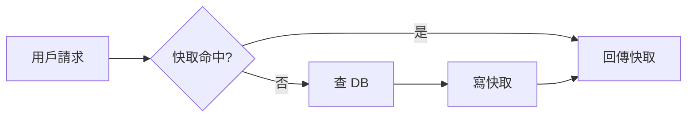
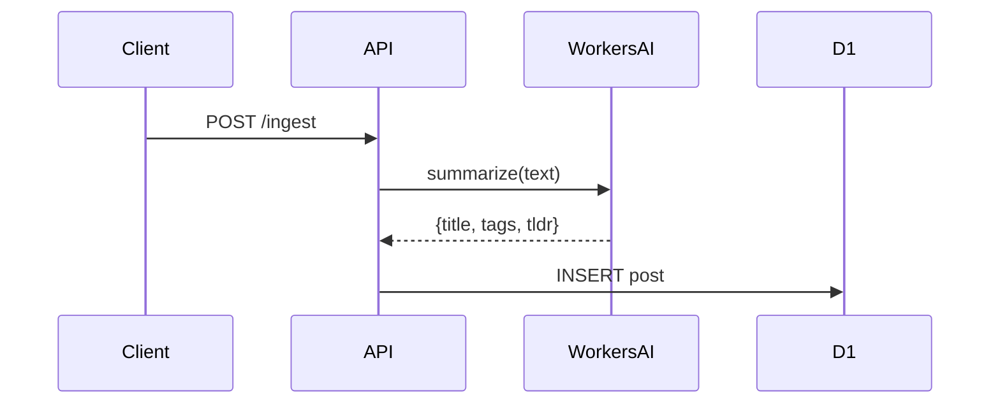

# quidproquo 寫作風格指南

## 核心原則

寫給「一週後的自己」看，也寫給遇到同樣事情的人看。

## 各分類風格

**tech（問題解決型）**：直接、具體，程式碼要完整。標題包含關鍵錯誤或技術名稱。結構固定：情境 → 問題 → 解法 → 原因 → 學到的事。篇幅精簡，不需要鋪墊。

**tech（專文介紹型）**：適合介紹工具、技術棧、架構設計。目標長度 1000-2000 字。不需要大量第一人稱經驗，介紹文的價值在於讓讀者理解工具、做出選擇。每個段落至少展開：這個工具的設計哲學是什麼、跟常見替代方案的比較、適合和不適合的使用情境。有程式碼範例就加，架構圖優先用 Mermaid，複雜度低時用 ASCII。標題直接點出主題，不需要加「的解法」。

**product**：從問題出發，說清楚為什麼做這個、怎麼做、做出來之後呢。著重決策脈絡和取捨，而不是功能列表。

**learning**：結構清晰，概念要解釋清楚。適合帶 `ai`、`education`、`policy` 等 tag 的主題。每個重點展開說明，必要時加比較表格或架構圖。references 必填。

**creative**：依 tag 調整語氣：
- `film` / `anime`：不劇透開頭，說清楚為什麼值得看（或不值得）。有觀點，不是劇情摘要。
- `coffee`：豆子來源、風味描述、沖煮參數（有的話）。
- `surf`：狀態、浪況、感受。不需要技術術語，但要有畫面。
- `design`：說明設計決策與取捨，為什麼選這個方向，放棄了什麼。
- `travel`：地點、氛圍、值得去或不值得去的理由。

**life**：隨意，不需要結構。帶 `career` tag 的文章誠實最重要，包含猶豫和失敗的部分，對讀者最有用。

## Title 原則

- 具體 > 抽象
- tech：包含錯誤關鍵字，結尾加「的解法」「踩坑記錄」
- learning / product：直接說這篇在講什麼，可加副標題補充角度
- creative / life：直接說這篇在講什麼

## 語氣

- 直接，不客套
- 可以有情緒
- 不需要介紹自己

## 視覺輔助原則

人類善於圖像理解。一個概念若用文字解釋超過 3 句，圖通常更有效。但不要為了加圖而加圖。

**何時加圖（主動判斷，不等用戶要求）：**

| 內容類型 | 使用工具 |
|---------|---------|
| 流程、步驟、決策分支 | Mermaid flowchart |
| 元件互動、服務之間的呼叫關係 | Mermaid sequenceDiagram / graph |
| 系統架構、模組關係 | Mermaid graph |
| 前後對比、簡單的層次結構 | ASCII |
| 多維比較（工具 A vs B vs C） | Markdown 表格 |

**何時不加圖：**
- `creative` / `life` 類文章（情感、感受不需要圖解）
- 短文（< 500 字）
- 程式碼本身就是最好的圖解

**Mermaid 範例（flowchart）：**
````markdown

````

**Mermaid 範例（sequenceDiagram）：**
````markdown

````

圖放在最相關的段落下方，不要集中在文末。

## 參考資料規則

- 文章只要引用外部工具、框架、模型、官方文件、論文、版本資訊、數據、比較結論，就要在文末加 `## 參考資料`
- 參考資料用 Markdown 清單列出，格式：`- [顯示名稱](URL)`
- 參考資料要對得上文章內容；如果文章在比較多個工具或框架，參考資料也要覆蓋主要對象，不要只放一條泛用連結
- `tech` / `learning` / `product` 類，以及帶有 `ai` / `policy` / `education` / `marketing` tag 的文章，預設都應該有參考資料
- 寫完可跑 `pnpm check:references` 做檢查
