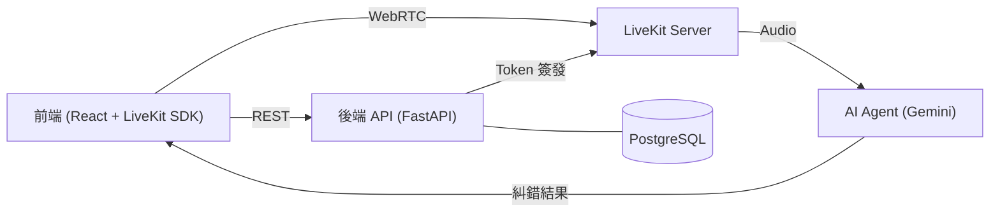
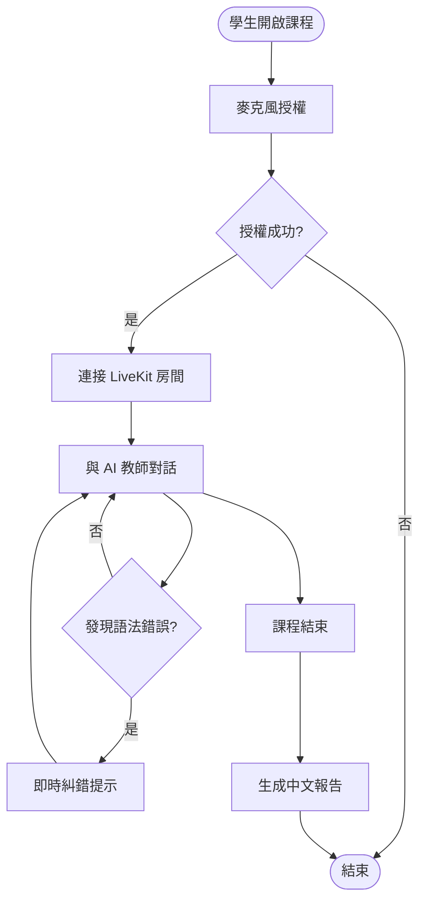

# Project Writing Guide

## 核心原則

寫給**不熟悉這個專案的工程師**看。他要能在 30 秒內理解：你做了什麼、為什麼難、怎麼解的、結果怎樣。

---

## 各欄位寫法

### background
說「為什麼做」，不是「做了什麼」。

- ❌ 「建置了一個 AI 語音教學平台。」
- ✅ 「學生缺乏低成本的即時口語練習管道，需要一個能在對話中即時糾錯的 AI 家教。」

背景要包含：使用情境 + 誰有這個問題 + 為什麼現有方案不夠

### challenge
說具體的技術/產品限制，避免模糊描述。

- ❌ 「技術很複雜，需要整合很多元件。」
- ✅ 「WebRTC 媒體流與 LLM 推理延遲需同時壓在 300ms 以下，且不能讓音訊切斷。」

challenge 要包含：限制條件 + 為什麼難處理 + 若不解決會怎樣

### solution
一句話總覽策略，重點是「選擇了什麼架構/方向，為什麼」。

- ❌ 「使用了多種工具整合。」
- ✅ 「採用解耦式 Agent Worker 架構，將媒體（LiveKit）、推理（Gemini）、API（FastAPI）分層，各自獨立擴展。」

### core_contributions
每條聚焦**一個技術決策**，格式：`以 **X** 建置/實作 Y`

- 必須含技術名（粗體）
- 說清楚「做了什麼」而非「用了什麼」
- ❌ 「使用 Docker」
- ✅ 「以 **Docker** 容器化所有服務，搭配 docker-compose 做本地開發環境一鍵啟動」

3–6 條即可，不要填充。

### outcome
可量化優先，不能量化就說可觀察的狀態。

- ❌ 「系統運作良好。」
- ✅ 「端到端語音回應延遲 < 400ms，支援 10 人同時授課，已部署至生產環境。」
- ✅ 「完成 MVP，作為個人展示用途穩定運行三個月。」

---

---

## Mermaid 圖表

每個 project page 需包含兩張圖：**架構圖** + **流程圖**。

### 架構圖（`## 架構圖`）

目的：呈現系統元件與層次關係，讓讀者一眼看懂「誰負責什麼、怎麼連接」。

**格式選擇**

| 情境 | 推薦格式 |
|------|---------|
| 多層服務（前端/後端/DB） | `graph LR` 或 `graph TB` |
| 微服務 / 模組邊界 | `graph LR` + subgraph |
| 複雜雲端架構 | `graph TB` + 節點分組 |

**寫法原則**
- 每個節點用簡短標籤 + 括號說明（`API["後端 API (FastAPI)"]`）
- 資料流方向：左→右 或 上→下，保持一致
- 3–8 個節點為宜；過多就拆 subgraph
- ❌ 把所有 library 都列上去（只列主要元件）
- ✅ 清楚顯示跨服務邊界（WebRTC、HTTP、DB 連線）

---

### 流程圖（`## 流程圖`）

目的：呈現使用者完成一項核心任務的操作路徑，包含分支與例外。

**格式選擇**

| 情境 | 推薦格式 |
|------|---------|
| 單一使用者操作流程 | `flowchart TD` |
| 多角色互動（用戶/系統/服務） | `sequenceDiagram` |
| 狀態機（訂單/任務狀態） | `stateDiagram-v2` |

**寫法原則**
- 起點用圓角（`([開始])`），終點用雙圓（`([結束])`）
- 判斷條件用菱形（`{條件?}`），分支標籤要說清楚
- 4–10 個節點；太長就只畫 Happy Path + 主要分支
- ❌ 把系統內部實作細節都畫進去
- ✅ 聚焦「使用者做了什麼，系統回應了什麼」

---

## 語氣

- 直接、技術性，不需要行銷語言
- 不用「強大」、「優秀」、「全面」等形容詞
- 數字 > 形容詞
