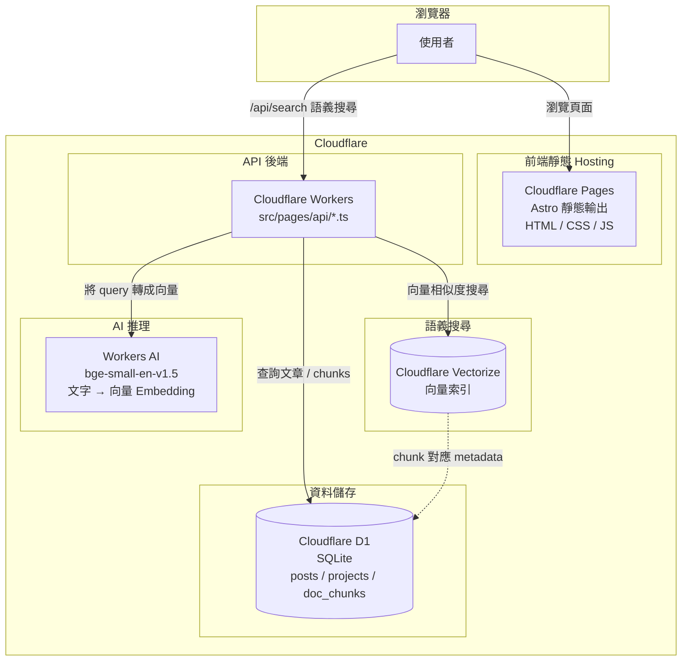
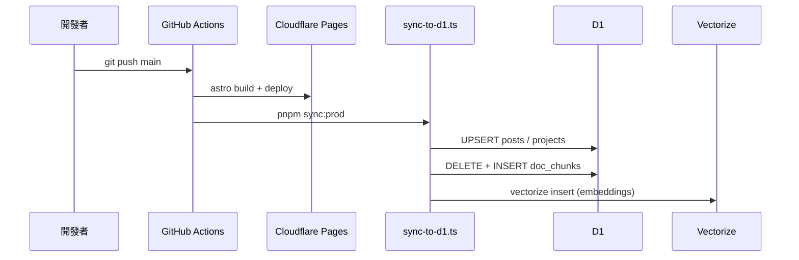
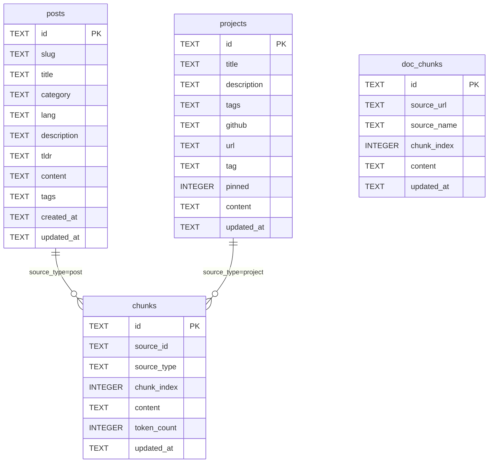

# 架構說明

## 技術棧

| 層級 | 技術 |
|------|------|
| 前端 | Astro 5 + React（互動元件） |
| 邊緣執行 | Cloudflare Workers |
| 資料庫 | Cloudflare D1（SQLite） |
| 向量索引 | Cloudflare Vectorize |
| AI 推理 | Workers AI / 外部 LLM |

## 系統架構



## 資料流



## 搜尋功能

網站提供兩種搜尋，入口分別在 `/search` 和 `/ai-search`：

| | `/search` | `/ai-search` |
|---|---|---|
| 技術 | Pagefind（靜態全文索引） | Vectorize（語義向量搜尋） |
| 運作方式 | build time 建立索引，純前端 JS 比對關鍵字 | 即時呼叫 `/api/search` → embedding → 向量相似度 |
| 需要 Workers | 否（prerender） | 是 |
| 搜尋能力 | 關鍵字完全比對 | 語義理解（同義詞、概念相近） |

`/api/search` 流程：

```
用戶輸入
  → Workers AI bge-small-en-v1.5（embedding）
  → Vectorize.query()（top-5 相似 chunks）
  → 回傳文章 slug / title / score
```

> 注意：這是語義搜尋（Semantic Search），不是 RAG。結果為文章列表，不會由 LLM 生成回答。

## D1 Schema


