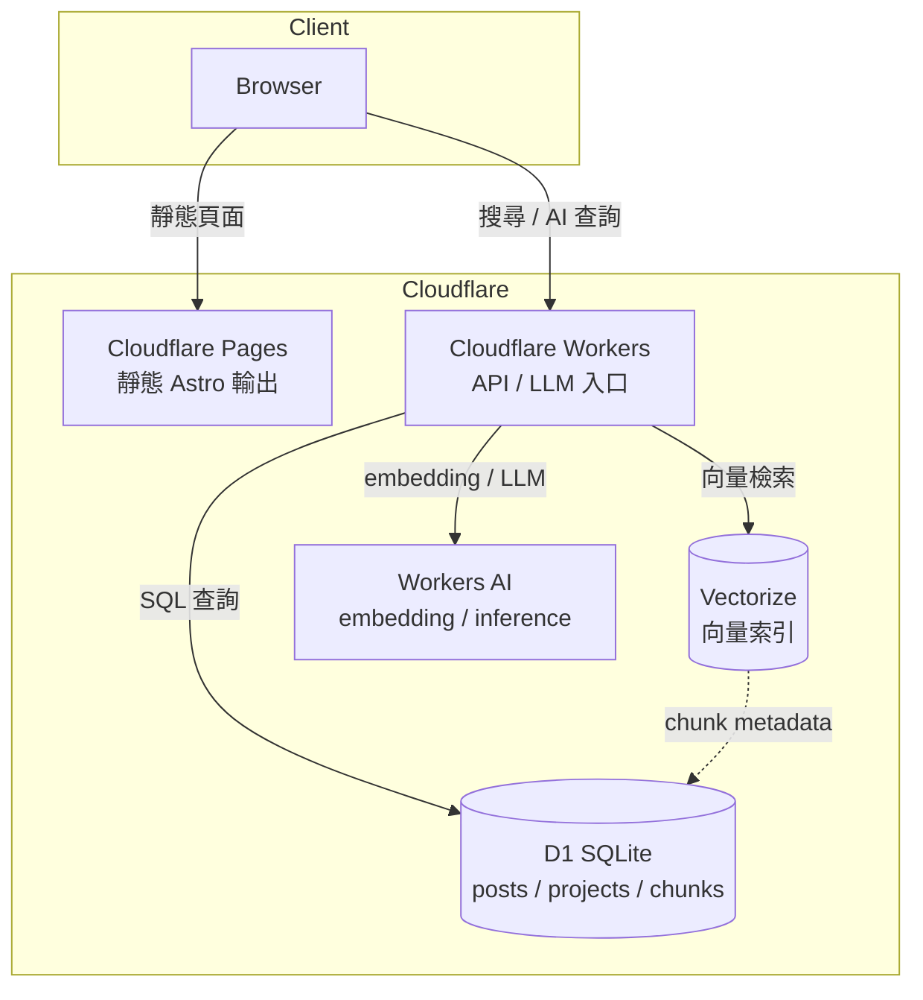
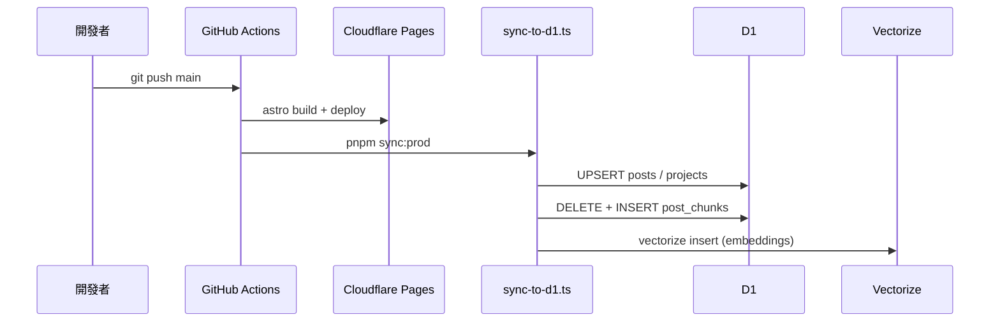
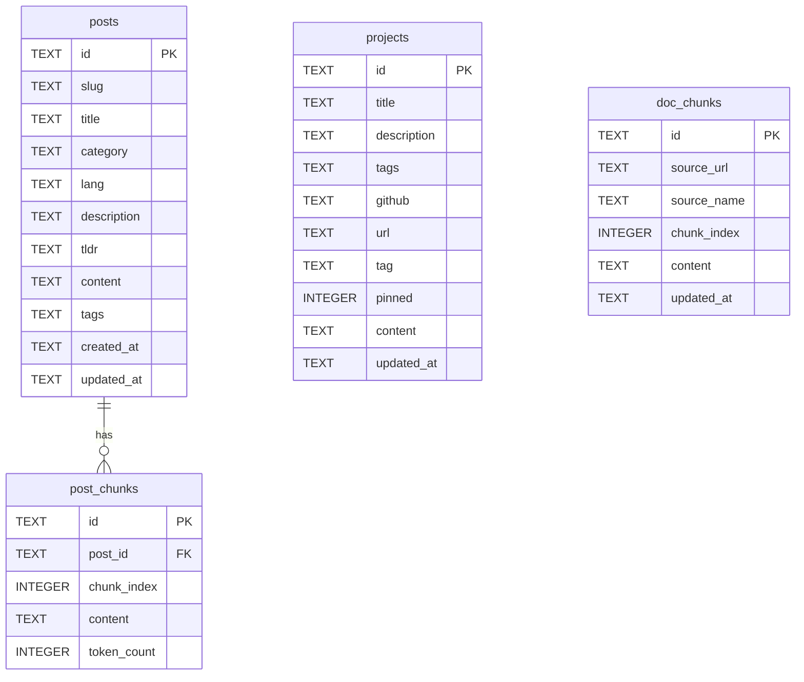

# 架構說明

## 技術棧

| 層級 | 技術 |
|------|------|
| 前端 | Astro 5 + React（互動元件） |
| 邊緣執行 | Cloudflare Workers |
| 資料庫 | Cloudflare D1（SQLite） |
| 向量索引 | Cloudflare Vectorize |
| AI 推理 | Workers AI / 外部 LLM |

## 系統架構

## 資料流

## D1 Schema

