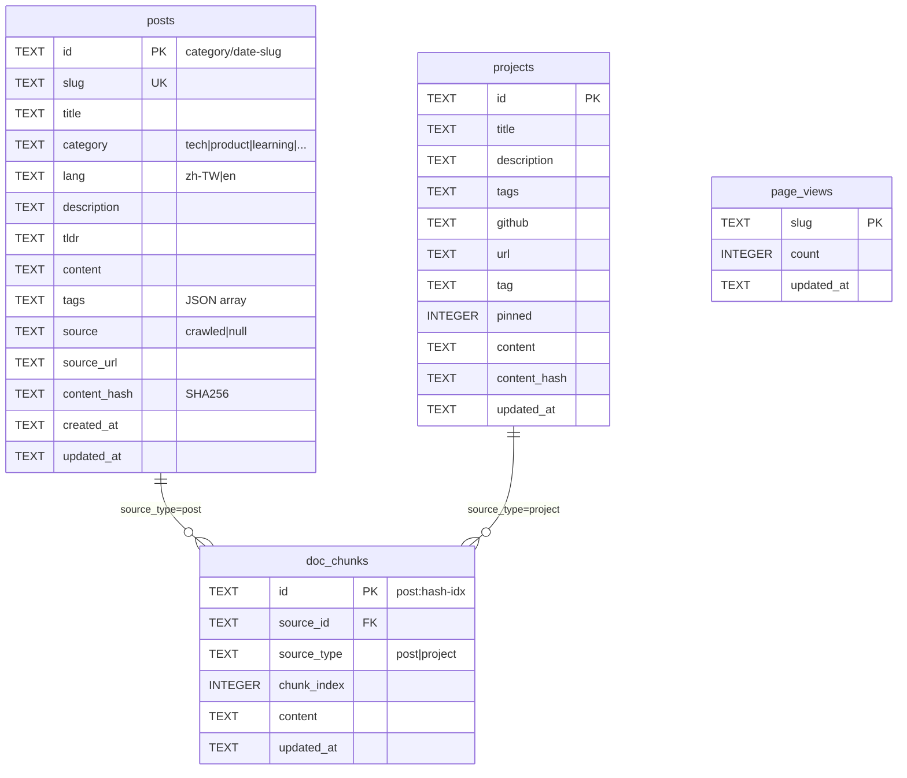

# 系統架構

## 技術棧

| 層級 | 技術 |
|------|------|
| 前端 | Astro 5 + React（互動元件） |
| 邊緣執行 | Cloudflare Workers（SSR + API routes） |
| 靜態搜尋 | Pagefind（build-time 全文索引） |
| 資料庫 | Cloudflare D1（SQLite） |
| 向量索引 | Cloudflare Vectorize（384 維，cosine） |
| AI 推理 | Cloudflare Workers AI |
| OG 圖片快取 | Cloudflare R2 |
| CI/CD | GitHub Actions |
| 套件管理 | pnpm 10 |

---

## 系統整體架構

```mermaid
graph TD
  subgraph Browser[瀏覽器]
    User[使用者]
  end

  subgraph External[外部來源]
    YT[YouTube / 字幕]
  end

  subgraph GHA[GitHub Actions]
    DeployCI[deploy.yml]
    CrawlCI[crawl.yml cron]
  end

  subgraph CF[Cloudflare]
    Pages[Cloudflare Pages\nAstro SSR]

    subgraph API[Worker API Routes]
      SearchAPI[/api/search]
      OGAPI[/api/og/...]
      ViewsAPI[/api/views]
    end

    subgraph Storage[資料儲存]
      D1[(D1\nengineer-news-db)]
      R2[(R2\nog-images bucket)]
      Vec[(Vectorize\nengineer-news-index)]
    end

    subgraph WAI[Workers AI]
      BGE[bge-m3\nembedding]
      Qwen[qwen1.5-14b\nRAG chat]
      Llama[llama-3.1-8b / 70b\ningest / crawl]
    end
  end

  User --> Pages
  Pages --> SearchAPI & OGAPI & ViewsAPI
  SearchAPI --> BGE & Vec & D1 & Qwen
  OGAPI --> R2
  ViewsAPI --> D1

  CrawlCI --> YT --> Llama
  CrawlCI -->|git push| DeployCI
  DeployCI --> Pages
  DeployCI --> BGE & D1 & Vec
```

---

## Pipeline 文件

| Pipeline | 文件 | 說明 |
|----------|------|------|
| AI 語義搜尋 | [pipelines/ai-search.md](pipelines/ai-search.md) | Vectorize + RAG（bge-m3 + qwen1.5-14b） |
| 靜態關鍵字搜尋 | [pipelines/search.md](pipelines/search.md) | Pagefind，build-time，無 API |
| OG 圖片生成 | [pipelines/og-image.md](pipelines/og-image.md) | satori + resvg-wasm + R2 快取 |
| 語音播放（TTS） | [pipelines/tts.md](pipelines/tts.md) | edge_tts + R2 快取，支援 MediaSource streaming |
| 手動發文 / 爬蟲 / Sync | [ingest.md](ingest.md) | ingest.ts、crawl.ts、sync-to-d1.ts |

---

## Cloudflare D1 Schema



---

## Workers AI 模型一覽

| 模型 | 用途 | 呼叫位置 |
|------|------|---------|
| `@cf/baai/bge-m3` | 多語言 embedding（384 維） | `/api/search`、`sync-to-d1.ts` |
| `@cf/qwen/qwen1.5-14b-chat-awq` | RAG 回答串流 | `/api/search` |
| `@cf/meta/llama-3.1-8b-instruct` | Ingest metadata 擷取 | `scripts/ingest.ts` |
| `@cf/meta/llama-3.1-70b-instruct` | Crawl 全文摘要 + Mermaid | `scripts/crawl.ts` |

---

## Cloudflare Bindings（wrangler.jsonc）

| Binding | 類型 | 名稱 | 說明 |
|---------|------|------|------|
| `DB` | D1 | `engineer-news-db` | 主資料庫 |
| `OG_IMAGES` | R2 | `engineer-news-og-images` | OG 圖片 + TTS 音檔快取 |
| `VECTORIZE` | Vectorize | `engineer-news-index` | 向量索引（384D cosine） |
| `AI` | Workers AI | — | AI 推理 binding |
| `TTS_API_URL` | 環境變數 | — | TTS server URL（選填，不設定則跳過自動合成） |

---

## 文章分類

| 分類 | 說明 |
|------|------|
| `tech` | 工程技術 |
| `product` | 產品思維 |
| `learning` | 學習筆記 |
| `career` | 職涯 |
| `life` | 生活 |
| `ai` / `design` / ... | 其他主題分類 |
