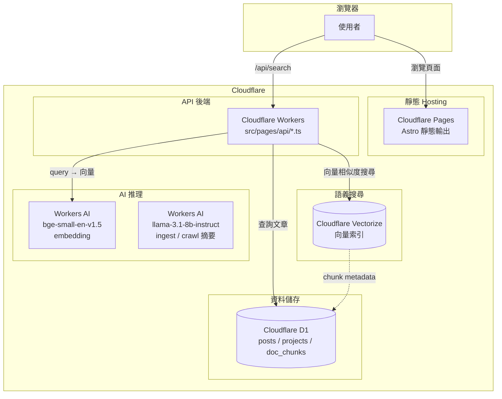
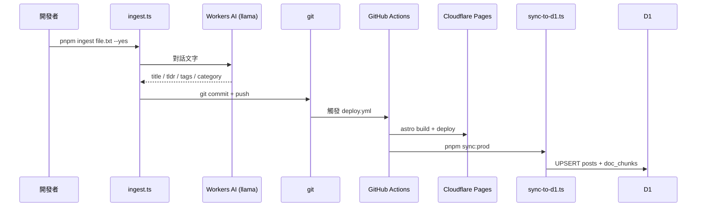
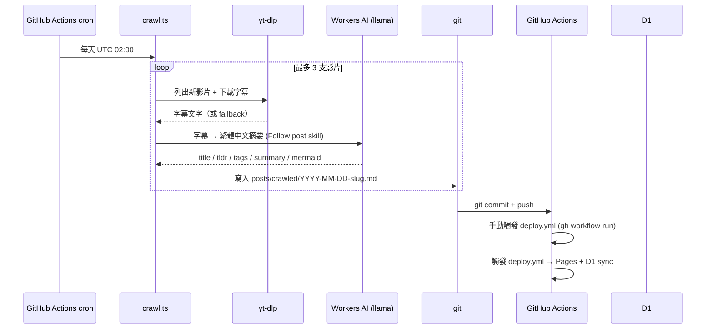
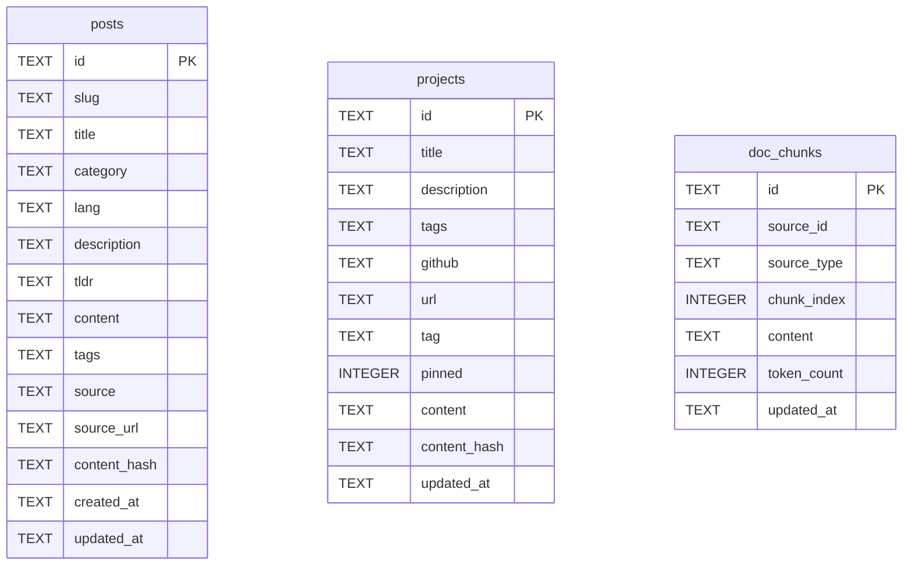

# 架構說明

## 技術棧

| 層級 | 技術 |
|------|------|
| 前端 | Astro 5 + React（互動元件） |
| 邊緣執行 | Cloudflare Workers |
| 資料庫 | Cloudflare D1（SQLite） |
| 向量索引 | Cloudflare Vectorize |
| AI 推理 | Cloudflare Workers AI |

## 系統架構



## 內容資料流

### 手動攝取（ingest）



### 自動爬蟲（crawl）



## 搜尋功能

| | `/search` | `/ai-search` |
|---|---|---|
| 技術 | Pagefind（靜態全文索引） | Vectorize（語義向量搜尋） |
| 運作方式 | build time 建立索引，純前端 JS 比對 | 即時呼叫 `/api/search` → embedding → 向量相似度 |
| 增量更新 | N/A | 基於 `content_hash` 的增量同步 (SHA256) |
| 需要 Workers | 否 | 是 |

## D1 Schema


  posts ||--o{ doc_chunks : "source_type=post"
  projects ||--o{ doc_chunks : "source_type=project"
```

## 文章類型

| type | 說明 | 來源 |
|------|------|------|
| `debug` | 踩坑記錄 | 手動 ingest |
| `deep-dive` | 技術深度介紹 | 手動 ingest |
| `guide` | 操作指南 | 手動 ingest |
| `project` | 專案介紹 | 手動 ingest |
| `crawled` | 自動爬取（YouTube） | crawl.ts 自動生成 |
