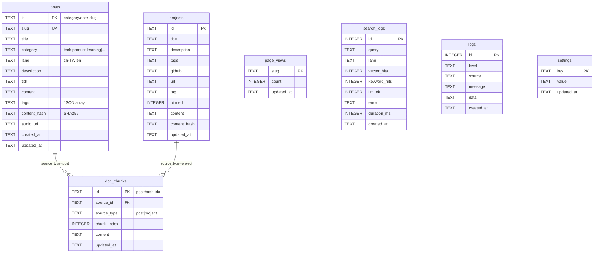

# 系統架構

## 技術棧

| 層級 | 技術 |
|------|------|
| 前端 | Astro 5 + React（互動元件） |
| 邊緣執行 | Cloudflare Pages Functions（Astro SSR + API routes） |
| 靜態搜尋 | Pagefind（build-time 全文索引） |
| 資料庫 | Cloudflare D1（SQLite） |
| 向量索引 | Cloudflare Vectorize（1024 維，cosine） |
| AI 推理 | Cloudflare Workers AI |
| OG 圖片快取 | Cloudflare R2 |
| CI/CD | GitHub Actions |
| 套件管理 | pnpm 10 |

---

## 系統整體架構

```mermaid
graph TD
  subgraph Browser[瀏覽器]
    User[使用者]
  end

  subgraph GHA[GitHub Actions]
    DeployCI[deploy.yml]
  end

  subgraph CF[Cloudflare]
    Pages[Cloudflare Pages Functions\nAstro SSR]

    subgraph API[Worker API Routes]
      SearchAPI[/api/search]
      OGAPI[/api/og/...]
      ViewsAPI[/api/views]
      TTSAPI[/api/tts/...]
      AdminAPI[/api/admin/...]
    end

    subgraph Storage[資料儲存]
      D1[(D1\nengineer-news-db)]
      R2[(R2\nengineer-news-og-images)]
      Vec[(Vectorize\nengineer-news-index)]
    end

    subgraph WAI[Workers AI]
      BGE[bge-m3\nembedding]
      Qwen[qwen1.5-14b\nRAG chat]
      Llama[llama-3.1-8b\ningest metadata]
    end
  end

  User --> Pages
  Pages --> SearchAPI & OGAPI & ViewsAPI & TTSAPI & AdminAPI
  SearchAPI --> BGE & Vec & D1 & Qwen
  OGAPI --> R2
  TTSAPI --> R2
  ViewsAPI --> D1
  AdminAPI --> D1

  DeployCI --> Pages
  DeployCI --> BGE & D1 & Vec
```

---

## Pipeline 文件

| Pipeline | 文件 | 說明 |
|----------|------|------|
| AI 語義搜尋 | [pipelines/ai-search.md](pipelines/ai-search.md) | Vectorize + RAG（bge-m3 + qwen1.5-14b） |
| 靜態關鍵字搜尋 | [pipelines/search.md](pipelines/search.md) | Pagefind，build-time，無 API |
| OG 圖片生成 | [pipelines/og-image.md](pipelines/og-image.md) | satori + resvg-wasm + R2 快取 |
| 語音播放（TTS） | [pipelines/tts.md](pipelines/tts.md) | edge_tts + R2 快取，支援 MediaSource streaming |
| 手動發文 / Sync | [ingest.md](ingest.md) | ingest.ts、sync-to-d1.ts |

---

## Cloudflare D1 Schema

```mermaid
erDiagram
  posts {
    TEXT id PK "category/date-slug"
    TEXT slug UK
    TEXT title
    TEXT category "tech|product|learning|..."
    TEXT lang "zh-TW|en"
    TEXT description
    TEXT tldr
    TEXT content
    TEXT tags "JSON array"
    TEXT content_hash "SHA256"
    TEXT audio_url
    TEXT created_at
    TEXT updated_at
  }
  projects {
    TEXT id PK
    TEXT title
    TEXT description
    TEXT tags
    TEXT github
    TEXT url
    TEXT tag
    INTEGER pinned
    TEXT content
    TEXT content_hash
    TEXT updated_at
  }
  doc_chunks {
    TEXT id PK "post:hash-idx"
    TEXT source_id FK
    TEXT source_type "post|project"
    INTEGER chunk_index
    TEXT content
    TEXT updated_at
  }
  page_views {
    TEXT slug PK
    INTEGER count
    TEXT updated_at
  }
  search_logs {
    INTEGER id PK
    TEXT query
    TEXT lang
    INTEGER vector_hits
    INTEGER keyword_hits
    INTEGER llm_ok
    TEXT error
    INTEGER duration_ms
    TEXT created_at
  }
  logs {
    INTEGER id PK
    TEXT level
    TEXT source
    TEXT message
    TEXT data
    TEXT created_at
  }
  settings {
    TEXT key PK
    TEXT value
    TEXT updated_at
  }
  posts ||--o{ doc_chunks : "source_type=post"
  projects ||--o{ doc_chunks : "source_type=project"
```

> `projects` 目前保留在 D1 schema 中，但 Astro content collection 只有 `posts`。`/projects` 頁面實際讀取的是 `posts` 中 `type: case-study` 的文章。

---

## Workers AI 模型一覽

| 模型 | 用途 | 呼叫位置 |
|------|------|---------|
| `@cf/baai/bge-m3` | 多語言 embedding（1024 維） | `/api/search`、`sync-to-d1.ts` |
| `@cf/qwen/qwen1.5-14b-chat-awq` | RAG 回答串流 | `/api/search` |
| `@cf/meta/llama-3.1-8b-instruct` | Ingest metadata 擷取 | `scripts/ingest.ts` |
| `@cf/myshell-ai/melotts` | 中文 TTS fallback | `/api/tts/cache`、`src/lib/tts.ts` |
| `@cf/deepgram/aura-2-en` | 英文 TTS fallback | `/api/tts/cache`、`src/lib/tts.ts` |

---

## Cloudflare Bindings（wrangler.jsonc）

| Binding | 類型 | 名稱 | 說明 |
|---------|------|------|------|
| `DB` | D1 | `engineer-news-db` | 主資料庫 |
| `OG_IMAGES` | R2 | `engineer-news-og-images` | OG 圖片 + TTS 音檔快取 |
| `VECTORIZE` | Vectorize | `engineer-news-index` | 向量索引（1024D cosine） |
| `AI` | Workers AI | — | AI 推理 binding |
| `ADMIN_TOKEN` | 環境變數 / secret | — | `/review` 與 `/api/admin/*` 驗證 |
| `GITHUB_OWNER` | 環境變數 | `a920604a` | Admin GitHub Contents API owner |
| `GITHUB_REPO` | 環境變數 | `engineernews` | Admin GitHub Contents API repo |
| `GITHUB_TOKEN` | secret | — | Admin GitHub Contents API token |
| `TTS_API_URL` | 環境變數 / secret | — | TTS server URL（選填；未設定時使用預設本機 URL，合成失敗再走 CF AI fallback） |

---

## 文章分類

| 分類 | 說明 |
|------|------|
| `tech` | 工程技術 |
| `product` | 產品思維 |
| `learning` | 學習筆記 |
| `creative` | 電影、動漫、設計、衝浪、咖啡、旅遊 |
| `life` | 日常、職涯、個人反思 |

> `src/content.config.ts` 目前沒有 enum 限制 `category`，舊文章仍可能保留 `career` 等歷史分類；新文章以 `docs/writing.md` 的五類為準。
