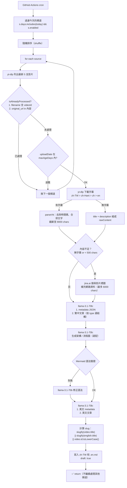

# Crawl 機制與策略

YouTube 自動爬蟲的設計決策、執行流程與維運指引。

---

## 設計核心原則

### 每次只處理 1 支影片

`crawl()` 找到第一個有新影片的頻道後，處理完就立刻 `return`，不繼續跑其他頻道。

原因：
- AI pipeline（字幕 + summarize + mermaid + translate）約 30–90 秒，一次處理太多容易逾時
- 每次只產出 1 篇，確保 review 品質來得及跟上爬取速度
- GitHub Actions 有執行時間限制，穩定優先

如需批次處理，重複手動觸發 `workflow_dispatch` 即可。

### 頻道隨機排序（shuffle）

同一天符合條件的頻道會被 shuffle 後再依序嘗試。

原因：若固定順序，排在後面的頻道永遠等不到處理。Shuffle 讓長期機率趨於公平。

### 所有爬取文章預設 `draft: true`

爬蟲產出的文章不直接發布，需透過 `/review` 頁面人工審核後才發布。

---

## 觸發排程

| 時間（台灣 UTC+8） | 適用日 | Cron |
|-----------------|--------|------|
| 08:00 | 平日（週一至週五） | `0 0 * * 1-5` |
| 17:00 | 平日（週一至週五） | `0 9 * * 1-5` |
| 每 6 小時 | 假日（週六、週日） | `0 */6 * * 0,6` |

手動觸發：Cloudflare Dashboard → GitHub Actions → `Crawl YouTube Sources` → `Run workflow`，或：

```bash
make remote-crawl
```

---

## 頻道清單與排班策略

頻道定義在 `scripts/sources.ts`，每個 Source 欄位：

| 欄位 | 說明 |
|------|------|
| `id` | 唯一識別碼（kebab-case） |
| `days` | 哪幾天爬（0=日, 1=一…6=六），可多天 |
| `maxAgeDays` | 影片年齡上限（天），超過則跳過 |
| `lang` | 頻道語言（`zh-TW` \| `en`），影響後續 AI 指令 |
| `tags` | 用於 AI summarize 的輔助 context |
| `enabled` | `false` 則完全跳過 |

### 排班設計（按星期分工）

| 星期 | 主題 | 頻道代表 |
|------|------|---------|
| 一 | 職涯 / 個人成長 | 大人學、muerstalk、ExplainThis |
| 二 | AI / ML | 李宏毅（NTU ML）、原子能、Yannic Kilcher、Two Minute Papers |
| 三 | 工程實務 | s09g、IT 咖啡、ByteByteGo、轩辕的编程宇宙 |
| 四 | 工具 / 科技 | 科技蝦、Fireship |
| 五 | 視野 / 產業 | The Valley 101、Y Combinator、MKBHD |
| 六 | 輕鬆 | benzi2662、Emmy追劇時間 |
| 日 | 補充 | 大人學、李宏毅、ByteByteGo、Fireship |

> 部分頻道跨多天，確保高產量頻道（如 Fireship）有更高的出現頻率。

`maxAgeDays` 依主題設定：技術類 180 天（避免爬到過時內容），職涯 / 生活類 365 天（常青內容較多）。

---

## 執行流程



---

## 內容 Pipeline 細節

### 字幕優先順序

`zh-TW → zh-Hant → zh → en`（任何可用語言）

字幕不存在時 fallback 用 `標題 + description`。此情況觸發 Jina 補充搜尋。

### 內容補強（Jina.ai）

觸發條件：
- 無字幕（fallback mode）
- 原始字幕 < 500 字元

呼叫 `https://s.jina.ai/{encoded_title}` 取得最多 6000 字的相關文章，與原始內容合併後送 AI。

### AI 呼叫次序

全部使用 `@cf/meta/llama-3.1-70b-instruct`：

| 步驟 | 輸入 | 輸出 | max tokens |
|------|------|------|-----------|
| metadata | 影片內容 | `{ title, tldr, tags, category, type }` JSON | 400 |
| 繁中文章 | 影片內容 + type 結構範本 | Markdown 文章 1500–2500 字 | 4000 |
| Mermaid 圖 | 影片內容 + 文章 | Mermaid 語法（選配） | 500 |
| Mermaid 修正 | 錯誤語法 | 修正後語法 | 500 |
| 英文 metadata | 繁中 metadata | `{ title, tldr, tags, description }` JSON | 400 |
| 英文文章 | 繁中文章 | 英文 Markdown | 3200 |

### 文章類型（type）

AI 根據內容從以下選一種，並套用對應的結構範本：

`how-to` / `explainer` / `listicle` / `deep-dive` / `debug` / `case-study` / `comparison` / `research` / `newsjacking`

---

## 去重機制

`isAlreadyProcessed(videoId, videoUrl)` 掃描 `src/content/posts/` 所有檔案，任一條件成立即視為已處理：

1. **檔名含 videoId**：舊版爬蟲產出的檔案（e.g., `2026-04-27-qjtpoz18tog.md` 含 YouTube ID）
2. **frontmatter 含 `original_url`**：新版爬蟲以 `original_url: "https://youtube.com/watch?v=..."` 為主要去重依據

條件 2 確保即使 slug 改變（e.g., 重新爬同一支影片），也不會重複產出。

---

## Slug 生成規則

```
slug = slugify(video.title) || slugify(english.title) || video.id.toLowerCase()
```

`slugify` 邏輯：小寫 → 移除非 ASCII 字元、標點符號 → 空白換成 `-` → 截斷至 60 字元。

| 情境 | slug 來源 |
|------|----------|
| 影片標題為英文 | `slugify(video.title)`，e.g., `why-postgres-is-everywhere` |
| 影片標題為中文（slugify 後為空） | `slugify(english.title)`，e.g., `how-llms-actually-work` |
| 標題無法生成有效 slug | `video.id.toLowerCase()`，e.g., `qjtpoz18tog` |

> 歷史問題：早期版本直接 fallback `video.id`（未 toLowerCase），造成 YouTube ID 大寫混入 slug。Astro v5 的 `entry.id` normalize 成小寫，導致 GitHub API 404。已於 2026-05-04 修復並重命名所有受影響檔案。

---

## 產出檔案格式

每次執行最多產出 **2 個檔案**（zh-TW + en）：

```
src/content/posts/{category}/{YYYY-MM-DD}-{slug}.md
src/content/posts/{category}/{YYYY-MM-DD}-{slug}.en.md
```

zh-TW frontmatter：

```yaml
---
title: "AI 生成的繁體中文標題"
date: "2026-05-04T08:00:00.000Z"
category: "learning"
tags: ["ai", "llm"]
lang: zh-TW
tldr: "一句話摘要"
description: "同 tldr"
type: explainer
original_url: "https://youtube.com/watch?v=..."
draft: true
---
```

---

## 新增頻道

在 `scripts/sources.ts` 的 `SOURCES` 陣列新增一筆：

```ts
{
  id: 'unique-kebab-id',
  name: '顯示名稱',
  type: 'youtube',
  channelId: 'UCxxxxxxxxxxxxxxxx',   // YouTube channel ID
  url: 'https://www.youtube.com/@handle',
  tags: ['標籤1', '標籤2'],
  lang: 'zh-TW',                     // 或 'en'
  enabled: true,
  days: [3],                          // 週三爬取
  maxAgeDays: 180,
},
```

**`days` 選擇建議：**
- 技術 / 工具類 → 平日（1–5）
- 輕鬆 / 生活類 → 週末（0, 6）
- 高產量頻道（每天有新影片）→ 可多天，確保不積壓

**`maxAgeDays` 建議：**
- 技術類（容易過時）→ 90–180 天
- 職涯 / 通識類（常青）→ 365 天

---

## 本地執行

```bash
make crawl           # 本地模式（D1 local，不寫 Vectorize）
make remote-crawl    # 觸發 GitHub Actions（遠端執行）
```

本地執行需要：
- `CLOUDFLARE_API_TOKEN`
- `CLOUDFLARE_ACCOUNT_ID`
- `yt-dlp`（`pip install yt-dlp`）
