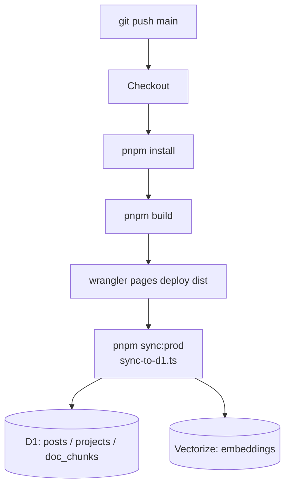
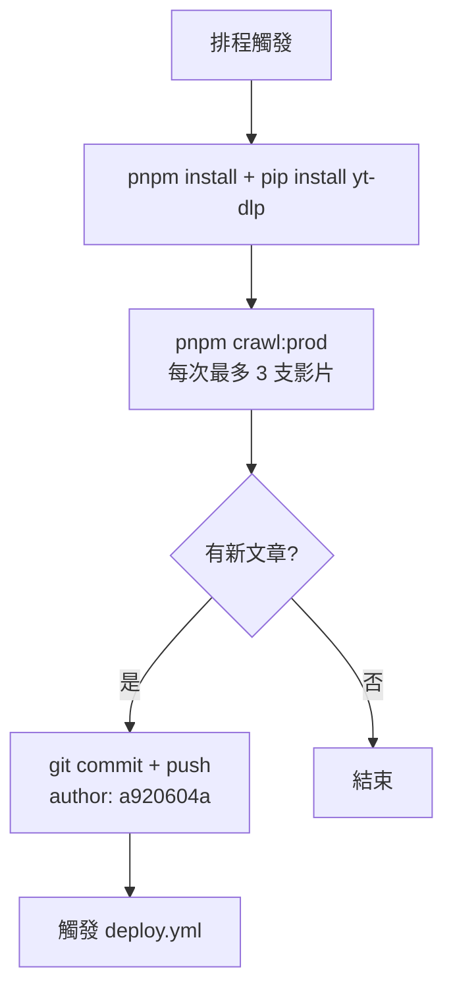

# 部署指南

## CI/CD 流程

### deploy.yml — 每次 push main 觸發



> D1 sync 在每次 deploy 後自動執行，不需手動觸發。

### crawl.yml — 每天 UTC 02:00（台灣時間 10:00）



爬蟲產生的文章 commit 後，deploy.yml 自動接手部署與 D1 sync。

---

## Git Author 規則

所有 commit（本地 + CI）的 author 固定為 `a920604a`：

- **本地**：`.git/hooks/commit-msg` 自動剔除 `Co-Authored-By:` 行
- **CI**：crawl.yml 中明確設定 `git config user.name "a920604a"`

---

## 本地驗證

```bash
make dev          # 啟動本地開發伺服器（需 Cloudflare 憑證）
pnpm build        # 確認 build 無誤
pnpm sync         # 同步到本地 D1（不加 --prod）
pnpm preview      # 預覽靜態輸出
```

---

## Secrets 設定

在 GitHub repo → Settings → Secrets 加入：

| Secret | 說明 |
|--------|------|
| `CLOUDFLARE_API_TOKEN` | 需有 D1、Pages、Vectorize、Workers AI 權限 |
| `CLOUDFLARE_ACCOUNT_ID` | Cloudflare Account ID |

本地開發在 `.env` 設定（不提交 git）：

```env
CLOUDFLARE_API_TOKEN=...
CLOUDFLARE_ACCOUNT_ID=...
```

---

## 手動套用 Migration

```bash
# 本地
wrangler d1 migrations apply engineer-news-db --local

# 遠端
wrangler d1 migrations apply engineer-news-db --remote
```

## 資料庫完整重建

```bash
make rebuild      # DROP + 重建 D1 表結構 + 重建 Vectorize index
make sync-prod    # 同步所有 markdown → D1 + Vectorize
```
