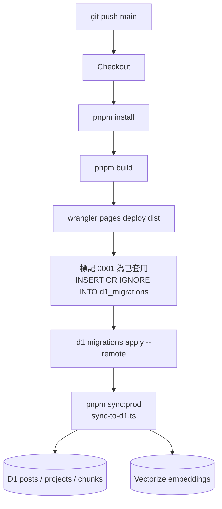

# 部署指南

## CI/CD 流程

每次推送到 `main` 自動觸發：



## 本地驗證

```bash
pnpm build          # 確認 build 無誤
pnpm sync           # 同步到本地 D1（不加 --prod）
pnpm preview        # 預覽靜態輸出
```

## Secrets 設定

在 GitHub repo → Settings → Secrets 加入：

| Secret | 說明 |
|--------|------|
| `CLOUDFLARE_API_TOKEN` | Cloudflare API Token（需有 D1、Pages、Vectorize 權限） |
| `CLOUDFLARE_ACCOUNT_ID` | Cloudflare Account ID |

## 手動套用 Migration

```bash
# 本地
wrangler d1 migrations apply engineer-news-db --local

# 遠端
wrangler d1 migrations apply engineer-news-db --remote
```
