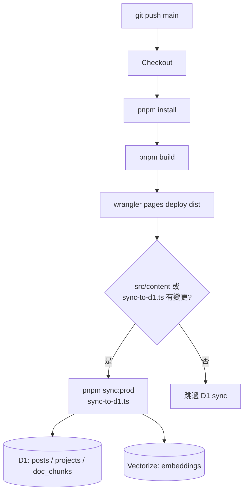
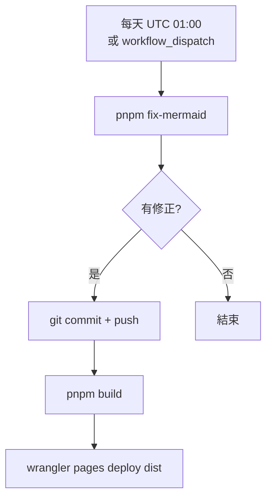

# 部署指南

## CI/CD 流程

### deploy.yml — 每次 push main 觸發


```mermaid
flowchart TD
  Push[git push main] --> Checkout
  Checkout --> Install[pnpm install]
  Install --> Build[pnpm build]
  Build --> Deploy[wrangler pages deploy dist]
  Deploy --> Changed{src/content 或\nsync-to-d1.ts 有變更?}
  Changed -- 是 --> Sync[pnpm sync:prod\nsync-to-d1.ts]
  Changed -- 否 --> End[跳過 D1 sync]
  Sync --> D1[(D1: posts / projects / doc_chunks)]
  Sync --> Vec[(Vectorize: embeddings)]
```

> D1 sync 只在 `src/content/` 或 `scripts/sync-to-d1.ts` 有變更時執行，避免沒有內容變動的部署也消耗 D1 / Vectorize API。

### fix-mermaid.yml — 每天 UTC 01:00


```mermaid
flowchart TD
  Cron[每天 UTC 01:00\n或 workflow_dispatch] --> Fix[pnpm fix-mermaid]
  Fix --> Check{有修正?}
  Check -- 是 --> Commit[git commit + push]
  Check -- 否 --> End[結束]
  Commit --> Build[pnpm build]
  Build --> Deploy[wrangler pages deploy dist]
```

---

## Git Author 規則

CI 產生的 commit author 固定為 `a920604a`：

- **CI**：fix-mermaid.yml 中明確設定 `git config user.name "a920604a"`

本地 commit 訊息請遵守 `docs/writing.md` 的 `post(<category>): <標題摘要>` 格式。

---

## 本地驗證

```bash
make dev          # 啟動本地開發伺服器（需 Cloudflare 憑證）
pnpm build        # 確認 build 無誤
pnpm sync         # 同步到本地 D1（不加 --prod）
pnpm preview      # 預覽靜態輸出
```

---

## Secrets 設定

在 GitHub repo → Settings → Secrets 加入：

| Secret | 說明 |
|--------|------|
| `CLOUDFLARE_API_TOKEN` | 需有 D1、Pages、Vectorize、Workers AI 權限 |
| `CLOUDFLARE_ACCOUNT_ID` | Cloudflare Account ID |
| `TTS_API_URL` | 選填；ingest 若設定則可預合成 TTS |

在 Cloudflare Pages 的環境變數 / secrets 設定：

| 名稱 | 說明 |
|------|------|
| `ADMIN_TOKEN` | `/review` 與 `/api/admin/*` 驗證 |
| `GITHUB_TOKEN` | Admin API 透過 GitHub Contents API 修改文章 |
| `GITHUB_OWNER` | GitHub owner，`wrangler.jsonc` 預設 `a920604a` |
| `GITHUB_REPO` | GitHub repo，`wrangler.jsonc` 預設 `engineernews` |
| `TTS_API_URL` | 選填；線上 TTS proxy / cache API 使用 |

本地開發在 `.env` 設定（不提交 git）：

```env
CLOUDFLARE_API_TOKEN=...
CLOUDFLARE_ACCOUNT_ID=...
```

---

## 手動套用 Migration

```bash
# 本地
wrangler d1 migrations apply engineer-news-db --local

# 遠端
wrangler d1 migrations apply engineer-news-db --remote
```

## 資料庫完整重建

```bash
make rebuild      # DROP + 重建 D1 表結構 + 重建 Vectorize index
make sync-prod    # 同步所有 draft:false markdown → D1 + Vectorize
```
