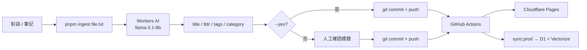
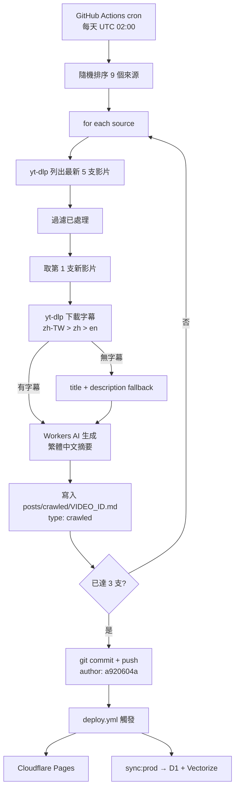
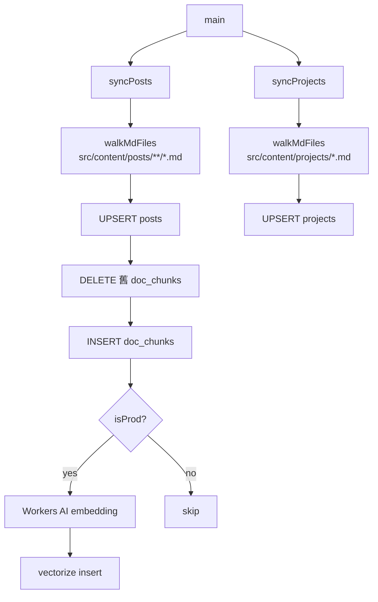

# 對話攝取與 Sync 工具

## 內容來源

本站內容有兩個來源：

| 來源 | 工具 | 觸發方式 |
|------|------|---------|
| 工程對話 / 筆記 | `scripts/ingest.ts` | 手動執行 |
| YouTube 頻道爬蟲 | `scripts/crawl.ts` | GitHub Actions 每天自動 |

---

## ingest.ts — 對話攝取

### 互動模式（預設）

```bash
pnpm ingest <conversation.txt>
```

Workers AI 分析對話內容，產生 title / tldr / tags / category，並詢問是否修改標題。確認後手動 commit 與 push。

### 自動模式（--yes）

```bash
pnpm ingest <conversation.txt> --yes
```

跳過所有互動，直接使用 AI 生成的 title，並自動執行：

```
寫入 markdown → git add → git commit → git push
```

push 後 CI 自動觸發部署與 D1 sync。

### 使用的 AI Model

呼叫 **Cloudflare Workers AI** 的 `@cf/meta/llama-3.1-8b-instruct`，將對話分析成結構化 metadata：

```
對話文字 → Llama-3.1-8b → { title, tldr, tags, category }
```

需設定環境變數：`CLOUDFLARE_ACCOUNT_ID`、`CLOUDFLARE_API_TOKEN`

### 工作流程



---

## crawl.ts — YouTube 爬蟲

### 執行方式

```bash
pnpm crawl         # 本地（不寫 Vectorize）
pnpm crawl:prod    # 遠端（含 Vectorize embedding）
```

每次執行最多處理 **3 支**新影片（來源 shuffle，不同頻道輪流）。

### 工作流程



### 來源設定

來源清單維護在 `scripts/sources.ts`，新增頻道只需在 `SOURCES` 陣列加一筆 `Source` 物件並設定 `enabled: true`。

目前收錄 9 個繁體中文 YouTube 頻道（AI、工程、職涯、個人成長）。

---

## sync-to-d1.ts 邏輯

遞迴掃描 `src/content/posts/`（含子目錄 `crawled/`）與 `src/content/projects/`，UPSERT 至 D1，並在 `--prod` 模式下更新 Vectorize embedding。



---

## 指令速查

| 指令 | 說明 |
|------|------|
| `pnpm ingest <file>` | 互動模式攝取對話 |
| `pnpm ingest <file> --yes` | 全自動攝取 + push |
| `pnpm crawl` | 本地爬蟲（不寫 Vectorize） |
| `pnpm crawl:prod` | 遠端爬蟲（含 Vectorize） |
| `pnpm sync` | 同步至本地 D1 |
| `pnpm sync:prod` | 同步至遠端 D1 + Vectorize |
