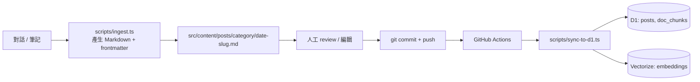
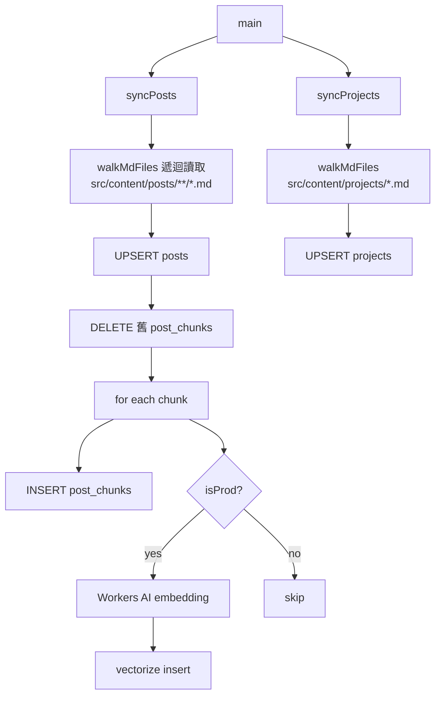

# 對話攝取與 Sync 工具

## 工作流程



## ingest.ts 用到的 AI Model

`pnpm ingest` 會呼叫 **Cloudflare Workers AI** 的 `@cf/meta/llama-3.1-8b-instruct`（LLM），將對話內容分析成結構化 metadata：

```
對話文字 → Llama-3.1-8b → { title, tldr, tags, category }
```

這是 build-time 的內容生成工具，與 runtime 搜尋的 embedding model（`bge-small-en-v1.5`）完全獨立。

需設定環境變數：
- `CLOUDFLARE_ACCOUNT_ID`
- `CLOUDFLARE_API_TOKEN`

## sync-to-d1.ts 邏輯



## 指令

```bash
# 本地 sync（開發用）
pnpm sync

# 遠端 sync（含 Vectorize）
pnpm sync:prod

# 攝取對話草稿
pnpm ingest

# 爬取外部文件到 doc_chunks
pnpm crawl
pnpm crawl:prod
```
