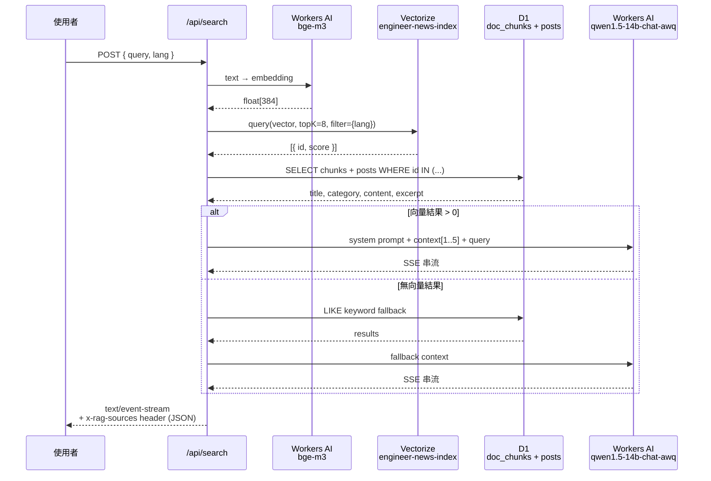

# AI 語義搜尋 Pipeline

路由：`POST /api/search`｜前端：`/ai-search`

---

## 流程總覽



---

## 參數設定

| 參數 | 值 | 說明 |
|------|----|------|
| Embedding 模型 | `@cf/baai/bge-m3` | 多語言，支援繁中 |
| Chat 模型 | `@cf/qwen/qwen1.5-14b-chat-awq` | 串流輸出 |
| Vectorize topK | 8 | 取前 8 個向量 |
| Lang filter | `{ lang }` metadata filter | 在向量層過濾語言 |
| Max sources | 5 | dedup by source_id |
| Excerpt 長度 | 220 字元 | per chunk |
| Source binding | `VECTORIZE`, `DB`, `AI` | wrangler.jsonc |

---

## Request / Response

**Request**
```json
POST /api/search
Content-Type: application/json

{ "query": "如何設計 API rate limiting", "lang": "zh-TW" }
```

**Response headers**
```
Content-Type: text/event-stream
x-rag-sources: [{"citation":1,"postId":"tech/...","title":"...","url":"...","score":0.87,...}]
x-rag-lang: zh-TW
```

**Response body**：SSE 串流文字，帶引用 `[1]` `[2]`

---

## Fallback 策略

```
向量搜尋 → 0 結果
  → Keyword SQL search（title / tldr / description / content / tags LIKE %query%）
  → 仍無結果 → LLM 告知找不到
  → LLM 失敗 → buildFallbackAnswer()（純文字，列出文章標題）
```

---

## RAG Prompt 結構

```
You are Engineer News' retrieval-augmented search assistant.

Rules:
- Answer in Traditional Chinese (Taiwan).
- Use only the provided context.
- Cite every factual claim with inline citations like [1] or [2].
- If the context is insufficient, say so clearly instead of guessing.

Context:
[1] 文章標題
URL: /posts/...
Category: tech
Excerpt: ...

Question:
<user query>
```

---

## 相關檔案

| 檔案 | 說明 |
|------|------|
| `src/pages/api/search.ts` | 主要 API handler |
| `src/pages/ai-search.astro` | 前端頁面 |
| `src/components/Search.tsx` | React 搜尋元件 |
| `scripts/sync-to-d1.ts` | 建立向量索引（indexing side） |
