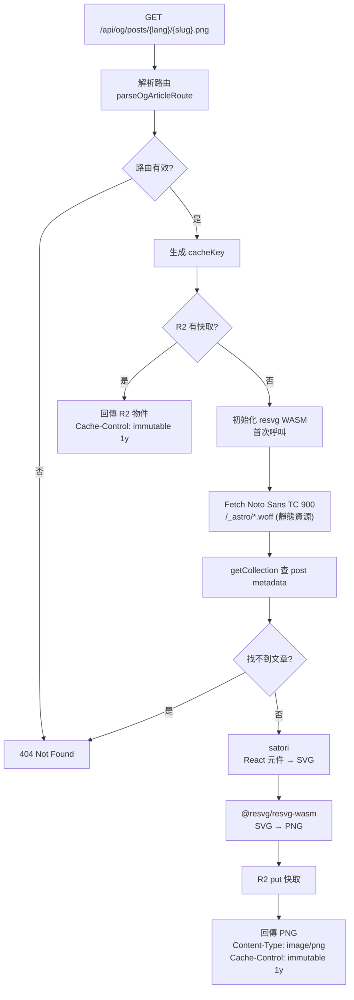

# OG 圖片生成 Pipeline

路由：`GET /api/og/[...slug].png`

---

## 流程總覽

---

## 路由格式

| 路由 | 說明 |
|------|------|
| `/api/og/posts/zh-TW/{slug}.png` | 繁中文章分享卡 |
| `/api/og/posts/en/{slug}.png` | 英文文章分享卡 |
| `/api/og/site.png` | 網站首頁預覽卡 |

Helper 函式：`src/lib/shareCard.ts`
- `parseOgArticleRoute(path)` — 解析 lang + postId
- `isOgSiteRoute(path)` — 判斷是否為 site card
- `getOgCacheKey(slug)` — 生成 R2 cache key

---

## 技術選型

| 套件 | 用途 | 備注 |
|------|------|------|
| `satori` | React 元件 → SVG | 支援 CF Workers |
| `@resvg/resvg-wasm` | SVG → PNG（WASM） | 替換 `@vercel/og`（見下方） |
| `@fontsource/noto-sans-tc` | 繁中字型（900 weight） | `?url` 靜態資源引用 |

> **為何不用 `@vercel/og`？**
> `@vercel/og` 在 module 初始化時執行 `fetch("./Geist-Regular.ttf", import.meta.url)`，
> 但 Geist 字型不在 Cloudflare Workers bundle 裡，fetch 失敗導致整個 ImageResponse 壞掉（500）。
> 改用 `satori` + `@resvg/resvg-wasm` 直接控制，字型和 WASM 都走靜態資源 URL。

---

## 卡片尺寸

| 屬性 | 值 |
|------|----|
| Width | 1200px |
| Height | 630px |
| 字型 | Noto Sans TC 900 |
| 背景 | `linear-gradient(135deg, #050505, #121212, #0a0a0a)` |

---

## R2 快取策略

- **Key**：`posts/{lang}/{slug}` 或 `site`
- **Hit**：直接回傳 ArrayBuffer，`Cache-Control: immutable, max-age=31536000`
- **Miss**：生成後立即寫入 R2，後續請求直接命中
- **Binding**：`OG_IMAGES`（`engineer-news-og-images` bucket）

---

## 相關檔案

| 檔案 | 說明 |
|------|------|
| `src/pages/api/og/[...slug].ts` | 主要 API handler |
| `src/lib/shareCard.ts` | 路由解析與 cache key |
