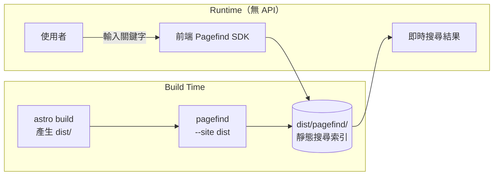

# 靜態關鍵字搜尋 Pipeline

路由：`/search`｜技術：Pagefind

---

## 流程總覽



---

## 與 AI 搜尋的差異

| | `/search`（Pagefind） | `/ai-search`（Vectorize） |
|---|---|---|
| 索引時機 | Build-time | 每次 `sync:prod` |
| 搜尋方式 | 關鍵字比對（TF-IDF） | 語意向量相似度 |
| 語言理解 | 否（精確字串） | 是（自然語言） |
| 需要 API | 否（純前端 JS） | 是（`/api/search`） |
| 成本 | 零 | Workers AI + Vectorize |
| 回應速度 | 即時（< 50ms） | ~1-3s（含 embedding + LLM） |
| 適合場景 | 知道關鍵字 | 語意描述、問題式搜尋 |

---

## Build 指令

```bash
pnpm build
# 實際執行：astro build && pagefind --site dist
```

Pagefind 會掃描 `dist/**/*.html`，對有 `data-pagefind-body` 屬性的頁面建立索引。

目前索引語言：`zh-tw`（注意：Pagefind 不支援繁中 stemming，但仍可搜尋）

---

## 相關檔案

| 檔案 | 說明 |
|------|------|
| `src/pages/search.astro` | 搜尋頁面 |
| `dist/pagefind/` | Build-time 產生的靜態索引（不提交 git） |
