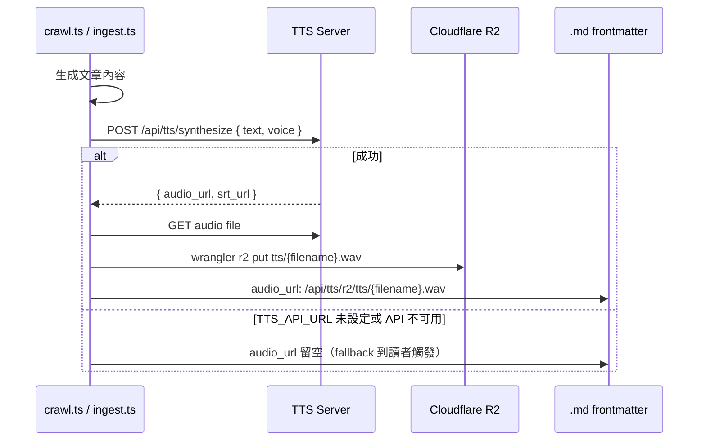

# 語音播放 Pipeline（TTS）

TTS 服務由外部 `edge_tts`（Microsoft Edge TTS）驅動，透過本地 FastAPI server 提供 API。音檔統一存放於 Cloudflare R2，格式為 `.wav`。

---

## 架構概覽

```
┌─────────────────────────────────────────────────────────────┐
│                        TTS Server                           │
│              /home/.../stt-tts-unified/backend              │
│                                                             │
│  POST /api/tts/synthesize  →  完整合成，回傳 audio_url       │
│  POST /api/tts/stream      →  串流輸出 MP3 chunks            │
│  GET  /api/tts/voices      →  列出可用語音                   │
└──────────────────────┬──────────────────────────────────────┘
                       │ proxy
┌──────────────────────▼──────────────────────────────────────┐
│              Cloudflare Worker（/api/tts/[...path]）         │
│                                                             │
│  /api/tts/r2/{key}   →  從 R2 讀取音檔                      │
│  /api/tts/cache      →  合成並存入 R2                        │
│  /api/tts/stream     →  proxy 到 TTS server stream          │
└─────────────────────────────────────────────────────────────┘
```

---

## Pipeline 1：爬蟲 / Ingest 時自動合成

文章生成後立即嘗試合成，結果寫入 frontmatter。



**環境變數**：`TTS_API_URL`（GitHub Actions secret，選填）

---

## Pipeline 2：讀者觸發（Fallback）

文章 `audio_url` 為空時，讀者點播放才合成。

```mermaid
flowchart TD
  Click[點播放按鈕] --> Check{HEAD /api/tts/r2/tts/{slug}.wav}
  Check -->|200 已快取| PlayR2[直接播放 R2 wav]
  Check -->|404 未快取| Stream

  Stream[POST /api/tts/stream] --> MSCheck{MediaSource 支援?}

  MSCheck -->|是 Chrome/Edge| MS[建立 MediaSource]
  MS --> FirstChunk[第一個 chunk 到達]
  FirstChunk --> PlayNow[立即開始播放]
  PlayNow --> Collect[持續收集 chunks]
  Collect --> Done[全部收完]

  MSCheck -->|否 Safari| Blob[收集全部 chunks]
  Blob --> Done

  Done --> Cache[背景 POST /api/tts/cache\n{ text, slug }]
  Cache --> Synthesize[TTS Server synthesize]
  Synthesize --> R2[存入 R2 tts/{slug}.wav]
  R2 --> SwapURL[swap audioUrl 為 R2 永久 URL]
```

**下次訪問**：HEAD check 命中 R2，直接播放，不再合成。

---

## Pipeline 3：批次補齊（make tts-all）

針對所有未有 `audio_url` 的文章一次性補齊。

```bash
make tts-all        # 本地 R2（需 TTS server 運行）
make tts-all-prod   # 遠端 R2（需 TTS_API_URL + CLOUDFLARE_API_TOKEN）
```

```mermaid
flowchart TD
  Start[tts-all.ts] --> Scan[掃描 src/content/posts/**/*.md]
  Scan --> Each{每篇文章}
  Each --> HasAudio{有 audio_url?}
  HasAudio -->|是| Skip[跳過]
  HasAudio -->|否| Synth[POST /api/tts/synthesize]
  Synth --> Upload[上傳 R2 tts/{filename}.wav]
  Upload --> Rewrite[回寫 frontmatter audio_url]
  Rewrite --> ProdCheck{--prod?}
  ProdCheck -->|是| D1[UPDATE posts SET audio_url WHERE slug]
  ProdCheck -->|否| Each
  D1 --> Each
```

> **`--prod` 與 local 的差異**
>
> | 模式 | R2 | D1 |
> |------|----|----|
> | `make tts-all`（local）| 寫入本地 R2 miniflare | 不更新，需另跑 `sync-to-d1` |
> | `make tts-all-prod` | 寫入遠端 R2 | **立即** `UPDATE posts SET audio_url` |

---

## R2 檔案命名規則

| 來源 | 格式 | 範例 |
|------|------|------|
| crawl / ingest | `tts/tts_{timestamp}.wav` | `tts/tts_20260427_091500_123456.wav` |
| 讀者觸發 cache | `tts/{slug}.wav` | `tts/2026-04-26-github-actions.wav` |
| tts-all | `tts/{slug}.wav` | `tts/2026-04-26-github-actions.wav` |

---

## Admin UI 語音設定

`/admin` → Settings → TTS 語音設定

- 從 TTS server `/api/tts/voices` 動態載入語音下拉選單
- 設定存入 D1 `settings` table（key: `tts_voice_zh`、`tts_voice_en`）
- TTS server 不可用時 fallback 為文字輸入框

---

## 相關檔案

| 檔案 | 說明 |
|------|------|
| `src/lib/tts.ts` | synthesize / processTextForTTS 等共用函式 |
| `src/components/TTSPlayer.tsx` | 前端播放器（MediaSource streaming + R2 fallback） |
| `src/pages/api/tts/[...path].ts` | TTS proxy + R2 讀取 |
| `src/pages/api/tts/cache.ts` | 合成並存入 R2 |
| `scripts/tts-all.ts` | 批次補齊所有文章語音 |
| `backend/routers/tts.py` | TTS server API routes |
| `backend/services/tts_service.py` | synthesize / stream_audio 實作 |
