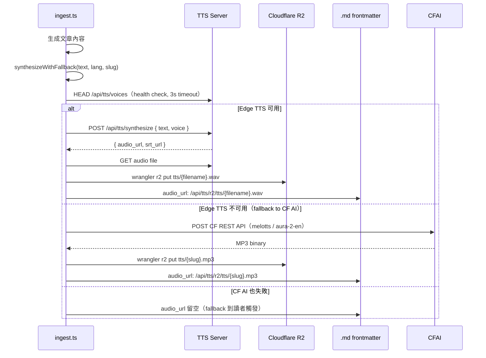
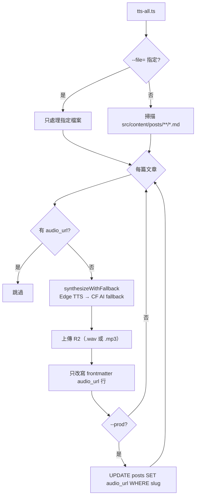
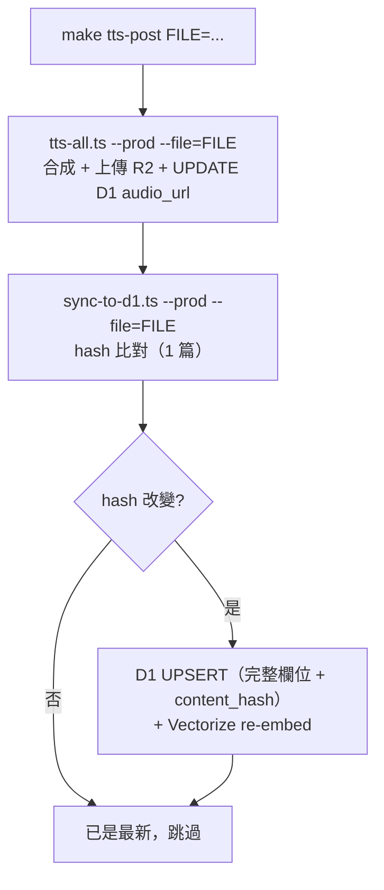

# 語音播放 Pipeline（TTS）

TTS 服務以 `edge_tts`（Microsoft Edge TTS）為主要引擎，透過本地 FastAPI server 提供 API。若 Edge TTS 不可用（CI 環境、server 未啟動），自動 fallback 到 **Cloudflare Workers AI**（中文：`@cf/myshell-ai/melotts`，英文：`@cf/deepgram/aura-2-en`）。音檔存放於 Cloudflare R2，Edge TTS 輸出 `.wav`，CF AI 輸出 `.mp3`。

---

## 架構概覽

```
┌─────────────────────────────────────────────────────────────┐
│                  Edge TTS Server（主引擎）                    │
│              /home/.../stt-tts-unified/backend              │
│                                                             │
│  POST /api/tts/synthesize  →  完整合成，回傳 audio_url       │
│  POST /api/tts/stream      →  串流輸出 MP3 chunks            │
│  GET  /api/tts/voices      →  列出可用語音                   │
└──────────────────────┬──────────────────────────────────────┘
       health check 成功 │         health check 失敗 ↓
                         │  ┌─────────────────────────────────┐
                         │  │   Cloudflare Workers AI（Fallback）│
                         │  │  @cf/myshell-ai/melotts（中文）   │
                         │  │  @cf/deepgram/aura-2-en（英文）   │
                         │  └──────────────┬──────────────────┘
                         │                 │
┌────────────────────────▼─────────────────▼──────────────────┐
│              Cloudflare Worker（/api/tts/[...path]）         │
│                                                             │
│  /api/tts/r2/{key}   →  從 R2 讀取音檔（.wav 或 .mp3）      │
│  /api/tts/cache      →  合成並存入 R2（含 CF AI fallback）   │
│  /api/tts/stream     →  proxy 到 TTS server stream          │
└─────────────────────────────────────────────────────────────┘
```

---

## Pipeline 1：Ingest 時自動合成

文章生成後立即嘗試合成，結果寫入 frontmatter。


```mermaid
sequenceDiagram
  participant Script as ingest.ts
  participant TTS as TTS Server
  participant R2 as Cloudflare R2
  participant MD as .md frontmatter

  Script->>Script: 生成文章內容
  Script->>Script: synthesizeWithFallback(text, lang, slug)
  Script->>TTS: HEAD /api/tts/voices（health check, 3s timeout）
  alt Edge TTS 可用
    Script->>TTS: POST /api/tts/synthesize { text, voice }
    TTS-->>Script: { audio_url, srt_url }
    Script->>TTS: GET audio file
    Script->>R2: wrangler r2 put tts/{filename}.wav
    Script->>MD: audio_url: /api/tts/r2/tts/{filename}.wav
  else Edge TTS 不可用（fallback to CF AI）
    Script->>CFAI: POST CF REST API（melotts / aura-2-en）
    CFAI-->>Script: MP3 binary
    Script->>R2: wrangler r2 put tts/{slug}.mp3
    Script->>MD: audio_url: /api/tts/r2/tts/{slug}.mp3
  else CF AI 也失敗
    Script->>MD: audio_url 留空（fallback 到讀者觸發）
  end
```

**環境變數**：`TTS_API_URL`（選填）、`CLOUDFLARE_ACCOUNT_ID`、`CLOUDFLARE_API_TOKEN`（GitHub Actions secrets）

---

## Pipeline 2：讀者觸發（Fallback）

文章 `audio_url` 為空時，讀者點播放才合成。

```mermaid
flowchart TD
  Click[點播放按鈕] --> Check{R2 已有 .wav 或 .mp3?}
  Check -->|200 已快取| PlayR2[直接播放 R2 音檔]
  Check -->|404 未快取| Stream

  Stream[POST /api/tts/stream] --> MSCheck{MediaSource 支援?}

  MSCheck -->|是 Chrome/Edge| MS[建立 MediaSource]
  MS --> FirstChunk[第一個 chunk 到達]
  FirstChunk --> PlayNow[立即開始播放]
  PlayNow --> Collect[持續收集 chunks]
  Collect --> Done[全部收完]

  MSCheck -->|否 Safari| Blob[收集全部 chunks]
  Blob --> Done

  Done --> Cache[背景 POST /api/tts/cache\n{ text, slug }]
  Cache --> HealthCheck{Edge TTS health check}
  HealthCheck -->|可用| Synthesize[Edge TTS synthesize → .wav]
  HealthCheck -->|不可用| CFAI[CF AI synthesize → .mp3]
  Synthesize --> R2[存入 R2]
  CFAI --> R2
  R2 --> SwapURL[swap audioUrl 為 R2 永久 URL]
```

**下次訪問**：HEAD check 命中 R2，直接播放，不再合成。

---

## Pipeline 3：批次補齊（make tts-all）

針對所有未有 `audio_url` 的文章一次性補齊。支援 `--file=` 只處理指定單篇。

```bash
make tts-all        # 本地 R2（需 TTS server 運行）
make tts-all-prod   # 遠端 R2（需 TTS_API_URL + CLOUDFLARE_API_TOKEN）
```


```mermaid
flowchart TD
  Start[tts-all.ts] --> FileArg{--file= 指定?}
  FileArg -->|是| Single[只處理指定檔案]
  FileArg -->|否| Scan[掃描 src/content/posts/**/*.md]
  Single --> Each{每篇文章}
  Scan --> Each
  Each --> HasAudio{有 audio_url?}
  HasAudio -->|是| Skip[跳過]
  HasAudio -->|否| Synth[synthesizeWithFallback\nEdge TTS → CF AI fallback]
  Synth --> Upload[上傳 R2（.wav 或 .mp3）]
  Upload --> Rewrite[只改寫 frontmatter audio_url 行]
  Rewrite --> ProdCheck{--prod?}
  ProdCheck -->|是| D1[UPDATE posts SET audio_url WHERE slug]
  ProdCheck -->|否| Each
  D1 --> Each
```

> **`--prod` 與 local 的差異**
>
> | 模式 | R2 | D1 audio_url |
> |------|----|----|
> | `make tts-all`（local）| 寫入本地 R2 miniflare | 不更新，需另跑 `sync-to-d1` |
> | `make tts-all-prod` | 寫入遠端 R2 | **立即** `UPDATE posts SET audio_url` |

> **frontmatter 寫入方式**：只替換 `audio_url:` 那一行（或插入）。title、tags、date 等其他欄位完全不動。

---

## Pipeline 4：單篇完整補齊（make tts-post）

針對單篇執行 TTS → R2 → D1 `audio_url` → Vectorize，不影響其他文章。

```bash
make tts-post FILE=src/content/posts/learning/2026-04-23-how-chatgpt-is-trained.md
```


```mermaid
flowchart TD
  Start["make tts-post FILE=..."] --> TTS["tts-all.ts --prod --file=FILE\n合成 + 上傳 R2 + UPDATE D1 audio_url"]
  TTS --> Sync["sync-to-d1.ts --prod --file=FILE\nhash 比對（1 篇）"]
  Sync --> Changed{hash 改變?}
  Changed -->|是| Upsert["D1 UPSERT（完整欄位 + content_hash）\n+ Vectorize re-embed"]
  Changed -->|否| Done[已是最新，跳過]
  Upsert --> Done
```

使用時機：
- `tts-all-prod` 因 TTS API 失敗跳過某篇
- 手動補齊特定文章的語音與向量

---

## R2 檔案命名規則

| 來源 | 引擎 | 格式 | 範例 |
|------|------|------|------|
| ingest（Edge TTS） | Edge TTS | `tts/tts_{timestamp}.wav` | `tts/tts_20260427_091500_123456.wav` |
| ingest（CF AI） | CF Workers AI | `tts/{slug}.mp3` | `tts/2026-04-26-github-actions.mp3` |
| 讀者觸發 cache（Edge TTS） | Edge TTS | `tts/{slug}.wav` | `tts/2026-04-26-github-actions.wav` |
| 讀者觸發 cache（CF AI） | CF Workers AI | `tts/{slug}.mp3` | `tts/2026-04-26-github-actions.mp3` |
| tts-all（Edge TTS） | Edge TTS | `tts/{slug}.wav` | `tts/2026-04-26-github-actions.wav` |
| tts-all（CF AI） | CF Workers AI | `tts/{slug}.mp3` | `tts/2026-04-26-github-actions.mp3` |

R2 lookup 順序��先嘗試 `.wav`，不存在則嘗試 `.mp3`，兩者皆無回傳 404。

---

## Admin UI 語音設定

`/admin` → Settings → TTS 語音設定

- 從 TTS server `/api/tts/voices` 動態載入語音下拉選單
- 設定存入 D1 `settings` table（key: `tts_voice_zh`、`tts_voice_en`）
- TTS server 不可用時 fallback 為文字輸入框

---

## 相關檔案

| 檔案 | 說明 |
|------|------|
| `src/lib/tts.ts` | synthesize / processTextForTTS 等共用函式 |
| `src/components/TTSPlayer.tsx` | 前端播放器（MediaSource streaming + R2 fallback） |
| `src/pages/api/tts/[...path].ts` | TTS proxy + R2 讀取 |
| `src/pages/api/tts/cache.ts` | 合成並存入 R2 |
| `scripts/tts-all.ts` | 批次補齊所有文章語音 |
| `backend/routers/tts.py` | TTS server API routes |
| `backend/services/tts_service.py` | synthesize / stream_audio 實作 |
