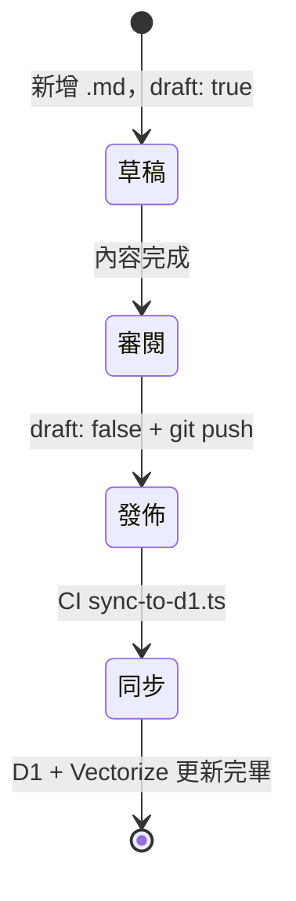

# 撰寫文章指南

## 文章生命週期



## 目錄結構

```
src/content/
├── posts/
│   ├── tech/
│   ├── ai/
│   ├── climbing/
│   └── <category>/
│       └── YYYY-MM-DD-<slug>.md
└── projects/
    └── <slug>.md
```

## Frontmatter

```yaml
---
title: ""
date: YYYY-MM-DD
category: ""
tags: []
lang: zh-TW          # zh-TW | en
description: ""      # SEO meta
tldr: ""             # 一句話摘要（tech / ai 必填）
draft: false
---
```

### 支援分類

`tech` / `ai` / `climbing` / `surf` / `film` / `life` / `coffee` / `learning` / `product` / `marketing` / `travel` / `design` / `education` / `policy` / `anime` / `career`

## Commit 格式

```
post(<category>): <標題摘要>
```

範例：`post(tech): Cloudflare D1 batch timeout 踩坑`
