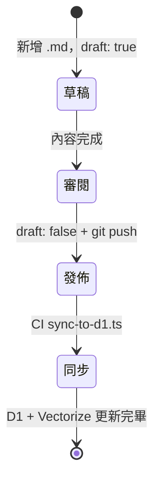

# 撰寫文章指南

## 文章生命週期


```mermaid
stateDiagram-v2
  [*] --> 草稿: 新增 .md，draft: true
  草稿 --> 審閱: 內容完成
  審閱 --> 發佈: draft: false + git push
  發佈 --> 同步: CI sync-to-d1.ts
  同步 --> [*]: D1 + Vectorize 更新完畢
```

## 目錄結構

```
src/content/
├── posts/
│   ├── tech/
│   ├── product/
│   ├── learning/
│   ├── creative/
│   ├── life/
│   └── <category>/
│       └── YYYY-MM-DD-<slug>.md
```

`/projects` 目前不是獨立 content collection；作品集頁面讀取 `posts` 裡 `type: case-study`、`draft: false` 的文章。

## Frontmatter

```yaml
---
title: ""
date: YYYY-MM-DD
category: ""
tags: []
lang: zh-TW          # zh-TW | en
description: ""      # SEO meta
tldr: ""             # 一句話摘要（tech 強烈建議）
audio_url: ""        # 選填；TTS 音檔 URL
srt_url: ""          # 選填；字幕 URL
draft: false
pinned: false        # 選填；作品集排序可用
type: case-study     # 選填；見下方文章類型
---
```

### 支援分類

新文章使用五個主分類：

| Category | 適用內容 |
|----------|---------|
| `tech` | 技術問題解決、工具介紹、架構設計、工程實踐 |
| `product` | 產品設計、UX、功能開發、市場策略 |
| `learning` | 概念解說、知識整理、AI/教育/政策主題 |
| `creative` | 電影、動漫、設計、衝浪、咖啡、旅遊 |
| `life` | 日常記錄、職涯、個人反思 |

`src/content.config.ts` 目前以 `z.string()` 接受 `category`，所以舊文章可能仍有 `career` 等歷史分類；文件與新文章以五類為準。`ai`、`design`、`film`、`coffee`、`career` 等主題應放在 `tags`。

### Tags

`tags` 必填，可為空陣列；建議使用全小寫 kebab-case。

推薦主題 tags：

`ai` / `marketing` / `design` / `film` / `anime` / `coffee` / `surf` / `travel` / `career` / `policy` / `education`

技術 tags 依內容選用，例如 `astro`、`cloudflare`、`llm`、`react`、`d1`、`vectorize`。

### 文章類型

`type` 選填，主要供爬蟲文章與作品集頁面使用；schema 接受：

`debug` / `deep-dive` / `guide` / `how-to` / `listicle` / `explainer` / `case-study` / `comparison` / `research` / `newsjacking`

`/projects` 會列出 `type: case-study`、`lang: zh-TW`、`draft: false` 的文章，並可用 `pinned: true` 置頂。

### 參考資料

只要文章引用工具、框架、官方文件、論文、版本資訊、數據比較、外部說法，就在文末補 `## 參考資料`，至少放 1 個有效 Markdown 連結。

tech / learning / product 類文章，以及帶有 `ai` / `policy` / `education` / `marketing` tag 的文章，預設應附參考資料。

## Commit 格式

```
post(<category>): <標題摘要>
```

範例：`post(tech): Cloudflare D1 batch timeout 踩坑`
