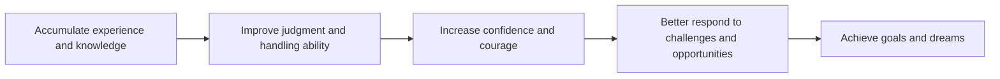

**Don't Envy Those Who Dare to Travel Abroad or Start a Business; They've Just Seen Enough People**

## TL;DR
The secret to success is not courage, but the accumulation of experience.

## What It Means
The phrase "seen enough people" refers to the accumulation of experience and knowledge. This experience and knowledge can come from various fields, such as work, travel, and learning. When a person accumulates enough experience and knowledge, they can better judge and handle situations, becoming more confident and courageous.

## Why It Matters
In today's society, many people envy those who dare to travel abroad or start a business. However, the real secret is not courage, but the accumulation of experience. With sufficient experience and knowledge, you can better judge and handle situations, becoming more confident and courageous. This enables you to better respond to challenges and opportunities, achieving your goals and dreams.

## How It Works
Here is the workflow of "seen enough people":

## The Difference from Courage
Courage refers to the bravery and determination a person shows when facing challenges and risks. Although courage is important, it is not the only key factor. The real secret is the accumulation of experience and knowledge. With sufficient experience and knowledge, you can better judge and handle situations, becoming more confident and courageous.

## Conclusion
If you want to achieve your goals and dreams, respond better to challenges and opportunities, and become more confident and courageous, you need to accumulate more experience and knowledge. Don't envy those who dare to travel abroad or start a business; instead, learn and accumulate more experience and knowledge.

## References
* 大人的Small Talk - EP666 Don't Envy Those Who Dare to Travel Abroad or Start a Business; They're Not Brave, They've Just Seen Enough People | 大人的Small Talk