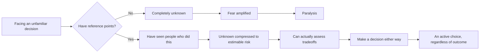

Some people seem to just do things. They say they're moving abroad and then they go. They decide to start a company and actually start it. You might think "they're so brave," or maybe "they just don't think things through." But EP666 of 大人的Small Talk offers a different explanation: those people aren't fundamentally braver. They've just **seen enough people**.

## TL;DR

- "Daring" isn't a fixed personality trait — it's a function of your reference points
- When you've seen enough people "do this thing and be okay afterward," the unknown becomes an estimable risk
- The core of fear is usually "I don't know what will happen," not "I know the outcome will be terrible"
- Expanding your reference points: deliberately seek out people who have done the thing, and hear their real stories
- Envying someone's courage is pointless; finding people who "already did it" and talking to them is actionable

## What Is It

Bryan and Joe's core argument: fear in decision-making comes largely from **uncertainty**, not from accurate risk assessment.

"Moving abroad" is a terrifying idea for many people — but the terror usually isn't "I know life abroad will be miserable." It's "I have no idea what life abroad will be like."

The people who seem fearless have a different internal picture. Their lives contain enough reference points — friends who tried it, relatives who went abroad, people they know who started businesses and either succeeded or failed — that "moving abroad" or "starting a company" has shifted from "completely unknown" to "a risk with a shape."

**Seeing enough people** doesn't mean knowing lots of successful people. It means seeing enough people "who did the thing, and then kept going with their lives" — including people who failed, came back, adjusted, and ended up more or less okay.

## Why It Matters

This framework matters because it moves the question from "am I brave enough" to "are my reference points rich enough."

The first is hard to change: you're either naturally bold or you're not.

The second is deliberately buildable: you can actively seek out people who have done the thing.

It also explains a common sibling pattern: why older children tend to be more risk-averse and younger children more adventurous. The younger sibling watched the older one try things, fail sometimes, cry sometimes, and ultimately be fine. That experience built a reference: "trying and failing isn't the end of the world." The older sibling had no such model to watch.

## How It Works

Fear is largest not when you know the outcome will be bad, but when you have no idea what the outcome will be. Reference points compress "total unknown" into "bounded uncertainty." That's what lets assessment — and decision — happen.

## The Difference from Courage

We typically attribute "daring" to personality: this person is naturally bold, that one is naturally cautious.

Bryan and Joe's framework reframes it:

| Attribution | Explanation | What you can do |
|-------------|-------------|-----------------|
| Courage theory | "They're naturally brave, I'm not" | Nothing — just envy them |
| Reference points theory | "They've seen enough people, I haven't yet" | Deliberately find people who have done the thing |

The reference points framework doesn't say everyone should ultimately go abroad or start a business. It says: your "can't do it" might only be "haven't seen enough people yet" — and that's something you can change.

## What to Actually Do

**Find people who have done the thing, and hear the real story**

Not success stories — those tend to show only the polished parts. Find people who "did it, it didn't work out, and they're still fine" and ask them:

- What was the worst case? Did it actually happen?
- If you could go back, would you do it again?
- What surprised you most that you hadn't expected?

These conversations build an honest reference point, not an idealized expectation.

**Deliberately encounter diverse life paths**

Many people's social circles are highly homogeneous: same educational background, same career trajectory, same life choices. In that environment, anything outside the standard path seems weirdly risky — because you've literally never seen what happens to people who take it.

Deliberately expanding your circle — not to build a network for advantages, but to encounter people who made different choices and see how their lives turned out — is the most natural way to build richer reference points.

## Summary

Envying someone's courage doesn't help, because courage might not even be the real variable. The real variable is how many "people who did the thing" you've seen.

Next time you find yourself thinking "they're so brave, I could never do that," try asking a different question: **how many people do I actually know who have done this? What happened to them?**

If your answer is "I don't know any" or "I have no idea," the bottleneck might not be your courage — it might just be that your reference points aren't rich enough yet.

## References

- [EP666 Do you envy people who dare to go abroad or start a business? They're not actually bold — they've just seen enough people | 大人的Small Talk](https://www.youtube.com/watch?v=_ct0BfDZ0fE)
- [大人的Small Talk | Spotify](https://open.spotify.com/show/6gZUHaC8fOZ7SkCniFkRrZ)
