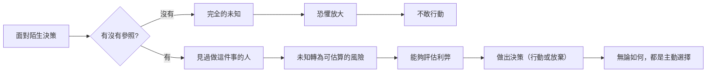

你有沒有見過某種人：他們說要出國就出國，說要創業就創業，好像對那些你覺得很恐怖的事情毫無猶豫。你心裡可能覺得「他們膽子真大」，或者「他們是不是沒想清楚風險」。但大人的Small Talk 的 Bryan 和 Joe 在 EP666 提出了一個不一樣的解釋：那些人不是膽子特別大，他們只是**看過足夠多的人**。

## TL;DR

- 「敢」不是一種天生的人格特質，而是參照系的函數
- 當你見過足夠多「做了這件事之後」的人，未知就變成了可以評估的風險
- 恐懼的核心通常是「不知道會發生什麼」，而不是「知道結果很糟」
- 擴展參照系的方式：刻意接觸做過這件事的人，聽他們真實的經歷
- 羨慕別人的膽量，不如找機會和那些「做過了」的人深談

## 是什麼

Bryan 和 Joe 的核心論點是：人的決策恐懼很大程度來自於**不確定性**，而非真實的風險評估。

「出國工作/生活」對很多人來說是個可怕的想法，但可怕的點通常不是「我知道出去之後會很慘」，而是「我不知道出去之後會怎樣」。

而那些看起來很敢的人，他們的差別在於：他們的生命裡有足夠多的參照點——朋友去過了、家人出過國、認識的人創業成功或失敗了——這些真實案例讓「出國」或「創業」從「完全未知」變成了「有範圍的風險」。

**見過足夠多的人**，不是指認識很多「成功的人」，而是見過很多「做了這件事，然後繼續過下去的人」——包括失敗了、回來了、調整了方向、過得還不錯的人。

## 為什麼重要

這個觀點很重要，因為它把問題從「我夠不夠勇敢」轉移到了「我的參照系夠不夠豐富」。

前者很難改變：你要不就是天生勇敢，要不就是不是。

後者可以刻意改變：你可以主動去接觸那些「做過了」的人。

這也解釋了一個常見現象：為什麼同一個家庭出來的孩子，老大比較不敢冒險，老么卻比較膽大？因為老么從小就看著老大嘗試各種事情，即使老大失敗了、哭了、最後也還好，老么建立了一個參照：「嘗試失敗，不是世界末日。」

## 怎麼運作

恐懼最大的地方，不是你知道結果很壞，而是你完全不知道結果是什麼。參照系的作用是把「完全未知」壓縮成「有範圍的不確定性」。

## 跟「膽量」的差別

我們通常把「敢不敢」歸因於性格：這個人天生勇敢，那個人天生膽小。

但 Bryan 和 Joe 的框架讓我們重新看：

| 歸因框架 | 解釋 | 行動意涵 |
|---------|------|---------|
| 膽量論 | 「他天生就勇敢，我不是」 | 沒有改變空間，只能羨慕 |
| 參照系論 | 「他見過足夠多的人，我還沒有」 | 可以刻意去接觸那些「做過了」的人 |

參照系論不是說每個人最後都應該去創業或出國——而是說，你的「不敢」可能只是「還沒見過足夠多的人」的結果，而這是可以改變的。

## 實際怎麼做

**找到做過這件事的人，聽真實的故事**

不是去讀成功案例（那些往往只講光鮮的部分），而是找到「做了、失敗了、還是過下去了」的人，問他們：

- 最壞的情況是什麼？最後發生了嗎？
- 如果重來，你還會做嗎？
- 當時最讓你意外的是什麼？

這些對話建立的是真實的參照系，而不是理想化的期待。

**刻意接觸多元的生命軌跡**

很多人的交友圈同質性很高：同樣的教育背景、同樣的職業路線、同樣的人生選擇。在這種環境裡，「不在這個路徑上的選擇」當然會顯得異常可怕，因為你從來沒見過「走那條路的人後來怎麼了」。

刻意擴展交友圈——不是為了找成功的人際網絡，而是為了見識不同的生命選擇——是擴展參照系最自然的方式。

## 小結

羨慕別人的膽量是沒有用的，因為膽量可能根本不是真正的差別所在。真正的差別在於：他們的參照系讓「未知」縮小到可以評估。

下次當你覺得「那個人真勇敢，我做不到」，試著換一個問題問自己：**我認識幾個做過這件事的人？他們後來怎麼了？**

如果你的答案是「不認識」或「不知道」，那問題可能不是你的膽量，而是你的參照系還不夠豐富。

## 參考資料

- [EP666 你羨慕那些敢出國、敢創業的人嗎？他們其實不是膽子大，而是看過的人夠多！｜大人的Small Talk](https://www.youtube.com/watch?v=_ct0BfDZ0fE)
- [大人的Small Talk | Spotify](https://open.spotify.com/show/6gZUHaC8fOZ7SkCniFkRrZ)
