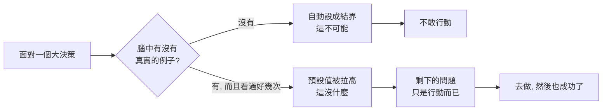

大人的Small Talk 這集，Bryan 從一場早餐聚會聊起。一位朋友認真地對他說：「你膽子比我大很多，當年你很勇敢地出國讀書、去紐約工作，後來還自己出來創業，這三件事我都不敢。」

Bryan 聽完一直在想這件事，因為他從小到大都不覺得自己膽子大——他身邊一直有那種敢冒險的朋友，他很清楚自己絕對不是。可是回家後仔細回顧出國讀書、出國工作、創業這三件事，他發現：它們對他來說確實是「突破」，卻好像都沒有真的動用到「大膽」。

## 三件大事，其實一點都不陌生

**出國讀書**。Bryan 高中、大學就立志出國，原因是他有幾位大他十幾歲的表哥表姐都出國讀書了。他念小學時，這些表哥表姐就在念大學、準備出國。對他來說出國很難、要努力、要突破，但**從來不是一件不可能的事**——因為身邊就有不只一個活生生的例子，他甚至知道有問題可以去問他們（雖然後來他幾乎沒真的問過、也沒真的需要被誰救）。他親眼看著表哥表姐念完、留在美國工作，看起來也很順利。

**出國工作**。其實是同一個道理。那些出國念過書的表哥表姐都在美國上過班，他爸爸也有一些朋友年輕時出國後就留在美國工作。所以 Bryan 很小就知道「有些台灣人是在美國工作的」——這件事厲害、要挑戰，但對他不是天方夜譚。

**創業**。這件事小時候對他才真的陌生，因為家族裡很少長輩創業。他原本想的人生就是好好讀書、進好公司、頂多當個主管。轉折發生在他到芝加哥西北大學念專案管理的時候——那是 2003、2004 年，正逢一波創業潮。他發現研究室裡一起瞎聊的外國同學，成績沒特別好、人也沒特別聰明，但超過一半的人都有創業夢，畢業後要回國做這做那，甚至有人是一邊創業一邊來念書。聽著聽著，他突然覺得創業好像也沒那麼了不起、是可以聊、可以分析、可以規劃的——而且這些人的作業還要抄他的，他們都敢當大老闆，自己為什麼不行？

而那位說 Bryan 膽子大的朋友，在 Bryan 眼中其實才是膽子超大的人：同樣念工程，卻一天工程都沒做，研究所一畢業就投入金融，很年輕就當分析師、交易員，待過財經媒體、親自去訪問上市櫃公司的老闆，後來自己當基金經理人、做私募基金，手上操盤的錢「沒有百億也有十億」。對 Bryan 來說那是二、三十歲絕對不敢做的事——但對這位從年輕就泡在金融業、看著前輩隨便操盤好幾億的朋友來說，這也沒什麼。

兩個人互相覺得對方膽子大。Bryan 的結論是：**膽子大小可能根本不是天性，而跟你的「預設值」有關**。

## 關鍵不是膽子，是例子

Bryan 後來查了一下，發現這件事真的有學者在研究。

學者 Bandura 在 1977 年提出**社會學習理論**：人類的學習與認知，常常不是靠自己做過的事，而是看別人做了什麼然後模仿。講白話就是——很多事你沒親自經歷過，但因為看到身邊的人做了，你就敢照著做。Bryan 看著表哥表姐出國、又在國外工作，等於有了一本「人體教科書」，照著做就好，這件事就不那麼可怕了。

另一位他很欣賞的心理學家、《快思慢想》作者 Kahneman，提出**可得性捷思**（availability heuristic）：當我們判斷一件事可不可能、會不會太難，靠的是「腦子有多快想到相關的例子」。越容易想到例子，就越覺得這件事可行；如果大腦對這件事毫無經驗，就會直覺認定它不可能。

> 所以關鍵不是膽子，是例子。同一件事，圈內人覺得「這沒什麼」，圈外沒見過的人覺得「太瘋狂了」。差別不在膽量、毅力、決心或氣魄，而在於我們腦中資料庫裡的案例不一樣。

## 四分鐘一英里：當一個人破牆，所有人跟上

Bryan 用一個經典故事說明「預設值」的威力。

1954 年以前，運動與醫學界有個定論：一英里（約 1.6 公里）的賽跑，人類再快也不可能在 4 分鐘內跑完，甚至有學者說硬逼到 4 分鐘以內會破壞身體結構、嚴重傷害健康。4 分鐘像一堵牆，被視為人類生理極限。

結果 1954 年 5 月 6 日，賽跑選手 Bannister 跑出 **3 分 59 秒 4**，震驚全世界體育界。更驚人的是，這個世界紀錄只維持了 46 天——6 月 21 日，澳洲選手 John Landy 跑出 **3 分 57 秒 9**，又快了 2 秒。接下來 3 年內，全世界陸續有 **15 個人**跑進 4 分鐘。

幾百年沒人破的牆，一旦破了，後面全部跟上。人類的腿不可能在 1954 年突然基因突變，唯一的解釋就是——大家腦中的預設值同時被改寫了。在 Bannister 之前，所有選手心裡都知道「逼近 4 分鐘就好」；當有一個傢伙證明玻璃天花板不存在，所有人的預設值瞬間提高，於是瘋狂打破紀錄。

## 這種現象，到處都是

**PayPal 幫。** PayPal 被 eBay 併購後，當初的創辦團隊散開來各自再創業，結果一個比一個誇張：Musk 後來做了 Tesla、SpaceX、Neuralink；Reid Hoffman 創辦 LinkedIn；Chad Hurley、Steve Chen 一起做了 YouTube；Peter Thiel 做了 Palantir（如今連美國國防部都在用）；連 Yelp 也是 PayPal 幫的人創立的。怎麼會這麼巧？Bryan 認為關鍵是——他們曾經彼此看過對方怎麼工作，一起把一家公司從零做到被收購。**有過一次，第二次的預設值就低很多。**

**矽谷的印度籍 CEO。** Google 的 Pichai、Microsoft 的 Nadella、YouTube 的 Mohan 都是印度裔。Bryan 這集不談民族性，而是從預設值的角度推論：一開始只有少數印度工程師爬到高階主管、CEO，後來大家發現「跟我一樣從印度來、一樣靠軟體往上爬的老鄉，都能當到 CEO」，加上印度社群家族緊密、彼此都認識——「張媽媽、李阿姨的小孩當了某家科技公司 CEO」——當這成了身邊老鄉正在做的事，預設值就放開了，剩下的結論只是「練啊」。

## 少年大人學：把孩子的預設門檻拉高

Bryan 提到大人學近年開了一門給國高中生的「少年大人學」，用專案管理的方式幫學生拆解未來的理想。開課前他電訪報名家長，一位爸爸的回答讓他印象深刻：孩子能不能在這堂三個半小時的工作坊裡找到夢想、學到很有用的東西，不是重點；他在意的是讓孩子「跟這樣的人做一些交流、開開眼界」。

後來的學員問卷印證了這點。有個學生寫道：他來之前的夢想就是考試考前幾名，結果現場看到年紀相仿、甚至更小的同學，有人想去蘋果上班、有人想當建築師、有人已經在想創業——他被震懾到了。最大的收穫不是他自己的夢想多偉大，而是**他看到了一個比自己預設值更高的世界**。

Bryan 說，這正是教育能改變未來的原因：一個窮困鄉下的孩子，身邊沒有例子，會自動把人生設限在「能吃飽、做勞力工作就了不起了」；但只要透過教育或體驗，讓他看到「也有很窮、小時候成績很爛的人當上總統或 CEO」，預設門檻就被整個拉高。重點不是他長大後真的多了不起，而是人生的維度被打開、可能性變多——這就是文明一代代進步的根基。

## 重新定義「向上社交」

這幾年很多人談向上社交：要跟比你強的人在一起。但傳統想法是去「要資源」——認識大老闆，希望他投資你、拉你一把。很多人去了發現沒被拉一把，又有骨氣不想求人，最後結論是「向上社交沒意義」。

Bryan 給了一個完全不同的定義：向上社交不是去拿資源，甚至不是去學他怎麼做到的——**你光是站在他旁邊看著，就有效了**。當年在美國，他根本沒問同學創業要準備多少錢，只是聽他們聊創業大夢，就已經被影響，覺得創業沒那麼可怕。

所以他鼓勵大家盡量**近距離接觸真實的人**——不是看網路影片（那沒用），而是真的跟對方對話、站在他旁邊看他的言行舉止。光是知道他做了某個突破、而且也活下來了、也沒什麼，你的預設值就會整個拉高一個維度。**而且他的預設值會變成你的預設值，你完全不用跟他要求任何東西。**

他補充一個自己的觀察：為什麼你對電視上富豪買 1 億跑車、周杰倫買 3000 萬超跑毫無感覺，但鄰居換了一台新的 Toyota 你卻很有 feel？因為後者跟你的生活有連結。例子要有效，就得是你日常氛圍的一部分。

## 開地圖，把預設值的最大值都抓回來

Bryan 還講了一位聽眾的故事。這位工程師將來想當 PM，寫信問有沒有專案管理的線上課；得知只有實體課後，他覺得「這個時代還要特地坐高鐵來台北、找旅館住，是誰會做這種蠢事」。被說服來上課後，他卻大受震撼——不是課講得多好，而是現場 48 個同學一大早就到、有人請假、有人從南部甚至馬來西亞、新加坡飛來，有些人已經上了二十幾門課。這徹底打破他的三觀：原來真的很多人在這樣投資自己，而且都還蠻優秀的。從那天起，他覺得自費上實體課「沒什麼了」，因為**他的預設值整個被改變了**。

Bryan 把這整套心得收束成一個比喻：就像玩即時戰略遊戲，一開始畫面邊緣全是「戰爭迷霧」，你只看得到中間一個亮點。你得自己往前、往左、往右走到底，地圖才會一塊塊亮起來——這邊一片海、那邊一堆金礦。我們用社交去認識這些人，不是要從他們身上拿什麼，而是去開地圖、增加自己的預設值。

具體做法：去接觸那些「幹過你沒幹過的事」的人，不一定要外向地交朋友，光是處在同一個空間、講上兩句、成為彼此認識的人就行。如果一週認識一個，幾個月後你就有 10 個人——有人在出國這件事上預設值比你高、有人在賺錢上比你高、有人在待人接物上比你高、有人在學習能力上比你高。你把每個維度的最大值都抓回來，整個人的維度就提升了、預設值就變大、你就自由了。

## 寫在最後

所以，不要怪自己膽子小。如果你真心想突破，能立刻執行的，就是去近距離接觸那些「做過你還沒做過的事、而且也好好活下來」的人。

> 我們以為自己缺的是膽子，其實真正缺的，是腦子裡能快速調出來的真實例子。膽子大的人，往往只是例子多。

當你有了例子，腦中的選項瞬間變多，你也就更能做到大人學常講的那句話——相信思考，勇於改變。

## 參考資料

- [EP666 你羨慕那些敢出國、敢創業的人嗎？他們其實不是膽子大，而是看過的人夠多！｜大人的Small Talk](https://www.youtube.com/watch?v=_ct0BfDZ0fE)
- [大人的Small Talk | Spotify](https://open.spotify.com/show/6gZUHaC8fOZ7SkCniFkRrZ)
