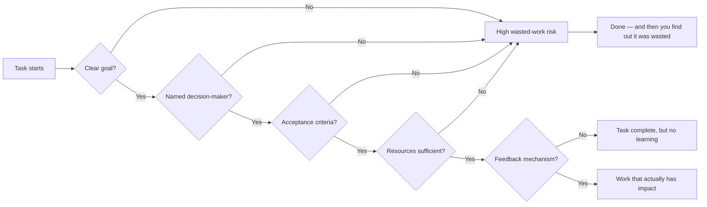

Have you ever spent weeks on a project, delivered it, and discovered that "the direction was completely wrong from the start"? Or run dozens of meetings on a task where nobody had authority to make a decision — and watched it quietly disappear without resolution? This isn't bad luck, and it's not your fault. EP667 of 大人的Small Talk names this pattern "sucker tasks" (冤大頭工作), and identifies five structural causes you can learn to recognize before they consume your time.

## TL;DR

- **Sucker tasks** aren't random — they follow five identifiable structural patterns
- Five root causes: unclear goals, no decision-maker, no acceptance criteria, insufficient resources, no feedback loop
- Most wasted work already contains at least one of these causes before it starts
- The fix isn't working harder — it's asking the right questions before you begin
- This is a shared responsibility between employees and managers

## What Makes a Task "Wasted Work"

Not all hard or frustrating work is wasted work. The specific pattern: **you invest significant time and energy, and the output has near-zero actual impact**. Unlike "busy work" (which is exhausting but produces results), sucker tasks are structurally doomed from the start — you just usually don't find out until after you've finished.

## Cause 1: No Clear Goal

"Make this good," "clean this up," "look into it" — what these assignments share: no clear completion standard.

When the goal is unclear, the executor has to guess. Guessing right is luck; guessing wrong is wasted work. And whether you guess right depends on how well you understand what the assigner expects, not on your actual ability.

**The fix**: Before accepting a task, ask: "What does done look like? What form is the output? Who uses it?" If the answer is "whatever you think," that's a warning sign — the goal itself hasn't been thought through.

## Cause 2: No Decision-Maker

A task is running, but who has authority to say "this is good enough"?

Much wasted work in organizations happens because the person who can approve the work isn't available, or there simply isn't a single owner for the task. The result: endless revision cycles, indefinite "let's review it again" loops, or the task simply disappearing with no resolution.

**The fix**: Confirm that there's one named decision-maker, and that their availability aligns with the task's timeline. If the decision-maker's window is uncertain, align on "when can I get a clear direction?" before starting work — not after.

## Cause 3: No Acceptance Criteria

Even when the high-level goal is clear, "what level of done counts as done" is often left undefined.

This puts the executor in a state of sustained anxiety: unsure how detailed to go, whether to dig deeper, worried about doing too little or too much. It also makes it impossible for the assigner to assess whether "what was delivered is what I wanted."

**The fix**: Before starting, use something like "If I deliver X, would you consider this task complete?" to force acceptance criteria into the open.

## Cause 4: Insufficient Resources

Resources means: time, people, information access, decision authority.

When task expectations and available resources are mismatched, wasted work is nearly inevitable. The most common version: being asked to produce a report in a week that needs a month of data gathering; needing cross-team coordination with no coordination mechanism; needing a decision approved through too many layers to be timely.

The executor's choices are: produce something that looks complete but is actually cobbled together — or say clearly upfront that "this level of resource can't meet this expectation." The second is harder to say; the first is a direct path to wasted work.

**The fix**: After receiving a task, immediately ask: "What do I need to achieve this?" If resources and goals don't match, surface this before starting — not halfway through.

## Cause 5: No Feedback Loop

Some tasks are delivered and then disappear. No "looks good," no "this doesn't work," no "here's how this gets used."

For the executor, this removes meaning. For the organization, it removes any learning opportunity — the same wasted-work pattern can reappear three months later.

**The fix**: After a task is complete, proactively follow up on how the output was used. Not just for personal satisfaction — to build a feedback loop: "Was this useful? Which parts? Which weren't?" This information makes your next piece of work more directionally sound.

## The Structural Picture

## Summary

Sucker tasks are hard to avoid because at the start they look identical to real work — same meetings, same output requirements, same time investment. The difference is structural: when any of the five causes is present, the task is architecturally unlikely to produce actual impact.

Recognizing these five causes isn't about shifting blame ("that's the manager's problem"). It's about knowing what questions to ask before the task begins. Most sucker tasks can be identified in the first 30 minutes of receiving the assignment — if you know what to look for.

## References

- [EP667 Why Are You Always Doing Wasted Work? 5 Root Causes and Solutions | 大人的Small Talk](https://www.youtube.com/watch?v=CAw_sR-k1P8)
- [大人的Small Talk | Apple Podcasts](https://podcasts.apple.com/us/podcast/%E5%A4%A7%E4%BA%BA%E7%9A%84small-talk/id1452688611)
