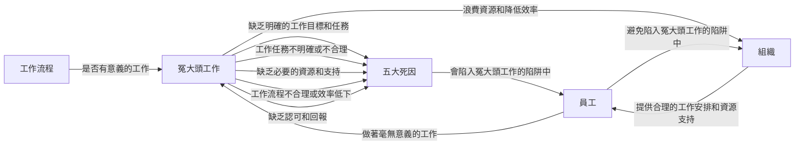

Why Are You Always Doing Unrewarding Work? The Five Deadly Sins of "Thankless Jobs" and How to Overcome Them

## TL;DR
Thankless jobs refer to tasks that appear meaningful but are actually worthless.

## What is it
Thankless jobs are tasks that seem meaningful but are actually worthless. They often result from poor management or leadership decisions, or from employees' own unwise choices, leading to employees doing meaningless work. These tasks not only waste employees' time and energy but also lower their morale and job satisfaction.

## Why is it important
Thankless jobs have negative impacts on both employees and organizations. Employees may feel frustrated and dissatisfied, even to the point of quitting, while organizations waste resources and decrease efficiency. Therefore, understanding and avoiding thankless jobs is crucial for both employees and organizations.

## How does it work
Thankless jobs usually result from the following five deadly sins:

1. Lack of clear work objectives and tasks
2. Unclear or unreasonable work tasks
3. Lack of necessary resources and support
4. Unreasonable or inefficient work processes
5. Lack of recognition and rewards

When these deadly sins occur, employees fall into the trap of thankless jobs, doing meaningless work.

## Difference from "Busy Work"
Busy work refers to tasks that require employees to complete a large amount of work in a short time, often requiring a lot of time and energy. However, busy work differs from thankless work. Busy work is at least meaningful, whereas thankless work is not.

## Conclusion
Thankless jobs have negative impacts on both employees and organizations, making it essential to understand and avoid them. Employees need to learn how to identify and avoid thankless jobs, while managers and leaders must provide reasonable work arrangements and resource support. Only then can employees avoid falling into the trap of thankless jobs and doing meaningless work.

## References
* 《大人的Small Talk》EP667：Why Are You Always Doing Unrewarding Work? The Five Deadly Sins of "Thankless Jobs" and How to Overcome Them

## Technical Structure Diagram

