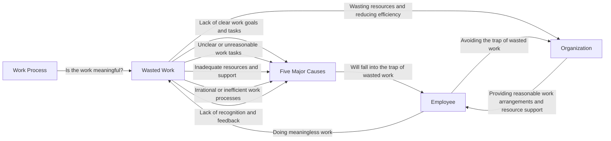

## The Truth About Wasted Work: Why You're Constantly Doing Non-Essential Tasks

Are you busy at work, but have you ever stopped to think if your tasks are truly meaningful? Or are you just doing "wasted work" that has no value? This type of work not only wastes your time but also affects the organization's efficiency and resources. Today, we'll explore the truth about wasted work, its five major causes, and how to avoid this trap.

## TL;DR
Wasted work refers to tasks that seem meaningful but have no value. Employees need to learn to identify and avoid these tasks, while managers and leaders must provide reasonable work arrangements and resource support.

## What is Wasted Work and Why is it Happening Now
Wasted work refers to tasks that seem meaningful but have no value. This type of work often results from poor management or leadership, or employees' own poor choices, leading to them doing meaningless work. With the changing work environment and management models, the problem of wasted work has become more common.

## How it Works
Wasted work usually stems from five major causes:

1. Lack of clear work goals and tasks
2. Unclear or unreasonable work tasks
3. Inadequate resources and support
4. Irrational or inefficient work processes
5. Lack of recognition and feedback

## The Difference from "Busy Work"
Busy work refers to employees completing a large amount of tasks in a short time, requiring a lot of time and effort. However, busy work is different from wasted work. Busy work is at least meaningful, whereas wasted work is not.

## The Impact of Wasted Work
Wasted work has negative effects on both employees and organizations. Employees feel frustrated and dissatisfied, which may lead to turnover. Organizations also waste resources and reduce efficiency due to these meaningless tasks. Therefore, understanding and avoiding wasted work is crucial for both employees and organizations. Employees need to learn to identify and avoid wasted work, while managers and leaders must provide reasonable work arrangements and resource support.

## References
* 《大人的Small Talk》EP667：Why You're Constantly Doing Non-Essential Tasks? The Five Major Causes and Solutions to Wasted Work
* [EP667 Why You're Constantly Doing Non-Essential Tasks? The Five Major Causes and Solutions to Wasted Work｜大人的Small Talk](https://www.youtube.com/watch?v=CAw_sR-k1P8)