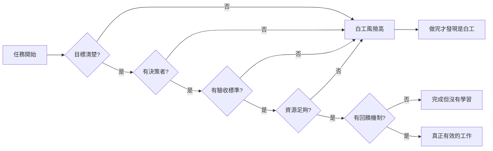

你是否有過這種經驗：花了好幾週做完一個專案，交出去之後卻發現「方向根本就不對」？或者開了幾十場會，最後發現決策根本沒人負責，這個任務就這樣消失了？這不是倒楣，也不是你做錯了什麼。大人的Small Talk EP667 把這種現象稱為「冤大頭工作」，而且它背後有可識別的五個死因。

## TL;DR

- **冤大頭工作**不是偶然，而是有五個可識別的結構性原因
- 五大死因：目標不清、決策者缺席、沒有驗收標準、資源不足、沒有回饋迴路
- 大部分的白工在「開始之前」就已經命中至少一個死因
- 破解方法不是更努力，而是在接受任務前就把關鍵問題問清楚
- 這是員工和管理者都需要負責的結構問題

## TL;DR（詳版）

不是每個努力都值得被努力。冤大頭工作的核心特徵是：**付出了相當的時間和精力，但產生的實際影響接近於零**。不同於忙碌工作（忙但有成果），冤大頭工作的輸出從一開始就注定沒有意義——只是這個事實通常要到工作結束之後才變得清楚。

## 成因一：目標不清

「把這個做好」、「整理一下」、「研究看看」——這類任務描述的共同問題是：完成的標準在哪裡？

當目標不清楚，執行者只能靠猜測。猜對了叫運氣，猜錯了就是白工。而且猜錯的機率取決於你對「出題者的期待」的理解程度，而非你的能力。

**破解方式**：在接受任務前，主動問出「這個任務的完成標準是什麼？最後的輸出是什麼形式？給誰用？」如果對方說「隨便你」，這是一個警訊，代表目標本身就沒想清楚。

## 成因二：沒有決策者

任務啟動了，但誰有權力說「這樣就好了」？

很多工作的白工來自於：執行者做完了，但能拍板的人沒有空，或者這個任務根本沒有一個明確的負責人。結果是：反覆修改、無止境的「再看看」，或者任務就這樣消失，沒有人知道它去哪了。

**破解方式**：確認任務有一個明確的決策者，而且這個人的時程和這個任務的時程是對得上的。如果決策者的窗口不確定，先討論「什麼時候能得到明確的方向」，而不是先開始做。

## 成因三：沒有驗收標準

即使目標大方向是清楚的，「做到什麼程度算達標」常常是模糊的。

這讓執行者處於一種持續焦慮的狀態：不知道要做到多細、不確定要不要繼續深入、擔心做太少或做太多。同時，給任務的人也無法判斷「這個交出來的東西，有沒有達到我要的」。

**破解方式**：在任務開始前，用「如果我交出 X，你會認為這個任務完成了嗎？」這類具體的確認問題，把驗收標準逼出來。

## 成因四：資源不足

資源包括：時間、人力、資訊存取、決策授權。

當任務的期待和可用資源不相稱，白工幾乎是必然結果。最常見的情境是：被要求在一週內完成需要一個月資料蒐集的報告、需要跨部門協作但沒有協調機制、需要某個決策授權但需要層層審批。

執行者在這種情況下的選擇是：做一個「看起來完整但實際上是湊出來的」東西，或者一開始就說清楚「這樣的資源做不到這樣的期待」。後者通常更難開口，但前者是做白工的捷徑。

**破解方式**：拿到任務後，先確認「要達到這個目標，我需要什麼？」如果資源和目標不匹配，在開始之前就提出，而不是做到一半再說。

## 成因五：沒有回饋迴路

有些任務做完之後，送出去就石沉大海。沒有人說好，沒有人說不好，也沒有人說「這個之後會怎麼用」。

對執行者來說，這讓工作失去意義感；對整個組織來說，這代表沒有學習機會——同樣的白工可能在三個月後再出現一次。

**破解方式**：在任務結束後，主動跟進輸出的使用情況。不只是為了自我滿足，而是為了建立回饋迴路：「這個有用嗎？哪裡有用？哪裡沒用？」這些資訊讓你下次的工作更有方向。

## 整體結構

## 總結

冤大頭工作之所以難避免，是因為它在開始的時候看起來和真正的工作一樣——同樣需要開會、同樣需要產出、同樣需要花時間。差別在於：當五個死因中的任何一個存在，這個任務在結構上就很難產生實際影響。

識別這五個死因不是為了推卸責任（「這是主管的問題」），而是為了在任務開始前就把問題問清楚。大多數的冤大頭工作，其實可以在接任務的前 30 分鐘就被識別出來——如果你知道要問什麼問題。

## 參考資料

- [EP667 為什麼你總是在做白工？職場「冤大頭工作」的五大死因與破解之道｜大人的Small Talk](https://www.youtube.com/watch?v=CAw_sR-k1P8)
- [大人的Small Talk | Apple Podcasts](https://podcasts.apple.com/us/podcast/%E5%A4%A7%E4%BA%BA%E7%9A%84small-talk/id1452688611)
