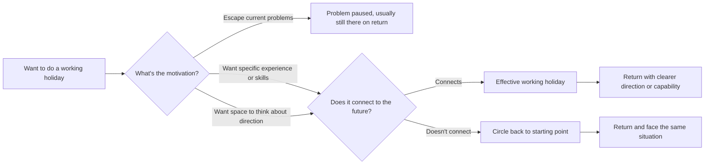

"I want to do a working holiday" — this sentence contains a lot of different motivations. Some people genuinely want to experience a different way of life. Some want to temporarily escape their current job pressure. Some feel that "going to see the world" is inherently valuable. Others hope the experience will make their resume more competitive. EP669 of 大人的Small Talk breaks the question open: does a working holiday actually help? Without thinking it through carefully, you might just go in a circle and come back to the same starting point.

## TL;DR

- Working holidays themselves are neither good nor bad — the question is **whether the experience will connect to where you actually want to go**
- The most common mistake: assuming "going abroad for a while" has inherent value without thinking concretely about what you're getting out of it
- If the motivation is "escape my current situation," a working holiday typically just pauses the problem rather than resolving it
- An effective working holiday has a clear purpose and a plan for how you'll use the experience when you return
- Ask yourself: "If nothing changes after the working holiday, am I okay with that?"

## What Is It

A working holiday is a visa scheme that combines work and travel, typically open to people aged 18–35, allowing legal employment in a country for one to two years. Common destinations for Taiwanese include Australia, New Zealand, the UK, and Canada. Jobs typically cluster in food service, agriculture, and retail — work as a means to fund the experience, not as the experience itself.

A working holiday is not the same as expat employment. The latter means using your existing professional skills to find a corresponding role abroad; the former is primarily about experience and travel, with work as the vehicle.

## Why It Matters

A working holiday is a significant life decision — not because it's inherently good or bad, but because its opportunity costs are real:

- Time you could spend accumulating professional experience in your home country
- Relationships and networks you could be building in your career trajectory
- If you're in a career inflection point — a promotion window, a transition period — the cost of pausing can be higher than at other times

These aren't reasons to not go. They're items to honestly calculate before deciding.

## How It Works

Bryan and Joe's analytical framework: whether a working holiday "connects" to your future depends on whether, before you go, you know what "connecting" looks like.

**The critical question isn't "should I go" — it's "what are you planning to bring back?"**

## Compared to Staying and Working

| | Working Holiday | Staying and Building |
|-|-----------------|---------------------|
| What you gain | Life experience, language immersion, exposure to different work cultures | Career continuity, professional depth, local network |
| What you give up | Career momentum at home, advancement windows, peer progress | The specific experience available only at this life stage |
| Right for | People with a clear purpose who can integrate it into their career | People clear on their direction who want to go deeper |

Neither is inherently better. The point is: **choices have costs, and acknowledging costs is how you make a clear-eyed choice**.

## When a Working Holiday Makes Sense

**You have a specific learning goal**: you're going to work in a kitchen because you want to understand the Australian restaurant industry before opening your own place; you want to work in an English-language environment for a year to build real-world business English. The experience has a clear "hook" back into your future.

**There's a natural pause point in your career**: after finishing a degree, after leaving a job, after a project wraps — these are natural windows where the opportunity cost of pausing is relatively low.

**You know what you'll do when you come back**: the plan doesn't have to be hyper-specific, but the direction should be clear. "I'll figure it out when I get back" usually means the working holiday becomes an expensive delay of a necessary decision.

## When to Think Twice

**You're just trying to escape**: if your current job is painful, a working holiday typically just suspends the problem. When you return, the same situation is waiting — possibly with the added friction of explaining a gap.

**You can't articulate how this experience will be useful**: "going to see the world" is a legitimate reason, but if you can't even tell yourself "I saw the world, and then what?", the working holiday's contribution to your career will be limited.

**The timing is genuinely bad**: if you're in a genuine career inflection point — early in a high-growth company, on a promotion track, in a field where continuity matters — the cost of pausing is higher than at other life stages.

## Summary

A working holiday is a choice with real costs — it isn't "all upside, no downside." Bryan and Joe's core point: **if the experience doesn't connect to the path you actually want to take, you may just loop around and come back to exactly where you started** — with a few stories to tell, but no career progress.

This isn't an argument against going. It's an argument for thinking through "what comes after" before booking the flight. If that next step is clear, a working holiday can be genuinely valuable. If that next step is foggy, clarifying it is more important than booking the ticket.

## References

- [EP669 Should I Do a Working Holiday? If It Doesn't Connect to Your Future Path, You Might Just Circle Back | 大人的Small Talk](https://www.youtube.com/watch?v=MdjuMkl_OEs)
- [大人的Small Talk | Spotify](https://open.spotify.com/show/6gZUHaC8fOZ7SkCniFkRrZ)
