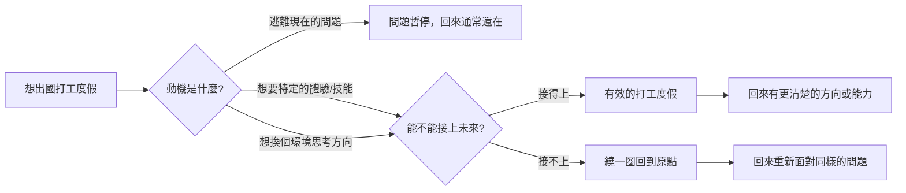

「我想去打工度假」——這句話背後藏著很多不同的動機：有人是真的想體驗不同的生活方式，有人是想暫時逃離現在的工作壓力，有人覺得「出去看看」總是好的，有人則是希望這段經驗能讓履歷更有競爭力。大人的Small Talk EP669 把這個問題拆開來問：打工度假到底有沒有用？如果沒有想清楚，可能真的只是繞了一圈又回到原點。

## TL;DR

- 打工度假本身沒有好壞，問題在於**這段經驗能不能接上你想走的路**
- 最常見的誤區：以為「出去一段時間」本身就有價值，而不思考具體獲得了什麼
- 如果動機是「逃離現在的困境」，打工度假通常只是把問題暫停，不是解決
- 有效的打工度假：有明確的目的、知道回來之後要用這段經驗做什麼
- 問自己：「如果打工度假之後什麼都沒變，我是否願意接受這個結果？」

## 是什麼

打工度假（Working Holiday）是一種結合工作和旅遊的簽證制度，通常開放給 18-35 歲的年輕人，允許在一個國家停留 1-2 年並合法工作。

對很多台灣人來說，澳洲、紐西蘭、英國、加拿大是常見的目的地。工作通常集中在餐飲、農場、零售等領域，目的是支撐在當地的生活費。

打工度假不等於海外工作（Expat）——後者通常是用原有的專業在海外找到對應的職位，前者更多是為了體驗和旅行，工作是手段，不是目的。

## 為什麼重要

打工度假是一個人生階段的重要決策，不是因為它一定好或一定壞，而是因為它的機會成本是真實的：

- 在台灣繼續累積工作經驗的時間
- 在原本職涯路徑上建立的人際網絡
- 如果是在職場關鍵時期（升遷窗口、轉型期），放棄可能代價高昂

這些成本不是「不能去」的理由，但應該是決策前清楚計算的項目。

## 怎麼運作

Bryan 和 Joe 的分析框架是：打工度假能不能「接上」你的未來，取決於你去之前就知不知道「接上」的邏輯是什麼。

**關鍵問題不是「要不要去」，而是「去了之後，你打算帶著什麼回來？」**

## 跟留在台灣繼續工作的差別

| | 打工度假 | 留在原地繼續工作 |
|-|---------|----------------|
| 得到的 | 生活體驗、語言環境、不同文化的工作方式 | 職涯累積、專業深化、在地人脈 |
| 失去的 | 台灣的職涯連續性、升遷時間、同儕的進度差距 | 特定時間點才能有的體驗 |
| 適合的人 | 有明確目的、能夠整合回職涯的人 | 對目前方向清楚且想深化的人 |

這不是要說哪個選擇比較好，而是說：**選擇是有成本的，承認成本才能做出清醒的選擇**。

## 什麼情況下打工度假有意義

**有具體的學習目標**：例如，要去做廚師打工是因為想了解澳洲餐飲業的運作，回來要開餐廳；或者想在英語環境工作一年，提升商業英語的實際應用能力。

**職涯有自然的停頓點**：完成一個學位之後、離開一份工作之後、一個專案告一段落之後——這些是自然的窗口，打工度假的機會成本相對低。

**你已經知道打工度假之後要做什麼**：回來的計畫不需要非常具體，但至少方向是清楚的。「回來再看」通常意味著打工度假變成了一個沒有出口的延遲決策。

## 什麼情況下要三思

**只是為了逃離**：如果現在的工作很痛苦，去打工度假通常只是把問題推後。回來之後，同樣的問題還在——也許還加上了空白期的解釋壓力。

**沒有想清楚這段經驗怎麼用**：「出去見見世面」是一個正當的理由，但如果連自己都說不清楚「見了世面之後然後呢」，這段時間對職涯的貢獻會很有限。

**時間點不對**：如果你在一個職涯關鍵窗口——例如剛進公司第二年、正在考慮升遷、或者在一個高速成長的產業剛站穩腳跟——暫停的代價會比其他時間點高得多。

## 小結

出國打工度假是一個有實際成本的選擇，不是「去了只有好，不會有壞」。Bryan 和 Joe 的核心觀點是：**如果這段經驗接不上你未來真正想走的路，你可能只是繞了一圈又回到原點**——有了一些故事可以說，但在職涯上沒有前進。

這不是要說別去，而是要說：在決定要不要去之前，先想清楚「去了之後的那一步」。如果那一步是清楚的，打工度假可以是很值得的一段經歷；如果那一步是模糊的，先花時間想清楚，比訂機票更重要。

## 參考資料

- [EP669 我該出國打工度假嗎？如果接不上未來想走的路，可能只是繞了一圈又回到原點！｜大人的Small Talk](https://www.youtube.com/watch?v=MdjuMkl_OEs)
- [大人的Small Talk | Spotify](https://open.spotify.com/show/6gZUHaC8fOZ7SkCniFkRrZ)
