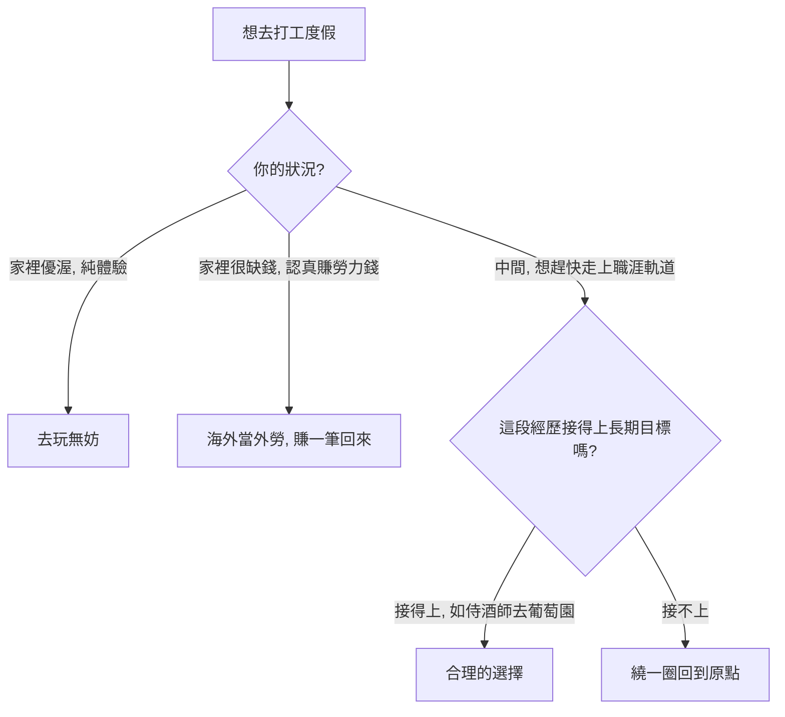

「我想去打工度假」這句話，背後常常裝著很多種動機：想體驗不同生活、想趁年輕看看世界、想存一筆錢、想練英文與獨立生活。但這些動機放在一起，未必能拼出一條清楚的路。

這集《大人的 Small Talk》由 Joe（張國洋）回覆一位 24 歲讀者的來信。讀者的處境很具體，Joe 的回答也很直接：**別把打工度假當成人生目標。**

## 讀者的處境

這位讀者畢業於國立大學歷史系，大學期間成績維持全系前 5%，參加過國科會大專生研究計畫、擔任過國立博物館校園大使，原本很有機會甄試進入政大、師大等前段研究所。但接近畢業時，他意識到留在研究室不是自己想要的，對商業世界抱有強烈好奇，於是放棄了學術這條相對安穩的路。

他為自己設定的目標是：畢業後一到兩年內出國打工度假至少一年，藉此把自己推進陌生環境、鍛鍊獨立生活與外語能力，最重要的是**存一筆錢**。

為了存旅費、準備英文，他畢業後的經歷是這樣的：

- **線上英文機構的電話銷售**：去年 2 月入職，想兼得高收入與公司的免費英語資源，但高壓環境加上單趟近一小時的通勤無法負擔，這份嚴格意義上的第一份正職不到一個月就結束。
- **日班保全**：改走「值班時讀英文、領穩定薪水」的策略，結果案主對保全帶有歧視，即使他沒打遊戲、沒偷睡覺，仍被剝奪讀書空間，做了一個多月便不歡而散。
- **小型電商的數位行銷企劃**：在參加三個月政府職涯班後，去年 7 月入職至今將滿一年。公司是家族企業，人力吃緊、職務界線模糊，他除了行銷與主導新客服系統導入專案，還常要支援客服電銷、影片拍攝、視覺設計，週末幾乎全員都會被排去展場做實體銷售。

問題在於：大老闆主導實體展場、習慣用權威甚至人身攻擊的方式教育員工，對辦公室業務一知半解也不重視；今年初的新考核制度更明顯偏重實體與電話銷售，讓他想深耕的數位行銷專業難以得到回報。一場銷售演練中，老闆指正他話術太平淡，接著話鋒一轉，持續施壓逼他「承認自己腦袋不好」，讓他覺得非常不受尊重。

帶著這些經歷，他提出三個問題：向上管理與情緒界限怎麼拿捏、明年該不該如期去打工度假、離職到出發前的 9 到 10 個月空窗期該怎麼佈局。

## 核心觀點：打工度假是「時間拉長版的迪士尼之旅」

Joe 最想先講清楚的，是打工度假的本質。

它比較像是一段時間拉長的迪士尼之旅——你去體驗不同的生活方式、看異國風景、交一些朋友，然後回來。這是一段很棒的體驗、一段回憶，**但它很難變成你職涯上的一塊磚頭，也就是很難變成基礎。**

換個方式說：把它當成一筆投資，你投入的是整整一年的時間加上前期旅費，回收的是回憶與照片；在履歷上、在能力累積上，它能給你的其實很少。

### 它適合誰？

Joe 認為打工度假其實只適合兩種人：

- **家裡經濟條件不錯的人**：家裡不需要你趕快開始工作，24、25 歲出去晃一年，回來不會有壓力，自己也不會焦慮。去體驗一下人生當然很好。
- **家裡真的很缺錢的人**：認真去賺那筆打零工的錢，本質上等於海外當外勞，賺一筆回來，這也 OK。

問題出在**介於中間**的人：家境不到優渥，又希望自己趕快讓職涯走上軌道。對這種人來說，花一年做這件事，幫助非常有限。

## 把三個出國目的逐一拆開

讀者列了三個去打工度假的理由，Joe 一個一個檢視。

**1. 想存錢。** 澳洲打工的時薪確實可能比台灣高，但你做的多半是農場採水果、餐廳洗碗、肉品加工這類勞力工作，純粹用體力換較高時薪。關鍵問題是：**存了這筆錢之後要做什麼？** 如果有明確目的（例如存一筆錢回來創業、或補一張專業證照），邏輯至少是通的；但從信裡看不出後續計畫，那就只是打了一年勞力工，回來錢慢慢花掉，職涯還在原點。

**2. 想提升外語。** 一年時間要讓英文大幅提升其實很難，尤其你是去打工不是去念書。在農場、背包客棧裡跟其他背包客講的英文，和職場上用的商業英文是兩回事。日常對話（點餐、買東西）可能變流利，但這個程度在職場上加分有限。要讓外語變成職涯優勢，需要的是專業場景裡的長期使用。

**3. 想訓練獨立生活。** 這是個迷思——以為出國才算獨立。其實你在台北自己租房、自己煮飯、自己處理生活大小事，就已經是獨立生活了。獨立的核心是對自己負責、自己解決問題，在台北做和在雪梨做沒有本質差別，不需要飛到南半球才學得會。

而那些勞力工作對長期職涯的加分也很有限：你不會因為在澳洲農場摘了一年草莓，回來面試就更有競爭力。站在商業世界的角度，這段經歷其實是一個空白，在某些產業甚至是扣分項。

## 更根本的問題：你的選擇之間沒有脈絡

Joe 接著拉回一個更底層的問題。讀者說自己「對商業世界感到好奇」，這個動機沒問題，但**這個說法太含糊了，含糊到沒辦法幫你畫出一張地圖。**

回頭看畢業後的選擇：電話銷售做不到一個月、保全做一個多月、再到家族電商做行銷企劃——這些事情之間是弱連結，彼此串不出一篇故事。電銷學到的幫不上保全，保全學到的也幫不上行銷企劃，精力是散的，像珠子落了一地。

> 一地的珠子，需要一條線把它們串起來，才會變成項鏈。而那條線，就是你的長期目標。

所以下一個該回答的問題是：你到底對商業世界的**哪個面向**好奇？是行銷、業務、財務，還是營運管理？想清楚這個，後續選擇才會開始有邏輯。讀者提到想當專案經理（PM），但 PM 其實也吃產業——你想在哪個產業當 PM，同樣需要釐清。

## 回覆三個問題

**Q1：向上管理與情緒界限怎麼拿捏？**

Joe 認為這根本不是向上管理的問題，而是「要不要繼續待在這個環境」的問題。一個會逼員工承認自己腦袋不好的主管，代表他習慣用羞辱的方式管理人；這種本質不會因為你怎麼溝通、怎麼做利害關係人管理而改變。今天你承認了，明天他會要你承認別的。

> 在一個不健康的職場裡練向上管理，就像在一艘漏水的船上練習怎麼駕船。先把船換掉。

如果你完全不在意自尊，只想讓衝突趕快過去，那承認一下確實沒什麼實際損失——但你做不到，否則不會寫信來問。既然它困擾你，繼續待下去環境就會持續消耗你。時間與精力有限，不要花在不值得的地方。

**Q2：明年該不該如期出發去打工度假？**

以現在的狀況，Joe 個人認為不應該去。如果真的想要一段「對職涯有幫助」的海外經歷，比較合理的做法是去念一個海外碩士——歷史系想轉商業領域、年紀又還輕，念一個（最好是好學校的）商管碩士，比較有機會在履歷上加分（不過他也誠實補一句：到了 2026 年，這種加分也有限）。但這和去農場打工是不同層次的事。

Joe 認為只有兩種情況下打工度假是合理選擇：一是這段經歷能跟長期職涯目標連結（例如侍酒師去布根地葡萄園摘葡萄一年），二是家裡夠優渥、純粹去玩一年也無所謂。讀者兩者都不符合。文科跨商業、在台灣累積實戰經驗都還不夠的階段，最需要的是趕快在一個有系統的商業環境裡磨練自己。

**Q3：離職到出發前的 9–10 個月空窗期怎麼佈局？**

Joe 指出，這個問題本身就反映了整個計畫的問題。為了存旅費先做短期工，空窗期又再找短期工，回來後又要從零開始。把整條時間軸串起來看：畢業到回來近三年，做過電銷、保全、家族企業行銷企劃，再加一年海外勞力工作，回來可能 26、27 歲，履歷上會是「什麼都做一點點、沒有一段超過一年、彼此也沒有關聯」。

> 等於畢業後花了近三年，存了一筆錢，去了一趟很長的迪士尼旅行，回來之後一切歸零、重新開始。

## 小結

Joe 最後誠實提醒：在商業實務的世界裡，一段與職涯無關的打工度假經歷，大部分時候不是加分、也不是中性，而是扣分項——因為它告訴面試官，你在該累積專業能力的年紀，選擇去做一件與職涯無關的事。除非你本身的技術能力、資歷夠好，能夠彌補這段空白。

這不是說絕對不能去，而是：每個人手上的牌不同，去同一趟迪士尼，每個人承擔的成本不一樣。真正該先回答的，是你最終的人生目標是什麼——想清楚那個，再來決定今天的每一步該怎麼踏。

## 參考資料

- [我該出國打工度假嗎？如果接不上未來想走的路，可能只是繞了一圈又回到原點！｜大人的Small Talk](https://www.youtube.com/watch?v=MdjuMkl_OEs)
- [大人的Small Talk | Spotify](https://open.spotify.com/show/6gZUHaC8fOZ7SkCniFkRrZ)
