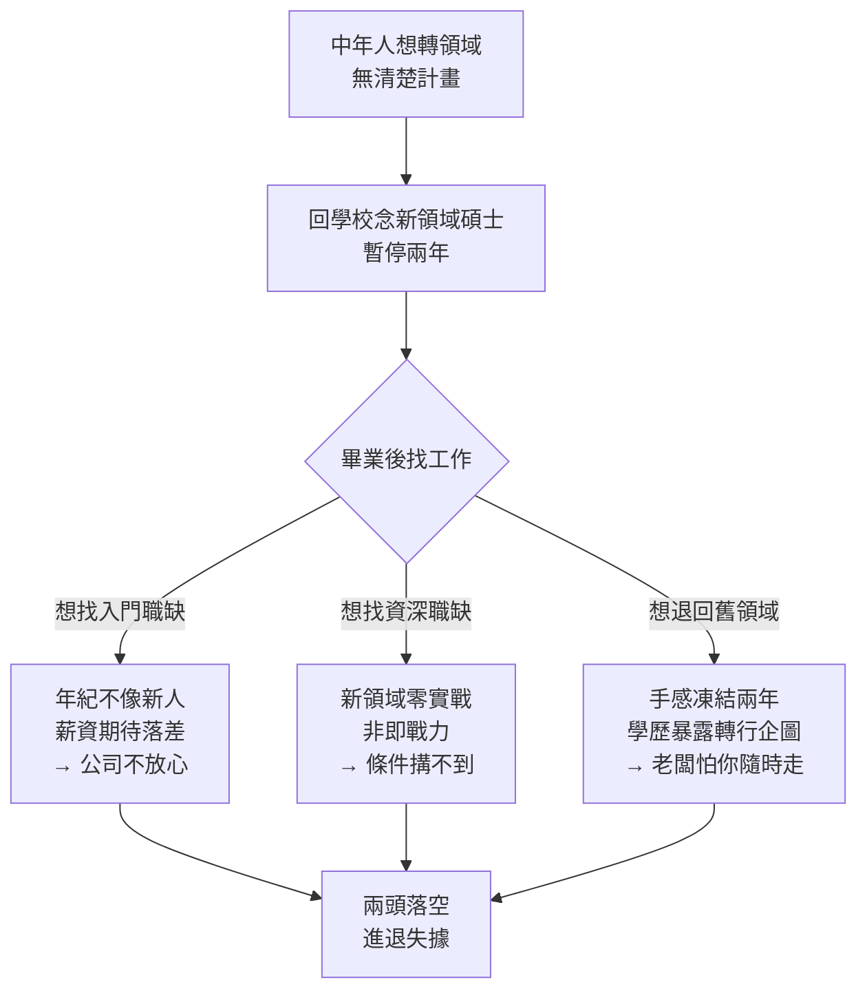

「我想換跑道，但年紀也不小了，是不是先回去念個學位才有機會？」

這是很多中年人面對轉職時，腦中跳出的第一個念頭。大人的 Small Talk（主持人 Joe 張國洋）把「回學校念書」這個主題拆成兩集，這篇談的是下集——專門寫給**中年想要轉換領域**的人。上集談的是大學生與應屆畢業生，結論是「就算家境好也該先工作、別急著念研究所」；這一集要獨立出來，是因為中年人的處境跟年輕人完全不同。

## 為什麼中年要單獨談？因為失敗的代價不一樣

年輕人有家庭、房貸的人少，沉沒成本低；同樣是念碩士甚至博士念錯了，年輕人頂多損失幾年時間。但中年人有家庭、有房貸、有沉沒成本、有時間壓力，**讀錯方向可能損失的是整個人生的下半場**。

Joe 這些年開履歷課，碰過很多中年想轉職的朋友。他觀察到一個共同模式：這些人在面對轉行時，第一個念頭常常是「我先去讀那個領域的碩士好了」，結果白白浪費兩年、甚至更久。所以在說「為什麼這條路對很多人不是好策略」之前，得先把分界線講清楚——並不是所有中年人念書都錯，有些情況念是對的。

## 三種情況，中年回學校是對的

### 一、你要進的行業有「制度型硬門檻」

有些領域有政府規定或產業公認的硬門檻。例如想轉做**心理諮商**，法律規定要有相關碩士、考到證照、還要實習，這沒得選。

但 Joe 在這裡特別提醒兩件事：

- **硬門檻不等於長期安穩。** 有些有門檻的產業市場正一路萎縮。你辛苦花兩年拿到入場券，可能只是擠進一個正在變小的池子；甚至畢業時市場剛好冷掉。進場前一定要評估清楚，不要閉著眼睛去念。
- **動機要夠強。** 如果你是真心嚮往、覺得這是志業，那沒問題、應該的。但 Joe 看過不少人，是工作五年十年後覺得「卡關了、升不上去、做的也不喜歡」，剛好朋友常找你談心事，就想「不然去當心理師好了」。這種動機薄弱的決策很危險——最怕的不是沒考過，而是**好不容易都通過了，才發現當心理師也有一堆麻煩事**，那時就太遺憾了。

### 二、你不轉領域，只是同領域升遷卡關（最推薦）

跟硬門檻類似、但更值得快快去念的情況：你**不離開現在的領域**，只是升遷卡關。有些大公司明文規定升到某職等要有特定學歷或考過某些試，那你就去念個**在職專班**就好。

Joe 說這是他最鼓勵的一種：回報明確、規則清晰，念完一定能變現，價值毋庸置疑。

### 三、你需要的是名校等級的人脈圈

如果你已經爬到很高階——是公司 CEO 或創業老闆——想擴張、想去海外、想認識可雇用的高階經理人，那麼用念書來擴充人脈是常見且值得的做法。

但前提有兩個：**一定要進名校**（或你產業裡公認的核心研究所）。中段、後段學校的 EMBA 往往沒有人脈效果，因為真正的強者多半都集中在頂尖學校。

### （補充）純粹圓夢、對學術有熱忱

還有一類人，事業穩固甚至財富自由了，想補念個研究所——補上年輕時學歷不高的遺憾，或圓年輕時喜歡電影、文藝卻只能去賺錢的夢。這種念書**不是為了變現**，那當然沒問題，開心最重要。Joe 形容這就像去迪士尼玩一趟，沒有代價的事。

## 最危險的念法：想靠學歷「無痛轉領域」

Joe 這些年看到最容易失望、失敗的，是抱著「**無痛轉領域**」幻想的人。

這類人心中的模型是：「我現在做的事有點無趣、也找不到熱情，但你問我下一步要去哪我又不知道，而且我沒有任何新領域的實戰經驗——那不如去念個新領域的學歷，念完不就自動有地方去、自動能換到新領域工作了嗎？」

這等於是把學校當成**人生的重啟鍵**，以為躲回學校兩年，舊問題就會消失、新人生會自動出現。但市場不是這樣運作的。如果念書前沒有清楚計畫，念完之後**新領域不會自動接住你，舊領域可能還回不去**。

### 為什麼會兩頭落空？

**新領域不把你當新人，也不把你當資深。** 大部分公司的新人職缺多半招到 30 歲上下，因為年輕人可塑性高，也願意接受助理、跑腿、低薪的安排而不覺得受辱。但你 40 幾歲、有家庭、生活成本高——光是薪資期待這關就過不去：履歷上十幾年經驗讓對方覺得你「至少值七八萬」，但新鮮人職缺只開三四萬。用人主管會想「找個 25 歲的就好，何必找你來吵架」。另一頭，資深職缺要的是即戰力（那個產業十年經驗、帶過團隊、有戰功），而你在新領域只有一張剛拿到的文憑，一樣搆不到。於是 HR 看到你的履歷只會頭痛：「42 歲、我們這行沒做過、薪資期待應該不低，到底開什麼職缺給他？」

**舊領域也有一定機率回不去。** 你離開兩年，原本累積的客戶、人脈、技術熟練度全都凍結了——尤其像程式開發這種變化快的領域，兩年後整個業界思維可能都換掉了。而且你那張**新領域的學歷，等於明明白白告訴別人你的轉行企圖**。要回原公司，老闆會想「這人之前就想逃、沒轉成功才回來」；要去舊領域其他公司，對方會擔心「他隨時會走，只是來臨時賺生活費」。結果這張文憑在新舊領域都沒加分，甚至是扣分訊號。

**念中段學校更會發出反向訊號。** 很多人覺得台大太難，去念排名中後段的轉行碩士。但面試官腦中第一印象會是：「這人沒做過我們這行，自己也知道競爭力不夠，才挑了門檻沒這麼高的學校，這張紙是來墊履歷的吧。」如果念的還是**社會人文科系**（社會學、哲學、歷史、文學、政治學…），情況更殘酷——因為這類成果不像 App、網站、分析報告那樣容易讓市場快速判斷你「能替組織解決什麼問題」。為興趣、為圓夢去念這些沒問題，但若目的是轉職變現，那念一線名校的重要度會高很多，因為你能拿來說服別人的，往往是學校品牌、老師、人脈、研究圈這些辨識度。

## 為什麼還是有這麼多人前仆後繼？

20 年前、10 年前回學校還有機會，但 Joe 認為從大約 2016 年到現在，隨意躲回學校帶來的效用是逐年降低的。那為什麼大家還這麼做？

- **儀式感與假長期主義。** 辭職、繳學費、報到、交作業、寫論文，這些行為很有重量感，加上親友稱讚「你好勇敢、年紀這麼大還去念書」，會讓人**誤把「看起來努力」當成「實際有效」**。但這個世界殘酷的地方在於：**只認有效，不認努力**。
- **它名義上提供了一個「暫停鍵」。** 中年是壓力最大的階段——上有老下有小、工作倦怠、又看著年輕人逐漸超過自己。「我去念個書」聽起來體面、社會認可，又能暫時離開現實壓力。

但這個暫停的代價非常高。Joe 算過一筆很多人沒算的帳：**回去念個碩士，成本至少 200 萬。** 假設月薪 5 萬，一年機會成本就是 60 萬、兩年 120 萬，加上學費、教科書、生活費約 80 萬，合計約 200 萬；月薪更高的人成本還會超過 200 萬。停下來的這兩年，房貸照繳、小孩照養、年紀照長、市場照變。

## AI 時代：作品與橋接，比學歷更有說服力

Joe 認為中年轉行的邏輯，這 20 年已經大幅改變，AI 又進一步加速這件事。

過去你父母那一代想轉行，確實沒什麼招——沒有新領域經驗，只能去念那個領域的研究所當通行證，而且當時產業變動慢，學校教的還跟得上業界。但這 20 年市場變動超快，中後段學校教的東西常常已經跟不上業界；2022 年起 AI 又改變了學習方式。

所以現在想轉新領域，第一個該想的是：**我能不能自己先學點什麼？** 跟 AI 對談、做練習、做作品集、找到那個圈子的關鍵人物。Joe 引用一位遊戲製作者寫的文章：有了 AI 之後，他面試最重視一個問題——「**你實際做過什麼遊戲？**」意思是，現在工具這麼方便，你說喜歡遊戲卻一路畢業什麼都沒做過，很難讓人相信你是真心的。

對中年人尤其如此。中年轉行的優勢**不是年輕、不是可塑性、更不是多一個學歷**——這個時代資歷才是一切。中年轉行真正的籌碼，是把**舊領域累積的東西，變成新領域的籌碼**，再加上真的動手做點什麼的經驗（也就是 Joe 在 S012 提過的「摸石頭過河」概念）。要做到這些，需要的不是讀書，是**橋接**。

核心問題回到那位遊戲製作人說的：你想轉領域沒問題，但你得回答——**你會什麼？你做過什麼？你過去的經驗能幫新領域什麼？** 這幾個問題想不出來，去念個書也不會有幫助。

## 小結

中年轉行最大的風險，不是不夠努力，而是**在錯的地方努力**。

很多中年人對「補學歷」的想法太理想化，停留在 20 年前的邏輯；但這 20 年早已大幅改變，AI 只會讓它更快過時。回學校是其中一條路，但它不是唯一、也不一定是最快的路。先看清你要去哪、看懂整個局，確認學位在這條路上到底扮演什麼角色——該念的三種情況就放手去念，其餘的，先把「你能替新領域解決什麼問題」想清楚，再決定。

## 參考資料

- [大人的 Small Talk：中年轉職該不該回學校念書（下集）](https://www.youtube.com/watch?v=8eatmpr43r8)
