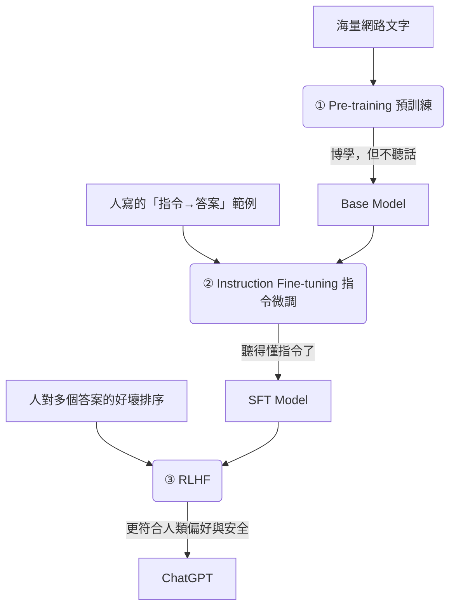

Every time you ask ChatGPT a question and get back a fluent, on-point answer, it's actually the result of three training stages with completely different characters stacked on top of one another. Professor Hung-yi Lee describes them vividly: **creating the world, showing the way, and surpassing oneself**. This post breaks down these three stages and adds one easily overlooked but most important insight — **"capability" and "alignment" are two things forged separately**.

## Stage One: Creating the World (Pre-training)

This is the stage where the model "builds knowledge," and it's also the most computationally insane part of the whole pipeline.

- **Goal**: Learn "text completion" — given a span of text, predict the next token.
- **Method**: **Self-supervised learning** on trillions of tokens of web text. No human annotation is needed, because the answer is hidden in the text itself: mask the next token, let the model guess, and correct it when it's wrong. By pushing "predict the next token" to the extreme, the model is forced to learn grammar, facts, common sense, and even a degree of reasoning.
- **Output**: A **base model**. It's very "knowledgeable" but **doesn't follow instructions** — when you ask it a question, instead of answering, it might continue with "a string of questions you might ask next," because that's the kind of text most common on the web.

> Key takeaway: Almost all of the model's **knowledge and capability** is formed during this stage. What the latter two stages do is not "pour in more knowledge," but "tune this skill set into a usable assistant."

## Stage Two: Showing the Way (Instruction Fine-tuning / SFT)

To turn the base model from a "text-completion machine" into an "assistant that answers," you need Supervised Fine-Tuning.

- **Goal**: Teach the model that when it sees an instruction (prompt), it should produce "the kind of response humans expect."
- **Method**: Have many annotators write high-quality "instruction → ideal answer" pairs ("write me a poem," "summarize this article," …), then fine-tune the model on these examples.
- **Significance**: The data volume is far smaller than pre-training, but its role is to **unlock** — steering the broad capabilities learned in pre-training into a behavior pattern that "understands human language and carries out instructions."

## Stage Three: Surpassing Oneself (RLHF)

Relying on human demonstrations alone has a ceiling, because **humans can't write the perfect answer for every question**, and "what makes a good answer" is often hard to articulate. RLHF (Reinforcement Learning from Human Feedback) takes a smarter angle:

1. Have the model generate multiple answers to the same question.
2. Have humans **rank these answers** from best to worst (ranking is far easier than writing the perfect answer from scratch).
3. Use these rankings to train a **Reward Model**, teaching it to predict "which one humans would prefer."
4. Then use the reward model as a signal to refine the original model via reinforcement learning (OpenAI used PPO), making it produce high-scoring responses more often.

This is the key result OpenAI demonstrated in the **InstructGPT** paper: an aligned smaller model can beat a much larger but unaligned base model on "human preference." **What makes ChatGPT stand out isn't being bigger, it's being better aligned.**

> The cost (alignment tax): Alignment can sometimes cause the model to regress slightly on certain pure-capability benchmarks — this is the tradeoff you pay for "safer and more obedient," and it has to be deliberately balanced in engineering.

## What I Learned

Looking at the three stages together, the one sentence most worth remembering is: **Pre-training gives the model its soul (knowledge and capability), while instruction fine-tuning and RLHF give it its personality and sense of proportion (usability and safety).**

This also explains a lot of phenomena: why a model "knows" something but isn't necessarily "willing to say it in the format you want" (that's the alignment layer's job); why the same base model can be aligned into assistants with completely different styles; and why "data quality" matters far more than "data quantity" in the latter two stages — you're sculpting behavior, not pouring in knowledge.

## References

- [How Is ChatGPT (a Large Language Model) Made — Stage One: Creating the World (Hung-yi Lee)](https://www.youtube.com/watch?v=hToO6daVuSw)
- [OpenAI: Aligning language models to follow instructions (InstructGPT)](https://openai.com/research/instruction-following)
