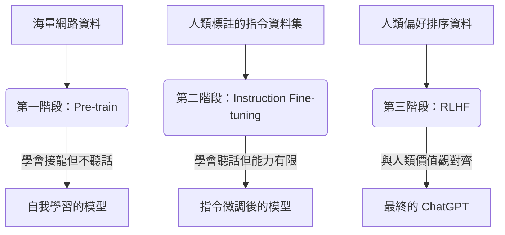

## TL;DR

ChatGPT 的訓練分為三個核心階段：
1. **Pre-training (自我學習)**：閱讀海量網路資料，學習如何「接龍」。
2. **Instruction Fine-tuning (指令微調)**：由人類提供高品質答案，教導它聽懂指令。
3. **RLHF (強化學習)**：讓模型與人類偏好對齊，訓練出超越人類示範的表現。

## 訓練流程圖

## 第一階段：開天闢地 (Pre-training)

這是 LLM 獲取知識最瘋狂的階段。
- **目標**：學習「文字接龍」。
- **做法**：讓模型在網路上閱讀數以兆計的文字。模型會不斷猜測下一個字是什麼，並從中學習語言的語法、常識、甚至是邏輯推理能力。
- **缺點**：此時的模型雖然「博學」，但「不聽人話」。你問它問題，它可能只會接龍出一堆相關的廢話，而不是回答你。

## 第二階段：指點迷津 (Instruction Fine-tuning)

為了解決模型不聽話的問題，我們需要進行「監督式學習」。
- **目標**：教導模型如何正確回應人類的指令（Prompt）。
- **做法**：聘請大量人類標註員，撰寫高品質的「指令-答案」配對。例如：「請寫一首詩」、「請摘要這篇文章」。
- **意義**：讓模型學會服務人類，將 Pre-train 學到的廣泛知識轉化為可用的對話能力。

## 第三階段：超越自我 (RLHF)

單靠人類示範是不夠的，因為人類寫不出所有完美的答案。
- **目標**：讓模型透過回饋不斷優化，達成「青出於藍」。
- **做法 (Reinforcement Learning from Human Feedback)**：
    1. 讓模型對同一個問題產生多個答案。
    2. 人類對這些答案進行「好壞排序」。
    3. 訓練一個 **Reward Model (獎勵模型)** 來學習人類的喜好。
    4. 最後用獎勵模型來磨練原始模型。
- **意義**：這是 ChatGPT 脫穎而出的關鍵，讓它產出的內容更符合人類的品味與安全標準。

## 學到的事

ChatGPT 的強大並非來自單一演算法的突破，而是「大數據自我學習」與「人類精細引導」的完美結合。Pre-train 給了它靈魂，而 RLHF 給了它性格。

## 參考資料

- [ChatGPT (大型語言模型) 是怎麼煉成的 - 第一階段：開天闢地](https://www.youtube.com/watch?v=hToO6daVuSw)
- [OpenAI: Aligning language models to follow instructions](https://openai.com/research/instruction-following)
