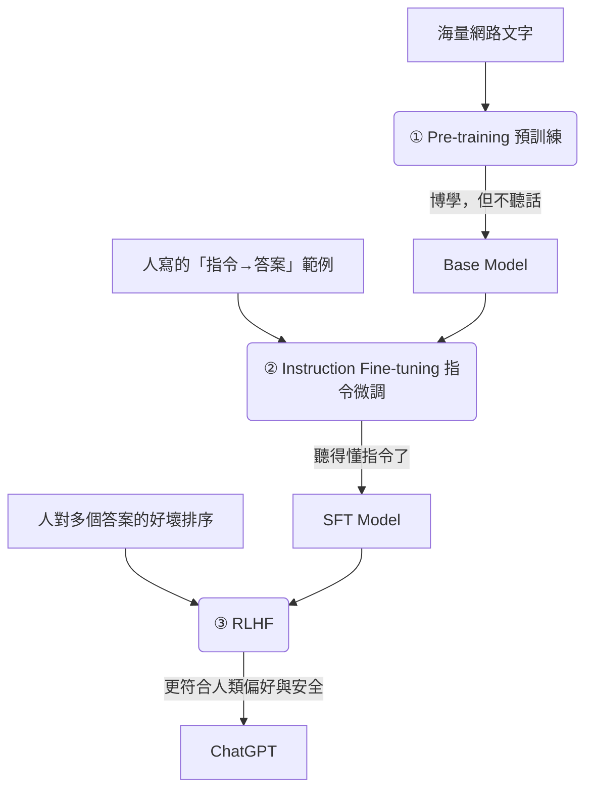

每次問 ChatGPT 一個問題、得到一段通順又切題的回答，背後其實是三個性質完全不同的訓練階段疊起來的結果。李宏毅老師把它講得很傳神：**開天闢地、指點迷津、超越自我**。這篇把這三階段拆開，並補上一個容易被忽略、但最重要的洞察——**「能力」和「對齊」是分開煉成的兩件事**。

```mermaid
flowchart TD
    A[海量網路文字] --> B("① Pre-training 預訓練")
    B -->|"博學，但不聽話"| C[Base Model]
    D[人寫的「指令→答案」範例] --> E("② Instruction Fine-tuning 指令微調")
    C --> E
    E -->|"聽得懂指令了"| F[SFT Model]
    G[人對多個答案的好壞排序] --> H("③ RLHF")
    F --> H
    H -->|"更符合人類偏好與安全"| I[ChatGPT]
```

## 第一階段：開天闢地（Pre-training）

這是模型「長知識」的階段，也是整個流程裡運算量最瘋狂的一段。

- **目標**：學「文字接龍」——給一段文字，預測下一個 token。
- **做法**：在數以兆計的網路文字上做**自監督學習**。不需要人工標註，因為答案就藏在文本裡：把下一個字遮起來讓模型猜，猜錯就修正。光是把「預測下一個字」這件事做到極致，模型就被迫學會語法、事實、常識，甚至一定程度的推理。
- **產物**：一個 **base model**。它很「博學」，但**不聽話**——你問它問題，它可能不是回答，而是接龍出「一串你可能會接著問的問題」，因為網路上長那樣的文本最多。

> 關鍵認知：模型幾乎所有的**知識與能力**，都是在這一階段就形成的。後面兩階段做的不是「灌更多知識」，而是「把這身本事調教成可用的助理」。

## 第二階段：指點迷津（Instruction Fine-tuning / SFT）

為了讓 base model 從「文本接龍機」變成「會回答的助理」，需要監督式微調（Supervised Fine-Tuning）。

- **目標**：教模型，看到一個指令（prompt）時，應該產出「人類期待的那種回應」。
- **做法**：請大量標註員撰寫高品質的「指令 → 理想答案」配對（「幫我寫一首詩」「摘要這篇文章」…），再用這些範例微調模型。
- **意義**：資料量遠小於預訓練，但作用是**解鎖**——把預訓練學到的廣泛能力，導引成「聽得懂人話、會照指令辦事」的行為模式。

## 第三階段：超越自我（RLHF）

只靠人類示範有天花板，因為**人類寫不出每一題的完美答案**，而且「什麼是好答案」常常難以言傳。RLHF（Reinforcement Learning from Human Feedback）換了個更聰明的切角：

1. 讓模型對同一個問題產生多個答案。
2. 請人類對這些答案**排序好壞**（排序比從零寫出完美答案容易得多）。
3. 用這些排序訓練一個 **Reward Model（獎勵模型）**，讓它學會預測「人類會比較喜歡哪個」。
4. 再用獎勵模型當訊號，透過強化學習（OpenAI 用 PPO）去磨原始模型，讓它更常產出高分回應。

這就是 OpenAI 在 **InstructGPT** 論文裡展示的關鍵結果：經過對齊的較小模型，在「人類偏好」上可以勝過大上許多、但沒對齊的 base model。**能讓 ChatGPT 脫穎而出的，不是更大，而是更對齊。**

> 代價（alignment tax）：對齊有時會讓模型在某些純能力的 benchmark 上略微退步——這是「更安全、更聽話」換來的取捨，工程上要刻意去平衡。

## 學到的事

把三階段連起來看，最該記住的一句話是：**預訓練給了模型靈魂（知識與能力），指令微調與 RLHF 給了它性格與分寸（可用性與安全）。**

這也解釋了很多現象：為什麼模型「知道」一件事卻不一定「願意照你要的格式講」（那是對齊層的事）；為什麼同一個 base model 可以對齊出風格完全不同的助理；以及為什麼「資料品質」在後兩階段比「資料數量」重要得多——你是在雕刻行為，不是在灌知識。

## 參考資料

- [ChatGPT（大型語言模型）是怎麼煉成的 - 第一階段：開天闢地（李宏毅）](https://www.youtube.com/watch?v=hToO6daVuSw)
- [OpenAI: Aligning language models to follow instructions（InstructGPT）](https://openai.com/research/instruction-following)
