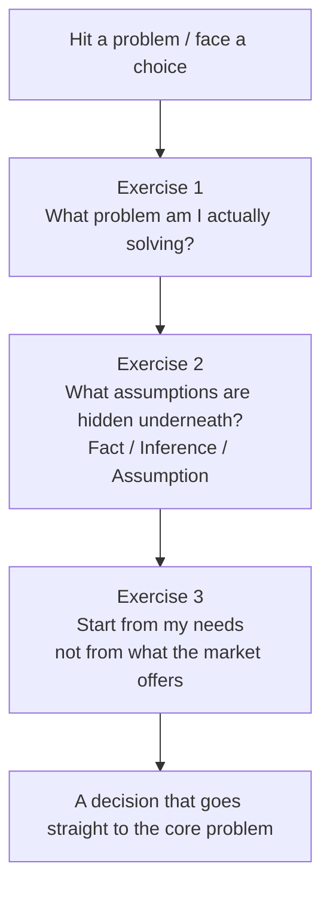

## Why There's a Real Gap Between "Understanding It" and "Being Able to Use It"

First principles is a concept a lot of people have heard of. Put simply, it means that when you run into a problem, you don't rush to see how others did it, you don't rush to look for industry conventions or so-called Best Practices — instead you step back to the most fundamental essence of the problem, and re-derive the solution from that essence. Its opposite is **analogical thinking** — you look at how someone else succeeded and copy it.

It sounds like it shouldn't be hard at all. But in this episode of *Dadu's Small Talk*, Joe (張國洋) points out a key observation: after so many years as a project management consultant and instructor, he's found that where most people get stuck **isn't failing to understand the idea — it's not knowing how to actually "get back to essence."** Tell someone to get back to essence, and they'll say "I thought I was already at the essence" — but they're not; most people simply don't have the ability to truly step back to the essence.

> The most famous example of first principles is how Elon Musk re-decomposed the cost of a battery. But Joe argues this method is actually *more* important for "ordinary office workers with limited resources" — because we can't afford to take detours.

So instead of explaining the concept one more time, in this episode he gives three **concrete thinking exercises**. The point isn't understanding, it's forcing yourself to decompose and reflect this way on every problem you meet, gradually internalizing it into intuition.

## Exercise 1: Swap "What Should I Do" for "What Am I Actually Solving"

The most common question looks like this: "Joe, should I take the PMP exam or not?"

It's a very classic yes/no question — pick "should" or "shouldn't," and life feels simple. But Joe says that if you answer directly, whether you say yes or no, **you've jumped to a conclusion too fast and fallen into a trap.** Because before the underlying context is clarified, "yes" or "no" doesn't actually mean anything concrete.

So he'll counter with: "What goal are you trying to achieve by taking the PMP?"

- Some want the certificate, to shore up an academic credential;
- Some want it to help at work;
- More commonly, it's for a **career switch.**

Suppose the person says they want to switch into being a product manager. He'll keep pressing: "Have you researched what product manager job postings actually require? Do any of them require a PMP?" Most people freeze at this point — because they've never seriously looked; they just assume "get a PMP and you can be a product manager," which is a very jumpy, linear kind of thinking.

The truth is usually: what a product manager needs isn't the PMP at all, it's **whether you've actually built a product, whether you have data-analysis ability, whether you're familiar with the business environment, whether you have experience collaborating with engineers.** PMP might matter, but it's way down the list — not the key, not a hard requirement. So why spend half a year now on a certificate that doesn't directly help your goal?

This is the most basic application of first principles: **you're not making a decision at the "should I take the PMP" level — you step back and ask yourself "what problem am I trying to solve by taking the PMP,"** define that truly core problem clearly first, then think it through from the ground up.

> The Dadu books make a similar point: when facing a life choice, don't write it as a yes/no question, don't pick between two options ("Should I go abroad for an MBA?"), but think about the outcome you expect, then start decomposing and substituting. Retreat to what you actually want, rather than agonizing among the existing options.

The same holds in project management: when a new requirement comes in, your first reaction shouldn't be "how do I do this," but "wait — why does this problem exist? Is it a technical problem, a management problem, or a political problem?" If you get even the *nature* of the problem wrong, the downstream solution is guaranteed to go crooked. This is what people call "reading the situation" — step back to find the essence, and once the essence is clear, the solution takes half the effort for twice the result.

**How to practice:** Don't rush to find an answer. Take a piece of paper, write down the problem, then ask yourself "is this really the problem I need to solve? Or is what I actually need to solve at a deeper level?" Ask "why" a few more times and you get a chance to dig down to the core.

## Exercise 2: Surface the Hidden Assumptions Behind "Everyone Does It This Way"

We make many decisions every day, and each hides some assumptions — assumptions that are often invisible, so much so that you don't even realize they're there.

Joe's example: after five to seven years of work, a lot of people start feeling anxious and stuck, and think "should I go get a master's degree?" Ask them why, and they say "because the people who got promoted all seem to have a master's."

Let's break it down — the observation "the people who got promoted all have a master's" might be true, but the assumption underneath is: **the master's is the reason they got promoted.** Does that hold?

Isn't it possible that those people were more driven and ambitious to begin with, and went for the master's simply because their personalities push them to pursue more; and that they got promoted because their **work performance was good,** with no direct connection to the master's? The master's might be one factor, but not the whole story.

This distinction is the crux of the decision:

- If a master's is the **only** reason for promotion, then of course you should go get it;
- If a master's is merely **correlated, not causal,** then you'd spend an extra two years (maybe going full-time, giving up the opportunity cost) only to find it doesn't help your promotion at all — the loss is those two years of time and cost.

Joe suggests breaking any decision into **three layers** (this is also something Bryan often discusses on the show):

| Layer | Definition | Example |
|-------|-----------|---------|
| **Fact** | Checkable, verifiable | It's 27°C today |
| **Inference** | A judgment based on facts, but unverified | It's 27°C, so the UV index outside is probably high |
| **Assumption** | A premise you take for granted but haven't verified | A master's will help me get promoted |

Where most people's decisions go wrong isn't that they misread a fact, nor that their inference is unreasonable — it's that **the bottom-layer assumption is simply wrong, and they never checked it.**

Another high-frequency trap: you're unhappy in your current job and want to switch, so you figure "I'm interested in another field, and a master's will get me in." But in many professional fields, if you have no relevant experience and didn't come from that field originally, spending two years on a theory-heavy master's still leaves a high chance you can't break in. The question is — before you go, did you ask anyone actually in that field? If this path is common in that field, then it's a fact, an assumption that's been verified; but very possibly you ask around and everyone shakes their head, in which case the assumption doesn't hold. The result is spending two years on the degree, sending out resumes, and nobody calls you in for an interview — a whole misunderstanding.

**How to practice:** Break the decision apart and pick out the assumptions inside it — is "doing this will make me rich / get me promoted / let me switch careers" actually true? Then do some degree of verification to connect it back to facts. If the data is insufficient, **run the lowest-cost minimum viable plan as an experiment first,** rather than making an assumption in your head, then filling in the blanks to support it, and only realizing at the very end that it was wrong. You'll be surprised how many things you once took for granted don't survive questioning.

## Exercise 3: Start From "What Do I Need," Not "What Does the Market Offer"

We live in an era of exploding options. Want to learn something? Tens of thousands of online courses. Want to invest? Hundreds or thousands of financial products. Want a job? Open a job board and there are tens of thousands of listings.

When there are too many options, most people try to shortcut the judgment — they look at reviews, rankings, what others recommend, or even hop onto Facebook or Threads to ask "I want this thing, please recommend something." But this is precisely the classic **analogical thinking:** you start from "what does the market offer" and pick the most-recommended one out of all the options. Yet the most-recommended option may only suit the most people, or a specific group — **it isn't necessarily the best fit for you.**

The first-principles approach is the reverse: **don't look at what the market offers first — first ask yourself "what is my current situation, what am I lacking, what do I need."** Get your own needs and the gaps you want to fill clear, then turn back to see what in the market connects to your needs. It's possible your pick isn't the one everyone recommends, but it delivers the most value for *you.*

> Joe uses Dadu's own founding as an example: back then they didn't first look at what education outfits already existed and then imitate them (that would only lead into a red ocean) — they started from the fumbling experiences of their own twenties into their thirties, realized "how great it would've been to know these things a few years earlier," then asked the adults around them and found everyone resonated and had similar gaps, and designed courses from those root problems. With a different starting point, the courses naturally grew to look nothing like a typical training provider's.

Back to daily life: if you want to learn personal finance, don't immediately jump on Threads asking "which ETF is good to buy right now" — first ask yourself "why do I want to learn personal finance" — is it for retirement? To save a home down payment within three years? Or fear of inflation eating your money? **Different purposes lead to completely different strategies** (steady ones, volatile ones, or even entirely different things). If you go with "what does everyone recommend," you'll very likely buy a pile of things that don't fit your current needs.

**How to practice:** Before any important choice, spend ten minutes writing down your own needs. At this stage don't read any recommendation posts, don't ask anyone — purely ask yourself "what is my current situation, where do I want to get to, what's missing in between." Take stock of the gap between your current state and your goal, then think about the options. You'll find your judgment suddenly gets much stronger — because you're building a clear, explicit standard for yourself, instead of parroting others and applying their standards to you.

## Why This Matters Especially for Ordinary Office Workers

Articles on first principles mostly cite examples of how Elon Musk or Steve Jobs made business decisions, so some people mistakenly think "that's a method only geniuses or big bosses use." Joe argues it's exactly the opposite.

Geniuses and big bosses already have plenty of resources and ability to try all kinds of methods; but **ordinary people's time, money, and energy are all limited, and often we simply can't afford to take detours.** Just like those who go for a master's to switch careers and end up stuck — the place they wanted to go won't take them, and if they want to fall back, they've wasted two years of tenure, stuck neither up nor down.

Precisely because resources are limited and we can't cover everything, we need all the more, at critical moments, to stop and think it through: am I taking this path because I've thought through the whole context and know it truly helps my core problem — **or just because everyone else takes it, so I blindly trust "it should work out well for me too"?** Spend your limited resources where they count — that's exactly what first principles is telling you.

## The Three Exercises, One More Time

1. **When you hit a problem, first ask "what am I actually solving,"** don't over-agonize over surface options; if an option doesn't connect to the problem, yes or no is meaningless.
2. **Before any important decision, decompose the approach, pick out the assumptions inside, and verify them;** proceed only if they pass, and if they don't, don't — it might save you millions and two years.
3. **When making a choice, start from your own needs, not from what the market offers;** define the problem clearly and experiment on the solution's assumptions clearly, and you can go straight to the core problem.

These three things sound simple, and they genuinely aren't hard — the key is to **internalize them into intuition.** Once they become intuition, the quality of your life decisions will be completely different — because you're no longer being pushed along by the options, you're steering the direction yourself.

## References

- [Dadu's Small Talk｜Original episode (YouTube)](https://www.youtube.com/watch?v=hToO6daVuSw)
- Dadu (大人學) blog: search "大人學 第一性原理" to read Bryan's earlier articles on first principles and Elon Musk's battery cost
