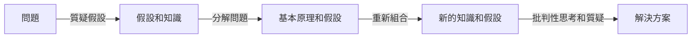

首先，我們來看什麼是「第一原則」（First Principles）。在這篇文章中，我們將探討什麼是第一原則、為什麼它們重要、如何運用它們，以及與其他概念的差別。

## 是什麼
第一原則是一種思考方式，源自古希臘哲學家阿里斯托德（Aristotle）的思想。它涉及將事物分解成基本的原理和假設，然後檢視和質疑這些假設，以找出事物的本質和根本原因。第一原則的核心思想是，不要被既有的知識和假設所束縛，反而要透過批判性思考和質疑，找出事物的真正本質。

## 為什麼重要
第一原則對於解決複雜問題和創新至關重要。透過運用第一原則，可以幫助我們識別和挑戰不正確的假設和知識，從而找到更好的解決方案。另外，第一原則也可以幫助我們避免思維定式和偏見，培養更開闊和創新的思考方式。

## 怎麼運作
運用第一原則的三個思考練習是：

1. **質疑假設**：識別和挑戰假設和知識的基礎。
2. **分解問題**：將問題分解成基本的原理和假設。
3. **重新組合**：透過批判性思考和質疑，重新組合和整合新的知識和假設。

## 跟「第二原則」（Second Principles）的差別
第二原則是基於既有的知識和假設，透過演繹和邏輯推理，得出新的結論。與第一原則不同，第二原則不涉及質疑假設和假設的基礎。

## 小結
運用第一原則需要批判性思考和質疑的能力，適合對於解決複雜問題和創新有興趣的人。透過運用第一原則，可以幫助我們找到事物的本質和根本原因，培養更開闊和創新的思考方式。

## 參考資料
* [First Principles](https://en.wikipedia.org/wiki/First_principle)
* [Second Principles](https://en.wikipedia.org/wiki/Second_principle)
* [從基本原理出發：3 個思考練習，讓你不再被選項牽著鼻子走](https://www.youtube.com/watch?v=hToO6daVuSw)