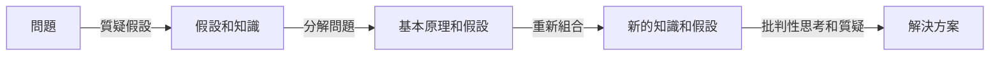

## TL;DR
第一原則是一種批判性思考和質疑的方式，透過分解問題、質疑假設和假設的基礎，重新組合和整合新的知識和假設，從而找到事物的本質和根本原因。

## 是什麼，為什麼現在才出現
第一原則源自古希臘哲學家阿里斯托德的思想，涉及將事物分解成基本的原理和假設，然後檢視和質疑這些假設。這種思考方式在古代就已經存在，但在現代社會中，第一原則的重要性日益凸顯。隨著科學技術的進步和複雜問題的增加，人們越來越需要批判性思考和質疑的能力，來找到創新的解決方案。

## 怎麼運作
運用第一原則的三個思考練習是：

1. **質疑假設**：識別和挑戰假設和知識的基礎。
2. **分解問題**：將問題分解成基本的原理和假設。
3. **重新組合**：透過批判性思考和質疑，重新組合和整合新的知識和假設。

```mermaid
graph LR
    A[問題] -->|"質疑假設"| B[假設和知識]
    B -->|"分解問題"| C[基本原理和假設]
    C -->|"重新組合"| D[新的知識和假設]
    D -->|"批判性思考和質疑"| E[解決方案]
```

## 跟「第二原則」（Second Principles）的差別
第二原則是基於既有的知識和假設，透過演繹和邏輯推理，得出新的結論。與第一原則不同，第二原則不涉及質疑假設和假設的基礎。第二原則更適合於既有的知識和假設已經被驗證的情況下。

## 實際用起來怎麼樣
運用第一原則需要批判性思考和質疑的能力，適合對於解決複雜問題和創新有興趣的人。透過運用第一原則，可以幫助我們找到事物的本質和根本原因，培養更開闊和創新的思考方式。但是，運用第一原則也需要付出更多的時間和精力，來進行批判性思考和質疑。

## 參考資料

* [First Principles](https://en.wikipedia.org/wiki/First_principle)
* [Second Principles](https://en.wikipedia.org/wiki/Second_principle)
* [從基本原理出發：3 個思考練習，讓你不再被選項牽著鼻子走](https://www.youtube.com/watch?v=hToO6daVuSw)

這讓我想到，第一原則可以應用在軟體開發中，透過質疑假設和假設的基礎，重新組合和整合新的知識和假設，來找到更好的解決方案。例如，在設計軟體架構時，使用第一原則可以幫助我們找到更合適的架構模式和技術選擇。