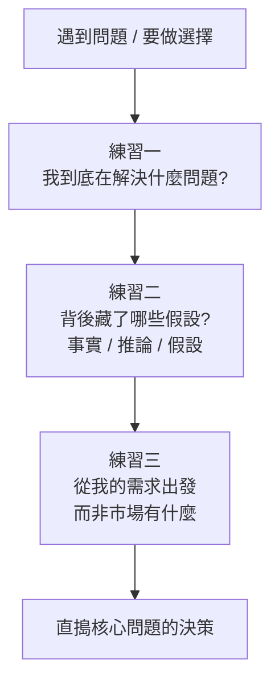

## 為什麼「聽懂」和「用得出來」之間有一段不小的距離

第一性原理（First Principles）這個概念，很多人都聽過。簡單講，就是當你遇到問題時，不要急著去看別人怎麼做、不要急著找業界慣例或所謂的 Best Practice，而是先退回到問題最根本的本質，再從那個本質重新推導出解法。它的相反，就是**類比思維**——看別人成功怎麼做，然後照著抄。

聽起來一點都不難。但大人學的 Joe（張國洋）在這集《大人的 Small Talk》裡點出一個關鍵觀察：做了這麼多年專案管理顧問和講師，他發現大部分人卡住的地方，**不是不懂這個道理，而是不知道到底要怎麼「回到本質」**。你叫他回到本質，他會說「我以為我已經在本質了」——但其實沒有，大部分人並沒有能力真的退回本質。

> 第一性原理最有名的例子，是 Elon Musk 怎麼用它重新拆解電池的成本。但 Joe 認為，這個方法對「資源有限的一般上班族」反而更重要——因為我們沒有本錢去走冤枉路。

所以與其再講一次概念，他這集直接給三個**具體的思考練習**。重點不是理解，而是逼自己碰到任何問題都用這種方式去拆解、反思，慢慢把它內化成直覺。

```mermaid
graph TD
    A[遇到問題 / 要做選擇] --> B[練習一<br/>我到底在解決什麼問題?]
    B --> C[練習二<br/>背後藏了哪些假設?<br/>事實 / 推論 / 假設]
    C --> D[練習三<br/>從我的需求出發<br/>而非市場有什麼]
    D --> E[直搗核心問題的決策]
```

## 練習一：把「我該怎麼辦」換成「我到底在解決什麼問題」

最常見的提問長這樣：「Joe，我該不該去考 PMP？」

這是個非常經典的是非題，選「該」或「不該」，感覺人生好像很簡單。但 Joe 說，如果你直接回答，不管說該或不該，**都是太快做結論、掉進陷阱**。因為在背後脈絡釐清之前，是或不是其實沒什麼具體意義。

所以他會反問：「你考 PMP 是為了想達成什麼目標？」

- 有人想拿證照、補強學術認證；
- 有人是為了在工作上有幫助；
- 更常見的，是為了**轉職**。

假設對方說要轉職去當產品經理，他會繼續追問：「你有沒有研究過，產品經理的職缺到底要求什麼？其中有要求 PMP 嗎？」大部分人到這裡就愣住了——因為他們從沒認真查過，只是覺得「考了 PMP 就能當產品經理」，這是一種非常跳躍式、線性的思考。

真相往往是：產品經理要的根本不是 PMP，而是你**有沒有做過產品、有沒有數據分析能力、熟不熟商業環境、有沒有跟工程師協作的經驗**。PMP 也許重要，但排在很後面，不是關鍵、不是剛需。那你何必現在花半年去考一張對目標沒有直接幫助的認證？

這就是第一性原理最基本的應用：**你不是在「要不要考 PMP」這個層次做決策，而是後退一步，問自己「我考 PMP，是想解決什麼問題」**，把那個真正核心的問題先定義清楚，再從根本開始想。

> 大人學的書裡也提過類似的：碰到人生抉擇時，不要把它寫成是非題、不要二選一（「我該出國念 MBA 嗎？」），而是去想你期待的結果是什麼，然後開始拆解、置換。退回到你真正想要的東西，而不是在現有選項之間糾結。

做專案管理時也一樣：一個新需求進來，第一個反應不該是「這怎麼做」，而是「等等，為什麼會有這個問題？它到底是技術問題、管理問題，還是政治問題？」如果連問題的性質都搞錯，後面的解法一定歪掉。這就是常講的「看懂局」——退一步找到本質，本質清晰了，後面的 solution 才能事半功倍。

**怎麼練：** 不要急著找答案。拿一張紙把問題寫下來，然後問自己「這真的就是我要解的問題嗎？還是要解的其實在更底層？」多問幾個為什麼，就有機會挖到核心。

## 練習二：找出「大家都這樣」背後的隱含假設

我們每天做很多決策，背後都藏著一些假設，而這些假設常常是隱形的，你甚至沒意識到它存在。

Joe 的例子：很多人工作五到七年後開始焦慮、卡關，就會想「我是不是該去念個研究所？」問他為什麼，他說「因為我看那些升遷的人，好像都有碩士學歷」。

拆解一下——「升遷的人都有碩士」這個觀察可能是真的，但背後的假設是：**碩士是他們升遷的原因**。這個成立嗎？

有沒有可能，那些人本來就比較積極、有企圖心，去念碩士只是因為個性本來就會追求更多；而他們升遷是因為**工作表現好**，跟碩士沒有直接關係？碩士也許是因素之一，但不是全部。

這個區別是決策的關鍵：

- 如果碩士是升遷的**唯一原因**，那你當然該去念；
- 如果碩士只是**相關而非因果**，那你額外花兩年（甚至全職去念、賠上機會成本），最後發現對升遷根本沒幫助，損失的就是這兩年的時間與成本。

Joe 建議把任何決策都拆成**三個層次**來看（這也是 Bryan 在節目裡常聊的）：

| 層次 | 定義 | 例子 |
|------|------|------|
| **事實** | 可查證、可驗證 | 今天 27 度 |
| **推論** | 基於事實做的判斷，但沒查證 | 27 度，外面紫外線可能很高 |
| **假設** | 你以為理所當然、卻還沒被驗證的前提 | 念碩士可以幫我升遷 |

大部分人的決策出問題，不是事實看錯、也不是推論不合理，而是**最底層的假設根本就是錯的，而他從來沒查驗過**。

另一個高頻踩雷：在現職做得不愉快想轉職，就覺得「我對另一個領域有興趣，去念個碩士就能轉過去」。但在很多專業領域，你沒有相關經驗、本質不是從那個領域出身，念個兩年理論的碩士，很高機率還是切不進去。問題是——在去念之前，你有沒有找那個領域的人問過？如果這條路在那領域很常見，那是事實、假設被驗證；但很可能你問一圈，大家都搖頭，那這個假設就不成立。結果就是花兩年念出來，投履歷沒人約面試，誤會一場。

**怎麼練：** 把決策拆開，挑出裡頭的假設——「我做這個就能賺大錢 / 升遷 / 轉職」是真的嗎？然後做一定程度的驗證去跟事實連上。如果資料不充分，就用**成本最低的最小可行計畫先實驗**，而不是自己心裡做了假設、再腦補去支持它，一路走到最後才發現是錯的。你會驚訝地發現，過去很多以為理所當然的事，其實經不起追問。

## 練習三：從「我需要什麼」出發，而不是「市場有什麼」

我們處在一個選項爆炸的時代。想學東西，線上課程幾萬堂；想投資，金融商品幾千幾百種；想找工作，104 一打開幾萬個職缺。

選項太多時，大部分人會想縮短判斷——去看評價、看排名、看別人推薦什麼，甚至跑去 Facebook、Threads 上問「我要這個東西，請大家推薦」。但這正是典型的**類比思維**：你是從「市場上有什麼」出發，在所有選項裡挑一個最多人推薦的。可是最多人推薦的，可能只適合最多人、或某個特定族群，**不一定最適合你**。

第一性原理的做法是反過來的：**先不要看市場有什麼，先問自己「我現在的狀況是什麼、我缺什麼、我需要什麼」**。把自己的需求、想補的洞想清楚，再回頭去看市場上能連上你需求的是什麼。有可能你選的不是大家推薦的，但對你來說效益最大。

> Joe 用大人學的創業舉例：當年他們不是先去看市場上有什麼教育機構、再模仿做類似的事（那樣只會進紅海），而是從自己二十幾歲到三十幾歲跌跌撞撞的體會出發，發現「如果這些事早幾年知道該多好」，再去問身邊的成年人，發現大家都有共鳴、有類似的缺，然後從這些根本問題去設計課程。出發點不同，課程自然長得跟一般培訓單位不一樣。

回到日常：想學理財，不要一上來就去 Threads 問「現在買什麼 ETF 好」，而是先問自己「我為什麼要學理財」——是為了退休？三年內存到買房頭期款？還是怕錢被通膨吃掉？**目的不同，策略會完全不同**（穩當的、波動大的，甚至根本是不同的事）。如果你採取的是「大家都推薦什麼」，就很可能買了一堆不適合你當前需求的東西。

**怎麼練：** 做任何重要選擇前，先花十分鐘寫下自己的需求。這時不要看任何推薦文、不要問任何人，純粹問自己「我現在的處境是什麼、我想到達的地方在哪、中間缺什麼」。盤點清楚現況與目標的落差，再來思考選項。你會發現判斷力忽然變強很多——因為你是在幫自己建立清楚明確的標準，而不是人云亦云拿別人的標準來套。

## 為什麼這對一般上班族特別重要

談第一性原理的文章，舉的例子大多是 Elon Musk、賈伯斯怎麼做商業決策，於是有人誤以為「那是天才或大老闆才用的方法」。Joe 認為剛好相反。

天才和大老闆本來就有很多資源和能力去嘗試各種方法；但**一般人的時間、錢、精力都有限，很多時候根本沒有本錢走冤枉路**。就像那些想轉職而去念碩士、結果卡住的人——想去的地方不收你，想退回來，兩年資歷又浪費了，不上不下。

正因為資源有限、不能面面俱到，我們更需要在關鍵時刻停下來想清楚：我走這條路，是因為把脈絡都想清楚了、知道它能真正幫到我的核心問題，**還是只因為別人都走、所以閉著眼睛相信「我走應該也會很好」**？把有限的資源用在刀口上，這正是第一性原理在告訴你的事。

## 三個練習，整理一次

1. **遇到問題，先問「我到底在解決什麼問題」**，不要在表面選項上過度糾結；選項若沒連上問題，是或不是都沒有意義。
2. **做任何重要決定前，把做法拆解開，挑出裡頭的假設並做驗證**；驗證通過才值得往下走，通不過就別走——搞不好幫自己省下幾百萬、省下兩年。
3. **做選擇時先從自己的需求出發，而非市場有什麼**；把問題定義清楚、把解法的假設實驗清楚，就能直搗黃龍解決最核心的問題。

這三件事聽起來簡單，也確實不難，關鍵是把它**內化成直覺**。一旦變成直覺，你做人生決策的品質會完全不一樣——因為你不再是被選項推著走，而是自己在主導方向。

## 參考資料

- [大人的 Small Talk｜原始節目（YouTube）](https://www.youtube.com/watch?v=hToO6daVuSw)
- 大人學部落格：可搜尋「大人學 第一性原理」，閱讀 Bryan 先前關於第一性原理與 Elon Musk 電池成本的文章
