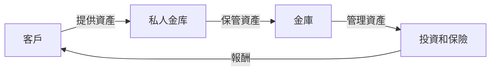

探秘全球最大私人金库：黄金东移潮、战争、衰退危机与“Plan B”

## 是什麼
全球最大私人金库是指位於瑞士的私人銀行和金庫，負責管理全球富豪和機構的財富，包括黃金、外匯和其他資產。這些金庫以其高度的保密性和安全性而聞名，為客戶提供資產管理、投資和保險等服務。

## 為什麼重要
全球最大私人金库對全球經濟具有重要影響力。它們管理著大量的資產，影響著全球金融市場的走勢。同時，私人金库也為富豪和機構提供了資產保護和保密的服務，這在全球化的經濟環境下尤其重要。

## 怎麼運作
私人金库的運作流程如下：

## 跟央行的差別
與央行不同，私人金库主要為私人客戶提供服務，而非為國家或政府服務。央行通常負責管理國家的貨幣政策和金融穩定，而私人金库則著重於資產管理和保密性。

## 小結
全球最大私人金库是全球富豪和機構管理資產的重要工具。它們提供資產管理、投資和保險等服務，並以高度的保密性和安全性而聞名。然而，私人金库也面臨著全球經濟不確定性的挑戰，包括黃金東移潮、戰爭和衰退危機等。

## 參考資料
* [瑞士私人銀行協會](https://www.swissbanking.org/)
* [全球最大私人金库排名](https://www.reuters.com/article/us-swiss-banks-wealth-idUSKBN1W51LQ)
* [探秘全球最大私人金庫背後的故事](https://www.youtube.com/watch?v=7D_8zimKtB4)