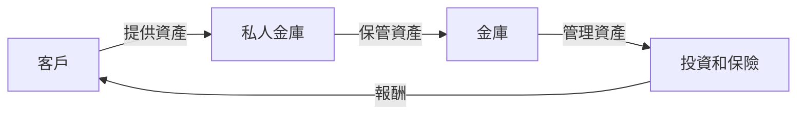

# 黃金東移潮、戰爭、衰退危機與安全投資的新選擇

## TL;DR
全球最大私人金庫的崛起，代表著富豪和機構對於資產安全的新需求。

## 是什麼，為什麼現在才出現
全球最大私人金庫是指位於瑞士的私人銀行和金庫，負責管理全球富豪和機構的財富，包括黃金、外匯和其他資產。這些金庫以其高度的保密性和安全性而聞名，為客戶提供資產管理、投資和保險等服務。然而，為什麼現在才出現這樣的需求？答案在於全球經濟的不確定性，包括黃金東移潮、戰爭和衰退危機等。

過去，富豪和機構往往將資產存放在央行或公眾銀行，但這些銀行面臨著政治和經濟風險，無法提供足夠的保密性和安全性。私人金庫的出現填補了這個空白，為客戶提供了資產保護和保密的服務。

## 怎麼運作
私人金庫的運作流程如下：

```mermaid
graph LR
    A[客戶] -->|"提供資產"| B[私人金庫]
    B -->|"保管資產"| C[金庫]
    C -->|"管理資產"| D[投資和保險]
    D -->|"報酬"| A
```

客戶將資產交給私人金庫，金庫負責保管和管理資產，並提供投資和保險等服務。私人金庫的運作高度保密，客戶的資產和身份信息受到嚴格保護。

## 跟央行的差別
與央行不同，私人金庫主要為私人客戶提供服務，而非為國家或政府服務。央行通常負責管理國家的貨幣政策和金融穩定，而私人金庫則著重於資產管理和保密性。央行也面臨著政治和經濟風險，無法提供足夠的保密性和安全性。

## 實際用起來怎麼樣
私人金庫的優點在於其高度的保密性和安全性，為客戶提供了資產保護和保密的服務。然而，也有缺點，例如費用昂貴，門檻高，只有少部分富豪和機構能夠使用。另外，私人金庫也面臨著全球經濟不確定性的挑戰，包括黃金東移潮、戰爭和衰退危機等。

在我看來，私人金庫是一種新的資產管理方式，為富豪和機構提供了安全和保密的服務。然而，需要注意的是，私人金庫的費用和門檻較高，需要仔細評估是否適合自己的需求。

## 參考資料

- [原始影片](https://www.youtube.com/watch?v=7D_8zimKtB4)