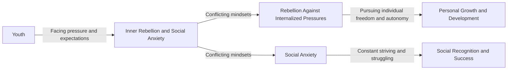

The Fragmentation of Youth: Understanding the Conflict Between Inner Rebellion and Social Anxiety
====================================================================

## TL;DR
The fragmentation of youth refers to the two conflicting mindsets that young people face: rebellion against the pressures of society and anxiety about their place in the world. These mindsets pull young people in opposite directions, making them feel both the need to break free and the pressure to conform.

## What is it and why is it happening now?
The fragmentation of youth is a phenomenon where young people experience two conflicting ideas and emotions when faced with the pressures and expectations of modern society. On one hand, they want to rebel against the internalized pressures of society and pursue their individual freedom and autonomy. On the other hand, they are troubled by social anxiety, feeling the need to constantly strive and struggle to make a place for themselves in society.

## How it works

This flowchart illustrates how young people face pressure and expectations, leading to the conflicting mindsets of inner rebellion and social anxiety. These conflicting mindsets, in turn, influence the direction of their personal growth and development.

## How it differs from other concepts
The fragmentation of youth differs from other concepts, such as adolescent identity formation and career choice, in its focus on the conflicting ideas and emotions that young people experience. While adolescent identity formation focuses on how young people establish their own identities and roles, and career choice focuses on how young people choose suitable careers and paths, the fragmentation of youth highlights the impact of conflicting mindsets on personal growth and development.

## Practical implications
The fragmentation of youth is a double-edged sword for young people. On one hand, it makes them more aware of their individual freedom and autonomy, encouraging them to pursue their dreams and goals. On the other hand, it creates pressure and anxiety, making them feel the need to constantly strive and struggle in the face of societal competition. Therefore, understanding and acknowledging this fragmentation is crucial for young people, helping them balance their needs with societal expectations and find their own path.

## References

*   《The Fragmentation of Youth: Rebellion Against Internalized Pressures and Social Anxiety》 - YouTube
*   《Career Choice and Personal Growth and Development》 - Wikipedia
*   [Why is the era so fragmented for young people?](https://www.youtube.com/watch?v=NkvFy3GCCBo)