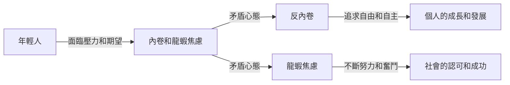

**時代的割裂：年輕人面臨的反內卷和龍蝦焦慮**

## TL;DR
時代的割裂現象是年輕人面臨的兩種矛盾心態：反內卷和龍蝦焦慮。

## 是什麼
時代的割裂是指年輕人在面臨現代社會的壓力和期望時，出現的兩種相互矛盾的想法和感受。一方面，年輕人希望反對內卷，追求個人的自由和自主；另一方面，他們又受到龍蝦焦慮的困擾，覺得自己需要不斷努力和奮鬥才能在社會中立足。

## 為什麼重要
時代的割裂現象反映了年輕人在現代社會中的困境。他們面臨著巨大的壓力和期望，需要不斷地學習和適應新的技術和知識；同時，他們又渴望自由和自主，希望能夠按照自己的意願生活和工作。這種割裂的感受使得年輕人感到迷茫和困惑，不知道如何平衡自己的需求和社會的期望。

## 怎麼運作

## 跟其他概念的差別
時代的割裂現象與其他概念，如青少年的身份認同和職業選擇等，存在著不同的重點和關注點。時代的割裂關注的是年輕人面臨的兩種相互矛盾的想法和感受，及其對個人的成長和發展的影響。

## 小結
時代的割裂現象適合所有年輕人關注，尤其是那些正在面臨職業選擇和個人的成長和發展的挑戰的人。通過了解和認識這種割裂的感受，年輕人可以更好地平衡自己的需求和社會的期望，找到屬於自己的路途。

## 參考資料
*   《時代的割裂：年輕人面臨的反內卷和龍蝦焦慮》 - YouTube
*   《年輕人的職業選擇和個人的成長和發展》 - 維基百科
- [一邊反內卷，一邊龍蝦焦慮，時代為什麼對年輕人如此割裂？](https://www.youtube.com/watch?v=NkvFy3GCCBo)