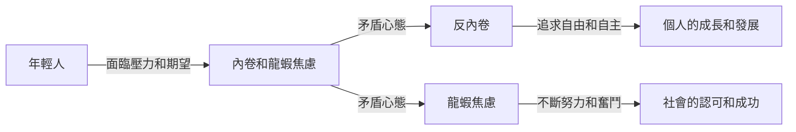

時代的割裂現象是一種年輕人面臨的兩種相互矛盾的想法和感受。它是由現代社會的快速變遷和競爭加劇所導致的，讓年輕人在追求自由和自主的同時，又感到不得不在社會競爭中奮鬥。

## TL;DR
時代的割裂現象是年輕人面臨的兩種矛盾心態：反內卷和龍蝦焦慮，這兩種心態讓年輕人在追求自由和自主的同時，又感到不得不在社會競爭中奮鬥。

## 是什麼，為什麼現在才出現
時代的割裂是指年輕人在面臨現代社會的壓力和期望時，出現的兩種相互矛盾的想法和感受。一方面，年輕人希望反對內卷，追求個人的自由和自主；另一方面，他們又受到龍蝦焦慮的困擾，覺得自己需要不斷努力和奮鬥才能在社會中立足。

## 怎麼運作

```mermaid
graph LR
    A[年輕人] -->|"面臨壓力和期望"| B[內卷和龍蝦焦慮]
    B -->|"矛盾心態"| C[反內卷]
    B -->|"矛盾心態"| D[龍蝦焦慮]
    C -->|"追求自由和自主"| E[個人的成長和發展]
    D -->|"不斷努力和奮鬥"| F[社會的認可和成功]
```

這個流程圖描述了年輕人如何面臨壓力和期望，進而陷入內卷和龍蝦焦慮的矛盾心態中。這種矛盾心態又會影響年輕人的成長和發展方向。

## 跟其他概念的差別
時代的割裂現象與其他概念，如青少年的身份認同和職業選擇等，存在著不同的重點和關注點。時代的割裂關注的是年輕人面臨的兩種相互矛盾的想法和感受，及其對個人的成長和發展的影響。相比之下，青少年的身份認同更側重於年輕人如何建立自己的身份和角色，而職業選擇更側重於年輕人如何選擇適合自己的職業和事業。

## 實際用起來怎麼樣
時代的割裂現象對年輕人來說是雙刃劍。一方面，它使得年輕人更加意識到自己的自由和自主，鼓勵他們去追求自己的夢想和目標。另一方面，它又使得年輕人感到壓力和焦慮，讓他們感到不得不在社會競爭中奮鬥。因此，了解和認識這種割裂的感受對年輕人來說是非常重要的，可以幫助他們更好地平衡自己的需求和社會的期望，找到屬於自己的路途。

## 參考資料

*   《時代的割裂：年輕人面臨的反內卷和龍蝦焦慮》 - YouTube
*   《年輕人的職業選擇和個人的成長和發展》 - 維基百科
*   [一邊反內卷，一邊龍蝦焦慮，時代為什麼對年輕人如此割裂？](https://www.youtube.com/watch?v=NkvFy3GCCBo)