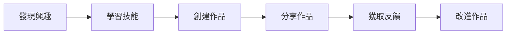

## TL;DR
斜槓不只是為了賺錢，而是一種自我實現和成長的方式，讓人們找到自我價值和喘息空間。

## 是什麼，為什麼現在才出現
斜槓是一種新型的工作模式，指的是一個人在主職業之外，另有一個或多個副業或興趣，通常是為了實現自我價值或增加收入。然而，斜槓不只是為了賺錢，它更是一種自我實現和成長的方式。在現代社會，工作壓力和生活成本不斷增加，人們開始尋找新的方式來實現自我價值和增加收入。由於網路和社群平台的普及，人們可以更容易地找到自己的興趣和熱情，並與他人分享和交流，從而實現自我成長和價值。

## 怎麼運作
一個人發展斜槓的過程，通常包括以下幾個步驟：

首先，人們需要發現自己的興趣和熱情，然後學習相關的技能。接下來，創建作品並分享給他人，獲取反饋和評價。最後，改進作品和持續學習，實現自我成長和價值。

## 跟全職工作的差別
全職工作和斜槓的最大差別，是工作的性質和目標。全職工作通常是為了實現經濟收入和社會地位，而斜槓則是為了實現自我價值和成長。全職工作通常需要投入大量的時間和精力，而斜槓可以根據個人的興趣和時間安排進行。

## 跟副業的差別
斜槓和副業的最大差別，是動機和目標。副業通常是為了增加收入或實現經濟目標，而斜槓則是為了實現自我價值和成長。副業通常需要投入大量的時間和精力，而斜槓可以根據個人的興趣和時間安排進行。

## 實際用起來怎麼樣
斜槓可以帶給人們一種成就感和自豪感，讓人們感到自己是有價值的。然而，斜槓也需要投入時間和精力，需要不斷學習和改進。另外，斜槓也需要面對市場和競爭的壓力，需要不斷創新和改進。為了避免斜槓變成另一份工作，我們需要找到自己的興趣和熱情，設定明確的目標和界限，保持工作和生活的平衡。

## 參考資料
* 《斜槓族：如何找到自己的第二職業》 - 蔡康永
* 《自我實現的力量》 - 馬斯洛
* [【十分鐘心理學】斜槓越做越累？你是不是忽略了什麼](https://www.youtube.com/watch?v=QjTpoz18tOg)