# TL;DR
How to cope with breathing difficulties caused by psychological pressure when the airplane cabin door closes.

# Prerequisites
- Basic knowledge of psychology
- Understanding of physiological changes caused by stress responses

# Steps
### Step 1: Understand your body's alarm system
When the airplane cabin door closes, your body's physiological responses to psychological pressure can lead to symptoms like rapid heartbeat and shallow breathing. These changes are a sign that your brain is processing stress and fear.

### Step 2: Use three emergency rescue methods
#### 1. Deep breathing
Deep breathing can help you relax and slow down your heart rate. Try inhaling through your nose and exhaling slowly through your mouth. Repeat this process until you feel your body relaxing.

#### 2. Relax your body
Tension in your body can make breathing more difficult. Try relaxing your muscles, starting from your head and working your way down to your feet. This can help reduce muscle tension and improve your breathing.

#### 3. Use mindfulness techniques
Mindfulness techniques can help you focus on the present moment and reduce worries about the future or past. Try focusing on your breathing, feeling the air enter and leave your body. When you feel your heart racing or breathing quickening, try using mindfulness techniques to calm them down.

# Complete Example
Here's a simple mindfulness exercise you can use when the airplane cabin door closes:
```
I am currently on a plane, and I feel anxious and scared.
I will use deep breathing to relax my body.
I will focus on my breathing, feeling the air enter and leave my body.
I will use mindfulness techniques to calm my heart and breathing.
```

# Frequently Asked Questions
- How do I know if I'm experiencing a stress response?
  - If you feel symptoms like rapid heartbeat, shallow breathing, or sweating, you may be experiencing a stress response.
- How do I know if I'm using mindfulness techniques correctly?
  - If you feel like you're focusing on the present moment and reducing worries about the future or past, you may be using mindfulness techniques correctly.

# References
- "Stress Management" - American Psychological Association
- "Mindfulness-Based Stress Reduction" - Massachusetts General Hospital

## Technical Structure Diagram

```mermaid
graph LR
    A[Airplane cabin door closes] -->| Triggers stress response | B[Body's alarm system goes off]
    B -->| Rapid heartbeat, shallow breathing | C[Stress response]
    C -->| Use emergency rescue methods | D[Deep breathing]
    D -->| Slows down heart rate | E[Relax body]
    E -->| Reduces muscle tension | F[Mindfulness techniques]
    F -->| Focuses on present moment | G[Calms heart and breathing]
    G -->| Completes | H[Safe landing]

style A fill:#f9f,stroke:#333,stroke-width:1px
style B fill:#f9f,stroke:#333,stroke-width:1px
style C fill:#f9f,stroke:#333,stroke-width:1px
style D fill:#f9f,stroke:#333,stroke-width:1px
style E fill:#f9f,stroke:#333,stroke-width:1px
style F fill:#f9f,stroke:#333,stroke-width:1px
style G fill:#f9f,stroke:#333,stroke-width:1px
style H fill:#f9f,stroke:#333,stroke-width:1px
```

