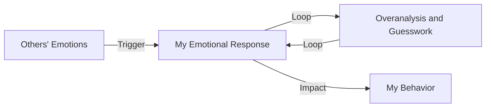

**Don't Own Other People's Emotions! Drop "Hypervigilance" and Reclaim Your Attention**

## TL;DR
Hypervigilance is a psychological state where individuals overfocus on and react to others' emotions, especially negative ones, affecting their own emotions and behavior.

## What is it and why is it a thing now
Hypervigilance is a common phenomenon, especially in the age of social media. As social media has become ubiquitous, people are more likely to see others' emotional expressions, triggering their own emotional responses. However, this excessive attention to others' emotions often leads to individuals' emotions and behavior being influenced by others, impacting their mental health and relationships.

## How it works

In this process, individuals overanalyze and guess others' emotions to avoid conflict or gain approval. This excessive focus on others' emotions leads to individuals' emotions and behavior being influenced by others, impacting their mental health and relationships.

## Difference from Depression
Hypervigilance and depression are distinct concepts. Depression is a severe mental health disorder characterized by persistent low mood and loss of interest. Hypervigilance refers to excessive attention to and reaction to others' emotions, which may lead to depression but is not depression itself.

## Putting it into practice
Hypervigilance is a common phenomenon, especially in the age of social media. Individuals need to recognize and manage their hypervigilance to avoid being influenced by others' emotions. Here are some practical suggestions:

*   Focus on yourself and reduce reactions to others' emotions.
*   Learn to distinguish your emotions and avoid being influenced by others.
*   Develop a healthy self-relationship, building confidence and self-esteem.
*   Avoid excessive social media use to reduce exposure to others' negative emotions.

## References
*   _Cognitive-Behavioral Therapy for Hypervigilance_ by Beck, A. T. (2011)
*   _Emotional Blackmail_ by Mann, W. E. (2017)
*   [【放心來信】別人的情緒不是你的責任！放下「過度警覺」，把注意力還給自己](https://www.youtube.com/watch?v=6BwN157O7kg)