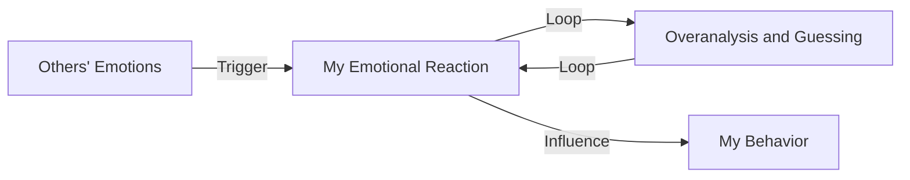

Untitled
==========

Introduction
------------

This article explains the concept of "overvigilance" and helps readers understand how to recognize and manage their emotions, avoiding being influenced by others' emotions. After reading this article, readers will understand how to focus on themselves and reduce their reactions to others' emotions.

TL;DR
----

Overvigilance refers to excessive attention to others' emotions and reactions, influencing one's own emotions and behavior.

What is Overvigilance
---------------------

Overvigilance is a psychological state where an individual excessively focuses on and reacts to others' emotions, especially negative ones, such as anger, disappointment, or fear. In this state, individuals often overanalyze and guess others' emotions, trying to avoid conflicts or gain approval.

Why is Overvigilance Important
-----------------------------

Overvigilance can lead to an individual's emotions and behavior being influenced by others' emotions, affecting their mental health and interpersonal relationships. Recognizing and managing overvigilance can help individuals better handle their emotions and establish healthier relationships.

How Overvigilance Works
----------------------

The mechanism of overvigilance is as follows:

Difference from Depression
-------------------------

Overvigilance and depression are two distinct concepts. Depression is a severe mental health disorder characterized by persistent low mood and loss of interest. Overvigilance refers to excessive attention to others' emotions, which may lead to depression but is not depression itself.

Conclusion
----------

Overvigilance is a common psychological state that requires recognition and management. Understanding the concept and mechanism of overvigilance can help individuals better handle their emotions and establish healthier relationships.

References
----------

*   Beck, A. T. (2011). Cognitive Behavioral Therapy for Overvigilance
*   Mann, W. E. (2017). Emotional Blackmail