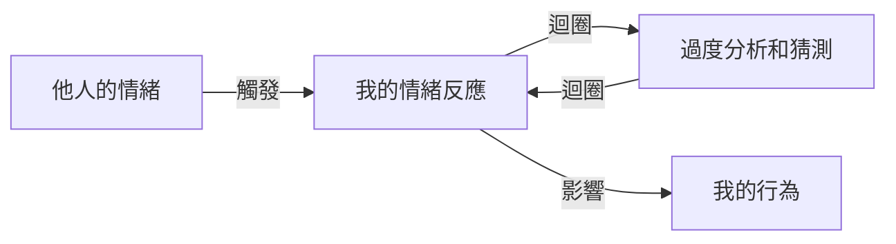

開頭 2-3 句：這篇文章要解釋「過度警覺」的概念，幫助讀者了解如何辨別和管理自己的情緒，避免被別人的情緒影響。讀者看完會理解如何將注意力集中在自己身上，減少對他人的情緒反應。

## TL;DR
過度警覺是指過度關注別人的情緒和反應，影響自己的情緒和行為。

## 是什麼
過度警覺是一種心理狀態，指的是個體過度關注和反應別人的情緒，尤其是負面情緒，例如憤怒、沮喪或恐懼。這種狀態下，個體往往會過度分析和猜測他人的情緒，試圖避免衝突或獲得他人的認可。

## 為什麼重要
過度警覺會導致個體的情緒和行為受到他人的情緒影響，從而影響自己的心理健康和人際關係。通過認識和管理過度警覺，可以幫助個體更好地處理自己的情緒，建立更健康的人際關係。

## 怎麼運作
過度警覺的運作機制如下：

## 跟 憂鬱症 的差別
過度警覺和憂鬱症是兩種不同的概念。憂鬱症是一種嚴重的精神健康疾病，表現為持續性的低落情緒和失去興趣。過度警覺則是指過度關注和反應別人的情緒，雖然可能導致憂鬱症，但不是憂鬱症本身。

## 小結
過度警覺是個體的一種常見心理狀態，需要認識和管理。通過了解過度警覺的概念和運作機制，可以幫助個體更好地處理自己的情緒，建立更健康的人際關係。

## 參考資料
*   《過度警覺的認知行為治療》 by Beck, A. T. (2011)
*   《情緒勒索》 by Mann, W. E. (2017)
- [【放心來信】別人的情緒不是你的責任！放下「過度警覺」，把注意力還給自己](https://www.youtube.com/watch?v=6BwN157O7kg)