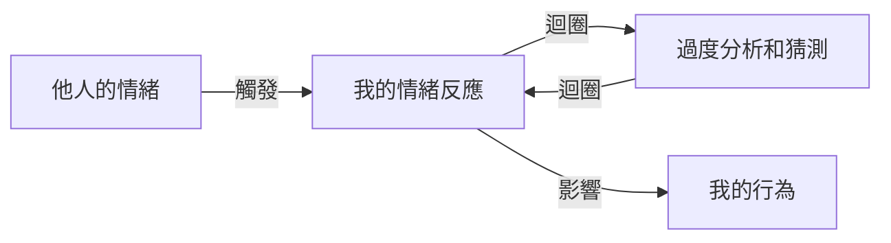

**別人的情緒不是你的責任！放下「過度警覺」，把注意力還給自己**

## TL;DR
過度警覺是一種心理狀態，指的是個體過度關注和反應別人的情緒，尤其是負面情緒，影響自己的情緒和行為。

## 是什麼，為什麼現在才出現
過度警覺是一種常見的現象，尤其是在社交媒體盛行的時代。隨著社交媒體的普及，人們越來越容易看到別人的情緒表達，從而引發自己的情緒反應。然而，這種過度關注別人的情緒，卻往往會導致個體的情緒和行為受到他人的情緒影響，從而影響自己的心理健康和人際關係。

## 怎麼運作
過度警覺的運作機制如下：

在這個過程中，個體會過度分析和猜測他人的情緒，試圖避免衝突或獲得他人的認可。這種過度關注別人的情緒，會導致個體的情緒和行為受到他人的情緒影響，從而影響自己的心理健康和人際關係。

## 跟 憂鬱症 的差別
過度警覺和憂鬱症是兩種不同的概念。憂鬱症是一種嚴重的精神健康疾病，表現為持續性的低落情緒和失去興趣。過度警覺則是指過度關注和反應別人的情緒，雖然可能導致憂鬱症，但不是憂鬱症本身。

## 實際用起來怎麼樣
過度警覺是一種常見的現象，尤其是在社交媒體盛行的時代。個體需要認識和管理自己的過度警覺，才能避免自己的情緒和行為受到他人的情緒影響。以下是一些實用的建議：

*   將注意力集中在自己身上，減少對他人的情緒反應。
*   學習辨別自己的情緒，避免被他人的情緒影響。
*   發展健康的自我關係，建立自信和自尊。
*   避免過度使用社交媒體，減少接觸他人的負面情緒。

## 參考資料
*   《過度警覺的認知行為治療》 by Beck, A. T. (2011)
*   《情緒勒索》 by Mann, W. E. (2017)
*   [【放心來信】別人的情緒不是你的責任！放下「過度警覺」，把注意力還給自己](https://www.youtube.com/watch?v=6BwN157O7kg)